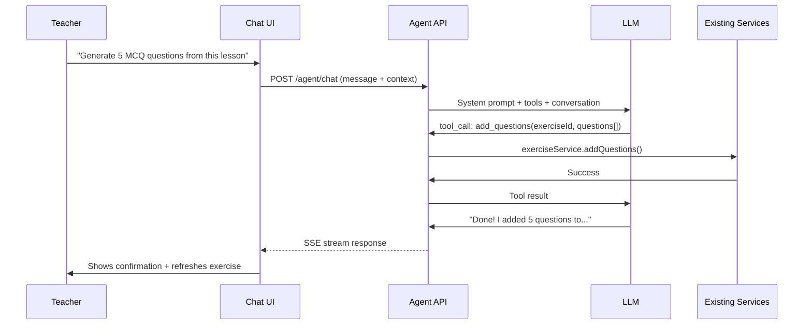
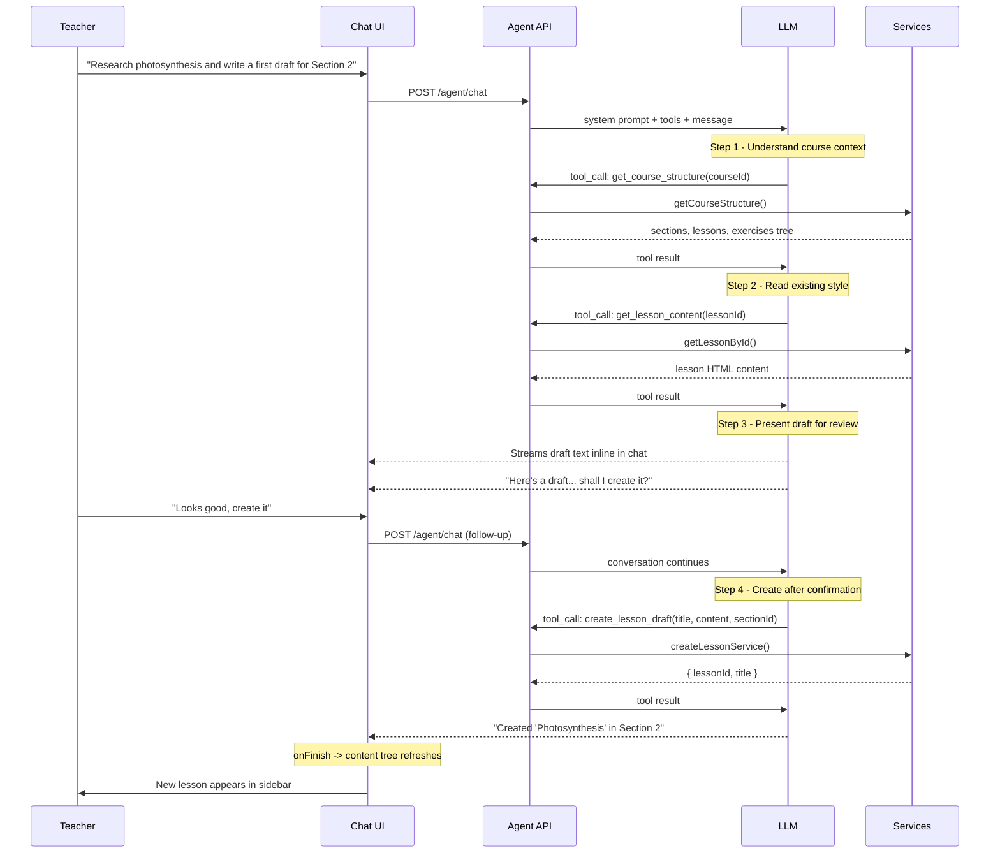

# AI Course Assistant PRD

## What We're Writing

Replace [prd/ai-course-assistant/README.md](prd/ai-course-assistant/README.md) with a comprehensive PRD for an AI assistant embedded in the course UI. The PRD will be a single markdown file covering architecture, UI, safeguards, package design, and implementation phases.

## Key Architectural Decisions

### Execution Model: Hybrid (Local Reads, API Writes)

The client already has course content loaded in Svelte stores (`lessonApi`, exercise `questionnaire`, etc.) when the teacher is on a page. The agent should:

- **Read context from the client** — pass the current lesson text, exercise questions, course structure to the agent as context with each message. No extra API calls to "read" content.
- **Write through the API** — all mutations route through existing API endpoints (`/course/:courseId/lesson`, `/course/:courseId/exercise`, etc.) using the full middleware stack (`authMiddleware` -> `orgMemberMiddleware` -> `courseTeamMemberMiddleware`). This gives us permission enforcement, single source of truth, and auditability for free.
- **Preview for destructive changes** — when the agent rewrites a lesson or makes a large edit, show a diff/preview in the chat with an "Apply" button. For additive actions (generate 5 questions), execute directly and confirm.

### Agent Architecture: Tool-Calling Pattern

The agent uses LLM function/tool calling (not free-form text parsing):




The LLM sees a set of **tools** (mapped to existing service functions) and decides which to call based on the teacher's message. The agent API executes the tool with full permission checks, then feeds the result back to the LLM for a human-friendly summary.

### SDK: Vercel AI SDK

The **Vercel AI SDK** (`ai` + `@ai-sdk/svelte` + provider packages) is the right fit:

- `@ai-sdk/svelte` provides a `Chat` class that uses Svelte 5 runes internally — same class-based reactive pattern as the project's existing `LessonApi` / `BaseApiWithErrors` ([base.svelte.ts](apps/dashboard/src/lib/utils/services/api/base.svelte.ts)).
- `streamText()` returns `toUIMessageStreamResponse()` which works directly as a Hono response — zero glue code ([Hono cookbook](https://sdk.vercel.ai/cookbook/api-servers/hono)).
- Tool calling is built-in with Zod schemas (already used everywhere in the project). The SDK handles the function-calling protocol, multi-step execution, and streaming tool results.
- Provider abstraction lets us swap between `@ai-sdk/openai` and `@ai-sdk/anthropic` by changing one line.
- The wire protocol carries text chunks, tool call events, tool results, and finish signals. The `Chat` class on the client parses all of this automatically.

**Packages to install:**

- `ai` — core (`streamText`, `tool`, types) — in `packages/ai-assistant` and `apps/api`
- `@ai-sdk/svelte` — Svelte 5 `Chat` class — in `apps/dashboard`
- `@ai-sdk/openai` — OpenAI provider — in `packages/ai-assistant`
- `@ai-sdk/anthropic` — Anthropic provider — in `packages/ai-assistant`
- `zod` — already installed everywhere

### Package: `packages/ai-assistant`

A thin, backend-focused package consumed by `apps/api`. No UI code. The heavy lifting is done by the Vercel AI SDK; this package provides project-specific configuration on top.

Responsibilities:

- **Provider factory** — creates the right AI SDK `LanguageModel` from env vars (`AI_PROVIDER`, `AI_API_KEY`, `AI_MODEL`). Wraps `@ai-sdk/openai` and `@ai-sdk/anthropic`.
- **Role-aware tool registry** — `getToolSchemas(role)` returns the right Zod schemas per role. No implementations — those live in the API.
- **Role-aware system prompt** — `buildSystemPrompt(context)` generates different LLM instructions for teachers vs students.
- **Shared types** — `AgentRole`, `AgentContext`, tool names, config types. Used by both `apps/api` and `apps/dashboard`.

Suggested structure:

```
packages/ai-assistant/
  src/
    index.ts                 # Public exports
    types.ts                 # AgentRole, AgentContext, AIProviderConfig, tool name constants
    providers/
      index.ts               # createModel(config) factory
    tools/
      index.ts               # getToolSchemas(role) registry
      shared.ts              # Read-only tool schemas (both roles)
      teacher.ts             # Mutation tool schemas (teacher only, v1)
      student.ts             # Learning tool schemas (student only, v2 stubs)
    prompt/
      system-prompt.ts       # buildSystemPrompt(context) — role-aware
      teacher.ts             # Teacher prompt template
      student.ts             # Student prompt template (v2 stub)
  package.json
  tsconfig.json
```

Note: the agent loop itself is NOT in this package — `streamText()` from the `ai` core package handles the full loop (prompt -> LLM -> tool call -> execute -> respond -> repeat). The Hono route assembles tools (schema from package + execute from services) and calls `streamText`.

### Foundation Layer: Role-Aware Design

The agent is not just a teacher tool — it's a **course assistant** that behaves differently per role. The foundation must support this from day one, even though students are gated off in v1.

`**AgentRole`** — the core discriminator:

- `'teacher'` — can read AND mutate course content (update lessons, generate questions, create drafts)
- `'student'` — can only read and discuss content (explain concepts, answer questions, quiz on material)

**Role detection** — server-side, automatic:

- The API route checks the user's course membership via existing queries (`isCourseTeamMemberOrOrgAdmin`)
- Team members (ADMIN/TUTOR role in `groupmember`) get `role: 'teacher'`
- Regular course members (STUDENT role) get `role: 'student'`
- In v1, `role: 'student'` returns a 403. In v2, it loads the student tool set.

**Tool registry** — `getToolSchemas(role)` returns the right set:

- `shared` tools (read-only): `get_course_structure`, `get_lesson_content`, `get_exercise_questions` — available to both roles
- `teacher` tools (mutations): `update_lesson_content`, `create_lesson_draft`, `add_exercise_questions` — teacher only
- `student` tools (v2): `explain_concept`, `quiz_me`, `clarify_exercise` — student only, stubs for now

Teachers get `shared + teacher`. Students get `shared + student`. This ensures students can never access mutation tools, even via prompt injection.

**System prompt** — role-aware via `buildSystemPrompt(context)`:

- Teacher: "You are helping a teacher organize and author course content. You can update lessons, create new content, and generate questions."
- Student (v2): "You are helping a student learn. You can explain concepts, answer questions about the material, and help with exercises. You cannot modify any course content."

**Single API endpoint** — `/agent/chat` serves both roles. Role is detected server-side (not passed by the client, preventing spoofing). The endpoint loads tools and prompt based on the detected role.

### Agent Tools

#### V1 Core Tools (7 tools)

Start small with the essentials for content authoring. Additional tools are added in later phases.


| Tool                    | Type  | Description                                          | Service                                               |
| ----------------------- | ----- | ---------------------------------------------------- | ----------------------------------------------------- |
| `get_course_structure`  | read  | Get sections, lessons, exercises tree                | `getCourseContentItems` + `listCourseSections`        |
| `get_lesson_content`    | read  | Get a specific lesson's note/text                    | `getLesson`                                           |
| `get_exercise_details`  | read  | Get exercise with all questions and options          | `getExercise`                                         |
| `create_lesson`         | write | Create a new lesson in a section (title + content)   | `createLesson`                                        |
| `update_lesson_content` | write | Update the note/text content of a lesson             | `updateLessonService` + `upsertLessonLanguageService` |
| `create_exercise`       | write | Create a new exercise with questions and options     | `createExercise`                                      |
| `add_questions`         | write | Add questions (with options) to an existing exercise | `updateExerciseService` (diff-based)                  |


#### Phase 2+ Tools (added after v1 is stable)

**Lessons**: `update_lesson_metadata`, `delete_lesson`, `reorder_lessons`, `update_lesson_translation`
**Sections**: `create_section`, `update_section`, `reorder_sections`, `delete_section`
**Exercises**: `update_exercise_metadata`, `update_question`, `delete_question`, `delete_exercise`, `create_exercise_from_template`
**Other**: `update_course_tags`, `create_newsfeed_post`, `list_exercise_templates`

#### Phase 4 Student Tools (v2)

`explain_concept`, `quiz_me`, `clarify_exercise`, `get_my_progress`, `get_my_submissions`

#### Tool Execution Rules

Each tool handler in the API will:

1. Extract IDs from tool arguments
2. Verify the target resource belongs to the course/org in context
3. Verify user is course team member or org admin (teacher tools)
4. **Check token balance** before LLM call (see Token Usage section)
5. Call the existing service function
6. Return structured result to the agent

#### No-Hallucination Boundary

The system prompt includes an explicit list of what the agent CANNOT do. When a user asks for any of these, the agent responds with a clear, helpful decline and suggests the closest available action. The agent must **never**:

- Pretend to perform an action it doesn't have a tool for
- Fabricate data it hasn't retrieved via a tool call
- Claim to have made a change unless a tool call succeeded

**Explicit CANNOT-do list (included verbatim in system prompt):**

- Cannot create, delete, or clone courses
- Cannot update course-level settings (title, description, logo, status)
- Cannot manage course members, invitations, or roles
- Cannot grade submissions or assign marks
- Cannot handle payments or attendance
- Cannot upload files, images, videos, or documents
- Cannot manage sections, reorder content, or delete content (v1 — added in Phase 2)
- Cannot manage org settings, members, or billing
- Cannot access data from other courses or organizations
- Cannot browse the internet or fetch external URLs
- Cannot send emails or notifications

**System prompt template:**

```
You are an AI assistant for ClassroomIO. You help teachers create and organize
course content.

You have access to specific tools listed below. If a user asks you to do something
NOT covered by your tools, respond clearly:
"I can't do that yet. [Brief reason]. Here's what I can help with: [closest action]."

NEVER pretend to perform an action you don't have a tool for.
NEVER fabricate data you haven't retrieved via a tool.
NEVER claim to have made a change unless a tool call returned success.
When drafting new content, always present it for review before creating.

Things you explicitly CANNOT do:
[list from above]
```

### Token-Based Usage Tracking

AI usage is metered by tokens. Each org gets a monthly base allowance from their plan, with the option to buy extra credit packs when exhausted.

#### How It Works

```mermaid
flowchart LR
    subgraph check [Before LLM Call]
        CheckBalance["Check: monthly_allowance\n+ credit_balance\n- tokens_used > 0?"]
    end
    subgraph call [LLM Call]
        StreamText["streamText() executes"]
        Usage["AI SDK returns\npromptTokens + completionTokens"]
    end
    subgraph record [After LLM Call]
        RecordUsage["Record usage in\nai_token_usage table"]
        UpdateBalance["Deduct from monthly\nallowance first,\nthen credits"]
    end

    CheckBalance -->|"Yes"| StreamText
    CheckBalance -->|"No"| Reject["Return 402:\nToken limit reached"]
    StreamText --> Usage
    Usage --> RecordUsage
    RecordUsage --> UpdateBalance
```


#### Plan-Based Allowances

Tied to the existing `organization_plan` table ([schema.ts](packages/db/src/schema.ts) line 1324). Each plan gets a monthly token allowance:

- **BASIC**: 0 tokens (AI assistant not available on free plan — or a small trial allowance, TBD)
- **EARLY_ADOPTER**: X tokens/month (e.g. 500K tokens — roughly 50-100 conversations)
- **ENTERPRISE**: Y tokens/month (higher, e.g. 2M tokens — or unlimited)

Allowance resets on the 1st of each month (or billing cycle start).

#### Extra Credit Packs

When the monthly allowance is exhausted, the org can buy credit packs:

- Credits are one-time purchases, do NOT expire, do NOT reset monthly
- Deduction order: monthly allowance first, then credits
- Purchase flow: upgrade modal / settings page -> payment -> credits added to `ai_credit_balance`

#### Database Design

New table: `ai_token_usage` — tracks per-request usage for auditing and aggregation.

```sql
CREATE TABLE ai_token_usage (
  id            BIGINT GENERATED ALWAYS AS IDENTITY PRIMARY KEY,
  org_id        UUID NOT NULL REFERENCES organization(id),
  user_id       UUID NOT NULL,
  course_id     UUID NOT NULL,
  prompt_tokens INTEGER NOT NULL,
  completion_tokens INTEGER NOT NULL,
  total_tokens  INTEGER GENERATED ALWAYS AS (prompt_tokens + completion_tokens) STORED,
  model         TEXT NOT NULL,
  created_at    TIMESTAMPTZ NOT NULL DEFAULT now()
);
CREATE INDEX idx_ai_token_usage_org_month ON ai_token_usage (org_id, created_at);
```

New table: `ai_credit_balance` — tracks purchased credits per org.

```sql
CREATE TABLE ai_credit_balance (
  id            BIGINT GENERATED ALWAYS AS IDENTITY PRIMARY KEY,
  org_id        UUID NOT NULL REFERENCES organization(id) UNIQUE,
  balance       INTEGER NOT NULL DEFAULT 0,
  updated_at    TIMESTAMPTZ NOT NULL DEFAULT now()
);
```

Allowances live in a config constant (or the plan's `payload` JSONB field), not a separate table. The plan already has `payload: jsonb()` which can store `{ "aiTokenAllowance": 500000 }`.

#### Token Tracking Flow (in the agent route)

1. **Before LLM call**: query `ai_token_usage` for current month + `ai_credit_balance`. Calculate: `remaining = (allowance - used_this_month) + credit_balance`. If `remaining <= 0`, return 402 with `{ error: "Token limit reached", upgradeUrl: "..." }`.
2. **After LLM call**: the Vercel AI SDK's `streamText()` result exposes `usage` with `promptTokens` and `completionTokens`. Insert a row into `ai_token_usage`.
3. **Deduction logic**: monthly allowance is consumed first (it's implicit — just the sum of usage this month vs the allowance). Credits are only touched when `used_this_month > allowance`. The credit deduction is: `max(0, total_tokens - max(0, allowance - used_before_this_request))`.

#### API Endpoints for Token Management

- `GET /agent/usage` — returns `{ used, allowance, creditBalance, remaining }` for the current org. Used by dashboard to show usage meter.
- `POST /agent/credits` — purchase credits (integrates with payment provider). Protected by `orgAdminMiddleware`.

#### Dashboard UI

- **Usage meter**: in the AI assistant sidebar header or org settings, show a progress bar: "X / Y tokens used this month" with remaining count.
- **Exhausted state**: when tokens run out, the chat input is disabled with a message: "Monthly AI token limit reached. [Buy more credits] or wait for reset on [date]."
- **Credits section**: in org settings, show credit balance and "Buy more" button.

### Safeguards

Four layers of protection:

1. **Route-level middleware** — agent API route uses `authMiddleware` + `orgMemberMiddleware` + at minimum `courseMemberMiddleware`. Role detection happens inside the handler. Defined in [apps/api/src/middlewares/](apps/api/src/middlewares/).
2. **Tool-level permission checks** — the tool set itself is the primary guard. Students physically cannot call `update_lesson_content` because it's not in their tool set. Additionally, each tool's execute function re-verifies resource ownership to prevent prompt injection (LLM tricked into passing a different `courseId`).
3. **Token budget enforcement** — every LLM call checks the org's remaining token balance. If exhausted, returns 402 before any LLM call is made. Usage is recorded after each call for accurate tracking.
4. **Rate limiting** — per-user, per-org rate limits on agent API calls (requests/minute). Prevents abuse even within token budget. Self-hosted is uncapped (user's own API key, their cost).

### Self-Hosted vs Cloud

- **Cloud**: AI assistant enabled by default. ClassroomIO provides the LLM API key server-side. Teachers see the button, no setup needed. Usage may be metered per plan tier.
- **Self-hosted**: AI assistant **disabled by default**. To enable, the self-hosted admin sets `AI_API_KEY` and optionally `AI_PROVIDER` / `AI_MODEL` in their environment. When configured, the assistant becomes available. When not configured, the button is hidden (check via a server-side flag exposed to the client, e.g. a `GET /agent/status` endpoint or a field in the org config response).

This is simpler than storing API keys in the database and avoids security concerns around key storage.

### UI Specification

- **Trigger**: "AI Assistant" button in the course sidebar navigation ([course-sidebar-navigation.svelte](apps/dashboard/src/lib/features/course/components/sidebar/course-sidebar-navigation.svelte)), below the existing nav items. In v1, only visible to teachers/admins (not students). Hidden when self-hosted and no AI key configured.
- **Panel**: Right sidebar using `@cio/ui` Sheet (`side="right"`, ~420px). Does NOT replace the left sidebar — both can be open simultaneously.
- **Chat interface**: Message list (user/assistant turns), text input with send button, streaming token display, quick-action chips.
- **Role-aware quick actions**: The chat panel accepts the detected `role` to show the right chips:
  - Teacher (v1): "Draft a lesson", "Generate questions", "Improve this text"
  - Student (v2): "Explain this lesson", "Quiz me on this topic", "Help me with this exercise"
- **Context awareness**: Client passes `courseId`, current `lessonId` or `exerciseId`. The role is NOT sent from the client — it's detected server-side to prevent spoofing.
- **Apply flow**: For large content changes (teacher only), the agent response includes a structured preview. The chat UI renders a diff with "Apply" / "Discard" buttons. Applying triggers the API write and refreshes the relevant store.
- **Existing `ai-button.svelte`**: The hidden [ai-button.svelte](apps/dashboard/src/lib/features/course/components/lesson/ai-button.svelte) component in the lesson editor can be removed or repurposed — the new sidebar chat replaces its functionality.
- **v2 student surface**: The same chat panel component can be rendered in the student course view (course-app). The `Chat` class and Sheet are identical — only the quick-action chips differ, and the server loads different tools/prompts based on role.

### Streaming

The Vercel AI SDK provides a structured SSE protocol via `toUIMessageStreamResponse()`. It carries:

- Text chunks (tokens stream one by one — ChatGPT-like typing)
- Tool call events (when the LLM decides to call a tool)
- Tool results (when the tool execution completes)
- Finish signals

On the frontend, the `Chat` class from `@ai-sdk/svelte` consumes this protocol automatically. No manual SSE parsing needed.

### How the Backend Code Works

The Hono route assembles everything:

1. **Provider factory** (`packages/ai-assistant`) creates a `LanguageModel` from env vars
2. **Tool schemas** (`packages/ai-assistant`) define Zod input schemas for each tool
3. **Tool execute functions** (inline in the Hono route) call existing services from `apps/api/src/services/`
4. `**streamText()`** (from `ai` core) runs the agent loop: sends system prompt + tools + messages to LLM, executes tool calls, feeds results back, repeats up to `stopWhen: stepCountIs(5)`, streams everything to the client

The route returns `result.toUIMessageStreamResponse()` directly as the Hono response.

### How the Frontend Code Works

The `Chat` class from `@ai-sdk/svelte` is instantiated once per chat panel. It:

1. Manages `messages` array as reactive `$state` (same pattern as `LessonApi`)
2. `sendMessage({ text })` sends a POST to the Hono endpoint, starts consuming the SSE stream
3. Updates `messages` reactively as tokens arrive — the UI re-renders automatically
4. Exposes `status` (`'idle'` | `'streaming'`) and `stop()` for abort
5. Each message has a `parts` array — `{ type: 'text', text }` for text, `{ type: 'tool-{name}', state: 'call' | 'result', result? }` for tool calls

The `Chat` class accepts:

- `api` — URL of the Hono endpoint (e.g., `${PUBLIC_API_URL}/agent/chat`)
- `headers` — we pass `{ 'cio-org-id': orgId }` via a reactive getter
- `body` — extra data merged into every request: `{ courseId, context: { lessonId, exerciseId } }`
- `credentials: 'include'` — sends auth cookies for Better Auth session
- `onFinish` — callback to refresh page data after the agent completes

### What the Chat UI Looks Like

**Empty state**: welcome message + quick-action chips ("Draft a lesson", "Generate questions", "Improve this text"). Clicking a chip fills the input and sends.

**During conversation**:

- User messages appear right-aligned with `bg-primary` styling
- Assistant messages appear left-aligned with `bg-muted` styling
- Text streams in token by token (automatic via `Chat` class)
- Tool calls render as inline status cards inside the assistant bubble:
  - `state: 'call'` shows spinner + "Generating questions..."
  - `state: 'result'` shows checkmark + "5 questions added"
- Stop button replaces send button while streaming

**After agent completes a mutation**:

- `onFinish` callback fires
- The relevant store refreshes (e.g., `lessonApi.get()` or exercise reload)
- Teacher sees updated content on the page without manual refresh

**Tool part rendering**: The AI SDK names tool parts as `tool-{toolName}`. In the Svelte template:

```svelte
{#each message.parts as part}
  {#if part.type === 'text'}
    <div class="prose">{@html renderMarkdown(part.text)}</div>
  {:else if part.type === 'tool-update_lesson_content'}
    <ToolStatusCard label="Updating lesson" state={part.state} />
  {:else if part.type === 'tool-add_exercise_questions'}
    <ToolStatusCard label="Generating questions" state={part.state}
      successText={part.state === 'result' ? `${part.result.count} questions added` : undefined} />
  {/if}
{/each}
```

### Example Agent Flows

These walk through what actually happens end-to-end for each key use case — which tools fire, what the teacher sees, and design decisions involved.

#### Flow 1: "Research photosynthesis and write a first draft lesson for Section 2"




**What "research" means**: The agent does NOT have internet access. "Research" means two things:

1. The LLM uses its training data knowledge about the topic (extensive for most academic subjects)
2. The agent reads existing course content via `get_course_structure` and `get_lesson_content` to understand the teacher's style, depth, and what's already been covered

**Confirmation before creation**: The system prompt instructs the LLM to present the draft in the chat first and ask for confirmation before calling `create_lesson_draft`. This is a prompt-engineering pattern, not a code constraint — the system prompt will say: "When drafting a new lesson, first present the full draft in your response and ask the teacher to confirm before creating it. Only call create_lesson_draft after the teacher approves." This gives a natural review gate via multi-turn conversation without requiring a custom "preview mode" in the API.

**Future consideration**: If real web research is needed, a `web_search` tool can be added to the tool registry. The foundation supports it cleanly — just another tool schema + execute function. Not in v1.

**What the teacher sees in the chat**:

1. User bubble: their request
2. Assistant bubble starts streaming:
  - Tool card: "Getting course structure..." -> checkmark
  - Tool card: "Reading existing lesson..." -> checkmark
  - Text streams in: the full draft lesson content, rendered as markdown
  - Text: "Would you like me to create this as a lesson in Section 2?"
3. Teacher types "yes" or "looks good, but change X"
4. Assistant bubble:
  - Tool card: "Creating lesson draft..." -> checkmark
  - Text: "Created 'Photosynthesis: Converting Light to Energy' in Section 2. You can find it in the content tree."
5. Content tree refreshes, new lesson appears

#### Flow 2: "Generate 5 MCQ questions from this lesson"

The teacher is viewing a lesson and opens the AI assistant.

1. Teacher sends: "Generate 5 multiple choice questions from this lesson"
2. The `Chat` class sends `{ courseId, messages, context: { lessonId: 'current-lesson-id' } }`
3. The system prompt includes: "The teacher is currently viewing lesson ID: {lessonId}"
4. LLM calls `get_lesson_content(lessonId)` to read the lesson text
5. LLM generates 5 questions based on the content
6. LLM calls `add_exercise_questions(exerciseId, questions)` — if there's a linked exercise, it adds there. If not, it tells the teacher there's no exercise linked and asks if it should create one.
7. Result streams back with tool status cards and a summary

**What the teacher sees**:

- Tool card: "Reading lesson content..." -> checkmark
- Tool card: "Adding 5 questions..." -> checkmark
- Text: "I've added 5 multiple-choice questions to the exercise. Here's a summary: 1. What is the primary function of... [etc]"
- Exercise data refreshes automatically

#### Flow 3: "Update the introduction paragraph of this lesson"

The teacher is editing a lesson and wants the AI to improve specific text.

1. Teacher sends: "Rewrite the introduction paragraph to be more engaging"
2. Context includes the current `lessonId`
3. LLM calls `get_lesson_content(lessonId)` to read the full lesson
4. LLM identifies the introduction paragraph, rewrites it
5. **System prompt instructs**: "When updating existing lesson content, show the proposed changes and ask for confirmation before applying." — this is the "preview for destructive changes" pattern
6. LLM presents the new introduction in the chat
7. Teacher says "apply it" or "make it shorter"
8. LLM calls `update_lesson_content(lessonId, fullUpdatedContent)`
9. Lesson store refreshes, teacher sees the updated text in the editor

**Important**: `update_lesson_content` replaces the full lesson note. The LLM must reconstruct the complete lesson HTML with only the introduction changed. The system prompt will instruct: "When updating lesson content, always preserve all existing content. Only modify the specific section the teacher asked about."

#### Flow 4 (v2): Student asks "I don't understand the Calvin cycle"

1. Student is viewing a lesson about photosynthesis
2. Student sends: "I don't understand the Calvin cycle, can you explain it more simply?"
3. Role detected as `'student'` — student tool set loaded (read-only)
4. LLM calls `get_lesson_content(lessonId)` to read what the lesson says about the Calvin cycle
5. LLM generates a simplified explanation based on the lesson content + its training knowledge
6. Response streams back — pure text, no tool mutations, no changes to any data

**Key difference from teacher flow**: No mutation tools are available. The agent can only read course content and generate text responses. The tool set IS the security boundary.

### LLM Provider Abstraction

Configurable via environment variables:

- `AI_PROVIDER` — `openai` | `anthropic` (default: `openai`)
- `AI_API_KEY` — the provider API key
- `AI_MODEL` — model name override (default: provider's recommended model)

The provider factory in `packages/ai-assistant` normalizes this into a single `LanguageModel` instance that `streamText()` consumes. Both OpenAI and Anthropic support function/tool calling natively through the AI SDK.

### Conversation Persistence

For v1, conversation history is **session-scoped** — managed entirely in-memory by the `Chat` class on the client. When the teacher closes the sidebar or navigates away, the conversation resets. No database table needed.

v2 consideration: persist conversations per course in the database for history/continuity.

## API Routes

New route domain: `/agent`

- `GET /agent/status` — returns `{ enabled, role, usage: { used, allowance, creditBalance, remaining } }`. Used by client to show/hide the button, configure chips, and display usage meter.
- `POST /agent/chat` — the single chat endpoint. Accepts `{ courseId, messages, context }`. Checks token balance, detects role, loads tools/prompt, returns SSE stream. Records token usage after completion.
- `GET /agent/usage` — returns detailed usage stats for the current org (current month usage, allowance, credit balance, history).
- `POST /agent/credits` — purchase additional credits. Protected by `orgAdminMiddleware`.

Registered in [apps/api/src/app.ts](apps/api/src/app.ts) as `.route('/agent', agentRouter)`.

## Implementation Phases

### Phase 1: Foundation (scaffold + role-aware chat shell + token tables)

- Create `packages/ai-assistant` with `AgentRole`, `AgentContext` types, provider factory, role-aware tool registry (v1: 7 core tools), and role-aware system prompt with no-hallucination boundary
- Add `ai_token_usage` and `ai_credit_balance` tables to DB schema, add token allowance to plan payload
- Add `GET /agent/status` and `POST /agent/chat` route skeleton in `apps/api` with role detection (students get 403 in v1) and token balance check
- Add "AI Assistant" button to course sidebar (gated on status endpoint + plan check)
- Build right sidebar Sheet with basic chat UI (hardcoded echo responses)

### Phase 2: Agent Core (LLM integration + v1 tools + usage tracking)

- Implement provider factory (OpenAI + Anthropic) using `createModel(config)`
- Wire v1 core tools (7 tools) to existing services via `streamText()` with `stopWhen: stepCountIs(5)`
- Record `promptTokens` + `completionTokens` after each call; enforce balance check before each call
- Connect chat UI to streaming API via `@ai-sdk/svelte` `Chat` class; render streamed tokens and tool status cards
- Add usage meter to AI assistant sidebar header
- Implement `onFinish` store refresh for lesson/exercise data

### Phase 3: Polish + Safeguards + Credits

- Add tool-level permission re-validation (verify resource belongs to course/org)
- Add rate limiting (per-user, per-org, requests/minute)
- Add quick-action chips and context-aware suggestions
- Self-host env var detection and `GET /agent/status` logic
- Add conversation context windowing (trim long histories)
- Implement `POST /agent/credits` for purchasing credit packs
- Add credit purchase UI in org settings + exhausted-state UI in chat
- Add `GET /agent/usage` for detailed usage dashboard

### Phase 4: More Tools

- Add Phase 2+ tools (sections, reorder, delete, translations, templates, tags, newsfeed)
- Update no-hallucination boundary to remove "cannot manage sections" etc.

### Phase 5: Student Assistant (v2)

- Implement student tool schemas and execute functions
- Write student system prompt template
- Remove the v1 student 403 gate
- Add student quick-action chips
- Surface the AI assistant button in the student course view (course-app)
- Student usage counts against the org's token budget (same pool)

## Files to Create / Modify

**New files:**

- `prd/ai-course-assistant/README.md` — this PRD (replace existing)

**Files referenced (not modified in PRD phase):**

- [packages/db/src/schema.ts](packages/db/src/schema.ts) — where `ai_token_usage` and `ai_credit_balance` tables will be added (near `organizationPlan` at line 1324)
- [packages/utils/src/plans/constants.ts](packages/utils/src/plans/constants.ts) — where AI token allowance feature constants will be added
- [apps/api/src/app.ts](apps/api/src/app.ts) — where agent route will be registered
- [apps/api/src/middlewares/](apps/api/src/middlewares/) — existing middleware to reuse
- [apps/api/src/services/](apps/api/src/services/) — existing services the agent will call
- [apps/dashboard/src/lib/features/course/components/sidebar/course-sidebar-navigation.svelte](apps/dashboard/src/lib/features/course/components/sidebar/course-sidebar-navigation.svelte) — where the AI button goes
- [apps/dashboard/src/lib/utils/store/org.ts](apps/dashboard/src/lib/utils/store/org.ts) — where plan-based derived stores live (e.g., `isFreePlan`, `currentOrgPlan`)

