# Course Enroll Route Migration Plan

## Summary

Migrate from `/invite/s/:token` to a course-scoped enroll route. **One request for both flows:**

- **Free courses:** `/course/:slug/enroll` – Join calls `POST /course/:courseId/enroll` (no token). User is enrolled directly; no invite creation.
- **Paid/invited:** `/course/:slug/enroll?invite_token=xxx` – Join calls `POST /course/:courseId/enroll` with `inviteToken`. Without token, request fails.

## Architecture

```mermaid
flowchart TB
    subgraph free [Free Course Flow]
        A1[Landing: Enroll click] --> A2[goto /course/slug/enroll]
        A2 --> A3[Page loads, validates free]
        A3 --> A4[User auths if needed]
        A4 --> A5[Join click]
        A5 --> A6["POST /course/:id/enroll (no token)"]
        A6 --> A7[Direct enroll: add to org + group]
        A7 --> A8[Redirect to LMS]
    end

    subgraph paid [Paid/Invited Flow]
        B1[Email link] --> B2[course/slug/enroll?invite_token=xxx]
        B2 --> B3[Page loads, validates token]
        B3 --> B4[User auths if needed]
        B4 --> B5[Join click]
        B5 --> B6["POST /course/:id/enroll with inviteToken"]
        B6 --> B7[Validate token, consume invite, enroll]
        B7 --> B8[Redirect to LMS]
    end
```

---

## Part 1: New Enroll Route

### 1.1 Create route files

**Add:** [apps/dashboard/src/routes/course/[slug]/enroll/+page.server.ts](apps/dashboard/src/routes/course/[slug]/enroll/+page.server.ts)
**Add:** [apps/dashboard/src/routes/course/[slug]/enroll/+page.svelte](apps/dashboard/src/routes/course/[slug]/enroll/+page.svelte)

**Server load logic – one request per branch:**

- **With `invite_token`:** Single call to `GET /invite/student/:token`. Response must include course (slug, cost, title, description, allowNewStudent, status, isPublished), organization (siteName, name, theme), invite (status, etc.). No separate course or org fetch. Extend the invite API response to be self-contained (add course.slug, course.cost, org.theme to the query/response).
- **Without `invite_token` (free):** Single call to `GET /course/slug/:slug` (or a dedicated enroll-context endpoint). Response must include course and org (with theme). Extend the course-by-slug response to include org if it does not already, so no separate OrgApiServer.getOrgBySiteName call.
- **Validation rules:** Same as before – 404, requiresPaymentOrInvite, etc. Determine "free" via `isCourseFree(calculatedCost)`.

**Page component logic:**

- When `requiresPaymentOrInvite: true`: render message "You need to pay for this course or be invited to get access" with link back to `/course/:slug`
- When `invite` present or free (no invite): show course info + Join button
- On Join:
  1. If not logged in → `goto(/signup?redirect=/course/:slug/enroll)` (preserve redirect, append `?invite_token=` if present)
  2. If logged in → call `**POST /course/:courseId/enroll**` with body `{ inviteToken?: string }`:
    - **Free:** no `inviteToken`, backend enrolls directly
    - **Paid/invited:** pass `inviteToken` from URL; backend validates and consumes invite
  3. Redirect to `result.data.redirectTo || '/lms'`
- Set theme and currentOrg from load data

### 1.2 Add route to PUBLIC_ROUTES

**File:** [apps/dashboard/src/lib/utils/constants/routes.ts](apps/dashboard/src/lib/utils/constants/routes.ts)

- Add `^/course/.*/enroll` to `PUBLIC_ROUTES` so unauthenticated users can load the enroll page (they will be prompted to auth when clicking Join)

---

## Part 2: Update Landing Page Enroll Flow

**File:** [apps/dashboard/src/lib/features/ui/course-landing-page/components/pricing-section.svelte](apps/dashboard/src/lib/features/ui/course-landing-page/components/pricing-section.svelte)

- For **free** course: remove `POST /invite/student/public-link` call; change to `goto(\`/course/${courseData.slug}/enroll)`

---

## Part 3: New Unified Enrollment API

**Add:** `POST /course/:courseId/enroll` (authenticated). Body: `{ inviteToken?: string }`

**Logic:** With `inviteToken` → reuse `acceptStudentInvite`; without token → only free courses, direct enroll (no invite). Remove public-link and accept routes.

**Part 3b – Build Enroll URL for emails:** [apps/api/src/services/course/invite.ts](apps/api/src/services/course/invite.ts)

- Add `buildEnrollLink(courseSlug: string, token: string, orgSiteName?: string): string`
  - Construct: `https://${orgSiteName || 'app'}.classroomio.com/course/${courseSlug}/enroll?invite_token=${encodeURIComponent(token)}`
  - Use same base-URL logic as elsewhere (dev vs prod; see [newsfeed](apps/api/src/services/newsfeed/newsfeed.ts) for org subdomain pattern)
- Replace `buildInviteLink` with `buildEnrollLink` in createSingleInvite/email flow; remove buildInviteLink
- Pass `courseSlug` and `orgSiteName` from course/org data in createStudentInvite and createEmailInviteAndSend
  - createPublicStudentInvite removed; email flow uses buildEnrollLink for invite URLs in emails

---

## Part 4: Redirect Preservation (from earlier discussion)

**Files:** [apps/dashboard/src/routes/(auth)/login/+page.svelte](apps/dashboard/src/routes/(auth)/login/+page.svelte), [apps/dashboard/src/routes/(auth)/signup/+page.svelte](apps/dashboard/src/routes/(auth)/signup/+page.svelte)

- On successful auth, preserve `redirect` query param: `window.location.href = redirect ? \`/?redirect=${encodeURIComponent(redirect)} : '/'`

**File:** [apps/dashboard/src/lib/features/app/init.svelte.ts](apps/dashboard/src/lib/features/app/init.svelte.ts)

- In `routeUserToNextPage`, move the `redirect` check **before** the `isOrgSite && pathname === '/'` early return so redirect is honored on org sites

---

## Part 5: Delete invite/s Route and Remove Obsolete Code

All logic from the old invite page moves to the new enroll route. Delete the invite/s route entirely.

### 5.1 Delete invite/s route files

**Delete:**

- [apps/dashboard/src/routes/invite/s/[hash]/+page.svelte](apps/dashboard/src/routes/invite/s/[hash]/+page.svelte)
- [apps/dashboard/src/routes/invite/s/[hash]/+layout.server.ts](apps/dashboard/src/routes/invite/s/[hash]/+layout.server.ts)
- [apps/dashboard/src/routes/invite/s/](apps/dashboard/src/routes/invite/s/) directory (delete if empty after removing [hash])

If [invite/t](apps/dashboard/src/routes/invite/t/) (teacher invite) exists, keep it; only student invite s/ is removed.

### 5.2 Remove obsolete constants

**File:** [apps/dashboard/src/lib/utils/constants/routes.ts](apps/dashboard/src/lib/utils/constants/routes.ts)

- Remove `INVITE_STUDENT: '/invite/s'` from `ROUTE`
- Remove `^${ROUTE.INVITE_STUDENT}/.*` from `ROUTES_TO_HIDE_NAV`
- Add enroll route to `PUBLIC_ROUTES`: `^/course/.*/enroll` (or equivalent)

### 5.3 Remove obsolete backend function

**File:** [apps/api/src/services/course/invite.ts](apps/api/src/services/course/invite.ts)

- Remove `buildInviteLink(token)` (replaced by `buildEnrollLink`)
- Ensure no remaining callers of `buildInviteLink`; update all to use `buildEnrollLink(courseSlug, token, orgSiteName)`

### 5.4 API routes – add, remove, rename, extend

- **Add:** `POST /course/:courseId/enroll` (unified endpoint; see Part 3)
- **Remove:** `POST /invite/student/public-link`, `POST /invite/student/:token/accept`
- **Rename:** `GET /invite/student/:token/preview` → `GET /invite/student/:token`
- **Extend** `GET /invite/student/:token` response: include `course.slug`, `course.cost`, `org.theme` so enroll page needs no extra fetches
- **Extend** `GET /course/slug/:slug` response: include `org` (id, name, siteName, theme) so free-enroll page needs no separate org fetch

---

## Part 6: People Page – Email Invite Links

When teachers send email invites, the link in the email must use the new format. The backend change in Part 3 covers this: `buildEnrollLink(courseSlug, token, orgSiteName)` will be used when generating links for `studentCourseInvite` email.

---

## Part 7: Email-Only Invites Plan (from planning doc)

Per [email-only-invites-plan.md](planning/secure-student-invites/email-only-invites-plan.md):

- Add Zod refine to `ZCreateCourseInvite`: require `recipientEmails` or `recipientCsv` (broad scope)
- Remove quick-link tab/section from People invite modal; make email the default
- Update `invitation-modal.svelte` to remove QuickLinkSection and set `activeStudentTab = 'email'`

---

## File Change Summary

| File                                                         | Action                                                                                                                                   |
| ------------------------------------------------------------ | ---------------------------------------------------------------------------------------------------------------------------------------- |
| `routes/course/[slug]/enroll/+page.server.ts`                | Create – load course, invite preview, validation                                                                                         |
| `routes/course/[slug]/enroll/+page.svelte`                   | Create – enroll UI, Join flow                                                                                                            |
| `lib/utils/constants/routes.ts`                              | Add enroll to PUBLIC_ROUTES; remove INVITE_STUDENT                                                                                       |
| `features/ui/course-landing-page/.../pricing-section.svelte` | Free: goto `/course/:slug/enroll`                                                                                                        |
| `api/services/course/invite.ts`                              | Add enrollInCourse, buildEnrollLink; extend previewStudentInvite with slug, cost, org.theme; remove public-link, accept, buildInviteLink |
| `routes/(auth)/login/+page.svelte`                           | Preserve redirect param                                                                                                                  |
| `routes/(auth)/signup/+page.svelte`                          | Preserve redirect param                                                                                                                  |
| `features/app/init.svelte.ts`                                | Honor redirect before org-site early return                                                                                              |
| `routes/invite/s/[hash]/+page.svelte`                        | Delete                                                                                                                                   |
| `routes/invite/s/[hash]/+layout.server.ts`                   | Delete                                                                                                                                   |
| `packages/utils/validation/course/invite.ts`                 | Zod refine for recipients                                                                                                                |
| `features/course/people/invitation-modal.svelte`             | Remove quick-link, default to email                                                                                                      |
| `features/course/people/quick-link-section.svelte`           | Delete                                                                                                                                   |
| `api/routes/invite/invite.ts`                                | Rename GET /student/:token/preview to GET /student/:token; remove public-link, accept                                                    |
| `api/services/course/course.ts` or course route              | Extend getCourse (slug) response to include org with theme for enroll page                                                               |

---

## Dependency Notes

- Course slug available from `getCourseById`/`getCourseWithOrgData`; ensure slug is selected in queries.
- `acceptStudentInvite` logic is reused when enroll is called with `inviteToken`.

