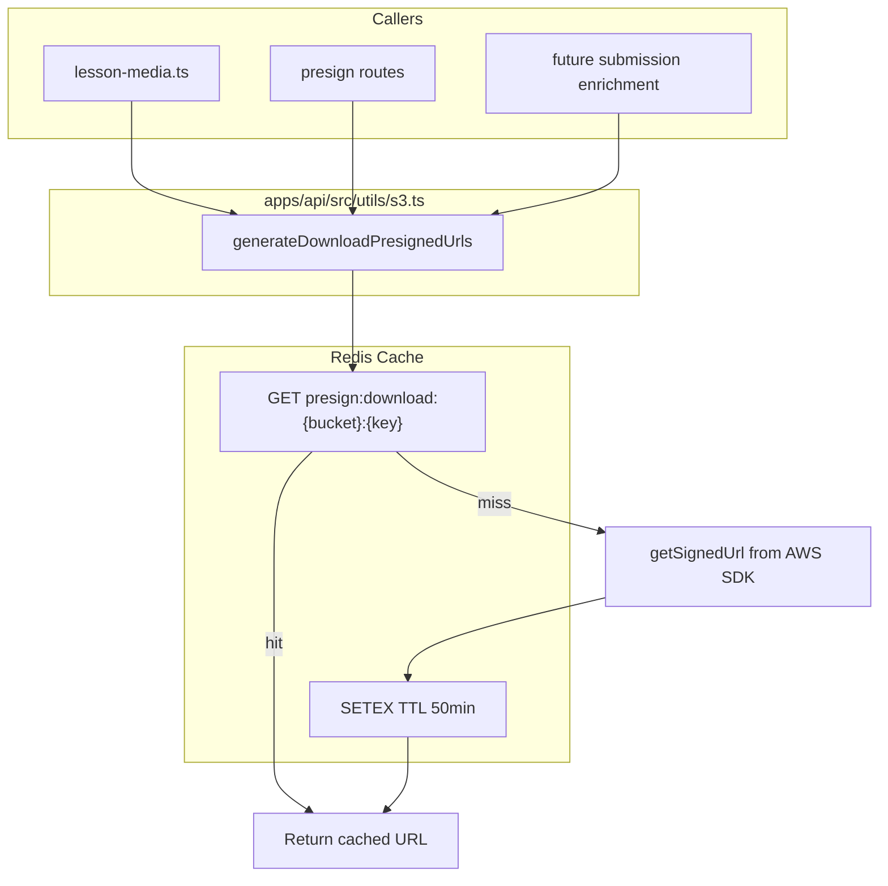

# Global Presigned URL Strategy – Redis Cache

## Current state

Every place that needs a presigned download URL calls S3 `getSignedUrl` with no caching:

| Caller                                                | When                                                                | Goes through                                                                   |
| ----------------------------------------------------- | ------------------------------------------------------------------- | ------------------------------------------------------------------------------ |
| [lesson-media.ts](apps/api/src/utils/lesson-media.ts) | Enrich single lesson (documents/videos)                             | `generateDocumentDownloadPresignedUrls` / `generateVideoDownloadPresignedUrls` |
| [presign.ts](apps/api/src/routes/course/presign.ts)   | Client calls `POST /presign/document/download` or `/video/download` | Same S3 utils                                                                  |
| Client `enrichFileUploadAnswersWithUrls`              | Open exercise submission                                            | Client → `POST presign/document/download`                                      |

**Problem**: Same fileKey generates a new presigned URL every time—whether loading a lesson again, opening the grading modal again, or re-requesting media. Server-side enrichment for lessons does not cache; each lesson load hits S3 again.

---

## Proposed approach: Redis cache in API

Cache presigned URLs in Redis at the S3 utils layer so all callers benefit without changes.

---

## Part A: Redis cache (API)

### 1. Add Redis cache inside presigned URL logic

**File**: [apps/api/src/utils/s3.ts](apps/api/src/utils/s3.ts)

- Import `redis` from [redis/redis.ts](apps/api/src/utils/redis/redis.ts)
- Inside `generateDownloadPresignedUrls`:
  - Cache key: `presign:download:{bucketName}:{fileKey}` (bucket distinguishes documents vs videos)
  - TTL: 3000 seconds (50 min); presigned URLs are typically valid 1 hour
  - Use `redis.mget()` for batch lookup of cache keys before generating
  - For cache hits: add to result
  - For misses: generate via `getSignedUrl`, store with `redis.setex()`, add to result
- `generateVideoDownloadPresignedUrls` and `generateDocumentDownloadPresignedUrls` call `generateDownloadPresignedUrls`, so they automatically use the cache; no changes needed

### 2. Graceful Redis failure

- If Redis is down or `mget`/`setex` fails, fall back to generating URLs without cache (current behavior)
- Log the error but do not fail the request

---

## Part B: PresignApi class (frontend)

Create a single API class responsible for all presigned URL requests so components never call `classroomio.course.presign...` directly.

### 1. PresignApi class

**New file**: [apps/dashboard/src/lib/features/course/api/presign.svelte.ts](apps/dashboard/src/lib/features/course/api/presign.svelte.ts)

- Extend `BaseApiWithErrors`, use `this.execute<RequestType>()` per AGENTS.md
- Methods:
  - `getDocumentUploadUrl(fileName: string, fileType: string)` → `{ url, fileKey }`
  - `getDocumentDownloadUrls(keys: string[])` → `Record<string, string>`
  - `getVideoUploadUrl(fileName: string, fileType: string)` → `{ url, fileKey }`
  - `getVideoDownloadUrls(keys: string[])` → `Record<string, string>`
- Each method wraps `classroomio.course.presign.document.upload`, `document.download`, `video.upload`, or `video.download`
- Export singleton: `export const presignApi = new PresignApi()`

### 2. Types in `utils/types.ts`

**File**: [apps/dashboard/src/lib/features/course/utils/types.ts](apps/dashboard/src/lib/features/course/utils/types.ts)

- Add request types inferred from API: `DocumentUploadPresignRequest`, `DocumentDownloadPresignRequest`, etc.

### 3. Export from course api

**File**: [apps/dashboard/src/lib/features/course/api/index.ts](apps/dashboard/src/lib/features/course/api/index.ts)

- Export `presignApi` from presign.svelte.ts

### 4. Callers to update

| Caller                                                                                                             | Current                                                                                                | Change                                                                                                      |
| ------------------------------------------------------------------------------------------------------------------ | ------------------------------------------------------------------------------------------------------ | ----------------------------------------------------------------------------------------------------------- |
| [view-mode.svelte](apps/dashboard/src/lib/features/course/components/exercise/view-mode.svelte)                    | `classroomio.course.presign.document.upload.$post` and `document.download.$post` in `handleFileUpload` | Use `presignApi.getDocumentUploadUrl` and `presignApi.getDocumentDownloadUrls`; remove `classroomio` import |
| [functions.ts](apps/dashboard/src/lib/features/course/utils/functions.ts) `enrichFileUploadAnswersWithUrls`        | `classroomio.course.presign.document.download.$post`                                                   | Use `presignApi.getDocumentDownloadUrls` (needs access to presignApi singleton)                             |
| [media-manager.svelte.ts](apps/dashboard/src/lib/features/media/api/media-manager.svelte.ts) `getAssetDownloadUrl` | `classroomio.course.presign.document.download` or `video.download`                                     | Use `presignApi.getDocumentDownloadUrls` or `presignApi.getVideoDownloadUrls`                               |
| [presign.ts](apps/dashboard/src/lib/utils/services/courses/presign.ts) `GenericUploader`                           | Calls `classroomio.course.presign...` in `getPresignedUrl` and `getDownloadPresignedUrl`               | Use `presignApi` methods instead                                                                            |

**Note**: `enrichFileUploadAnswersWithUrls` is a pure function in `functions.ts`. It would need to either:

- Accept `presignApi` (or a fetch function) as a parameter, or
- Import `presignApi` directly from `$features/course/api`

The latter is simpler; we import presignApi where needed.

---

## Files to change

| File                                                                                                                         | Change                                                             |
| ---------------------------------------------------------------------------------------------------------------------------- | ------------------------------------------------------------------ |
| [apps/api/src/utils/s3.ts](apps/api/src/utils/s3.ts)                                                                         | Add Redis cache check/store inside `generateDownloadPresignedUrls` |
| [apps/dashboard/src/lib/features/course/api/presign.svelte.ts](apps/dashboard/src/lib/features/course/api/presign.svelte.ts) | New: PresignApi class                                              |
| [apps/dashboard/src/lib/features/course/utils/types.ts](apps/dashboard/src/lib/features/course/utils/types.ts)               | Add presign request types                                          |
| [apps/dashboard/src/lib/features/course/api/index.ts](apps/dashboard/src/lib/features/course/api/index.ts)                   | Export presignApi                                                  |
| [view-mode.svelte](apps/dashboard/src/lib/features/course/components/exercise/view-mode.svelte)                              | Use presignApi; remove classroomio import                          |
| [functions.ts](apps/dashboard/src/lib/features/course/utils/functions.ts)                                                    | Use presignApi.getDocumentDownloadUrls                             |
| [media-manager.svelte.ts](apps/dashboard/src/lib/features/media/api/media-manager.svelte.ts)                                 | Use presignApi for download URLs                                   |
| [presign.ts](apps/dashboard/src/lib/utils/services/courses/presign.ts)                                                       | GenericUploader uses presignApi                                    |

---

## Benefits

- **Lesson documents/videos**: Re-loading the same lesson uses cached URLs
- **Presign API**: Repeated client calls for same keys hit cache
- **Exercise submissions**: When client calls `enrichFileUploadAnswersWithUrls` (or future server enrichment), cache reduces S3 calls
- **Media manager**: Same pattern—shared cache across the app

