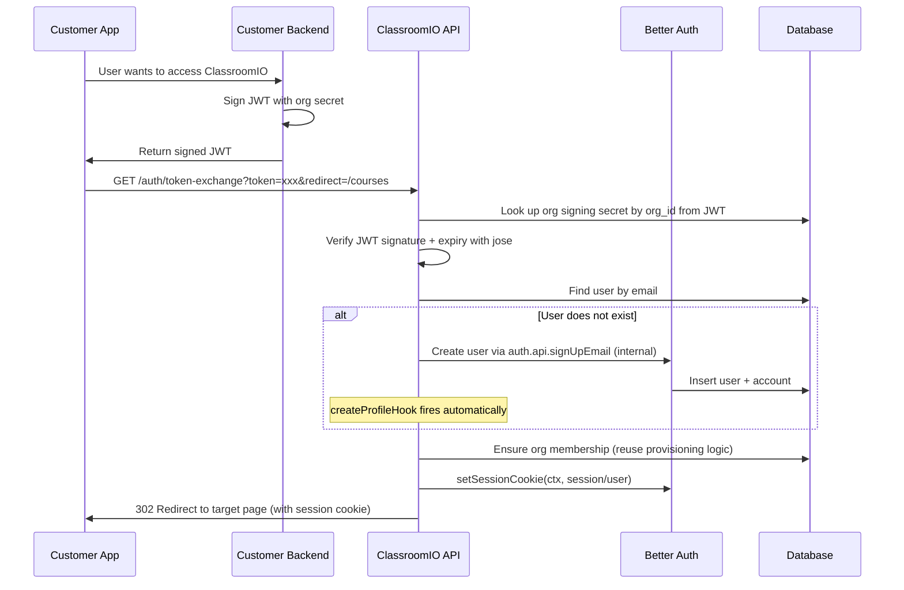

# JWT Token Exchange for Seamless Auto-Login

## Architecture




## Step 1: Database -- Add `organization_token_auth` table

Create a new table rather than overloading `organization_sso_config`, since token exchange is conceptually separate from OIDC SSO and should work independently (an org might want token exchange without configuring Okta/Auth0).

**New table: `organization_token_auth`**

- `id` (uuid, PK)
- `organization_id` (uuid, unique FK to organization, cascade delete)
- `signing_secret` (text, not null) -- HMAC secret for HS256 JWT verification
- `is_active` (boolean, default false)
- `created_by_profile_id` (uuid FK to profile)
- `created_at`, `updated_at` (timestamptz)

Files to change:

- [packages/db/src/schema.ts](packages/db/src/schema.ts) -- add `organizationTokenAuth` table definition after line 1934
- New migration file: `packages/db/src/migrations/0008_add_token_auth_table.sql`
- [packages/db/src/types.ts](packages/db/src/types.ts) -- add inferred types

## Step 2: Database Queries

**Location**: `packages/db/src/queries/organization/token-auth.ts` (per ARCHITECTURE.md Layer 1 pattern)

Create [packages/db/src/queries/organization/token-auth.ts](packages/db/src/queries/organization/token-auth.ts) with pure DB functions -- no business logic, no HTTP calls, no transactions (those belong in the service layer):

- `getTokenAuthByOrgId(orgId)` -- look up signing secret for an org
- `createTokenAuth(data: TNewOrganizationTokenAuth)` -- insert new record, use `.returning()`
- `updateTokenAuth(orgId, data: Partial<TOrganizationTokenAuth>)` -- update fields, use `.returning()`
- `deleteTokenAuth(orgId)` -- remove the record

Every `catch` block must log with function name for traceability: `console.error('getTokenAuthByOrgId error:', error)`.

## Step 3: Validation Schemas

**Location**: `packages/utils/src/validation/organization/token-auth.ts` (per ARCHITECTURE.md -- shared validation in `@cio/utils/validation`, used by both API and frontend)

Create [packages/utils/src/validation/organization/token-auth.ts](packages/utils/src/validation/organization/token-auth.ts):

- `ZTokenExchangeQuery` -- validates the `token` (string, min 1) and optional `redirect` (string) query params
- `ZTokenExchangePayload` -- validates the decoded JWT payload: `sub` (string), `email` (email), `name` (string, optional), `org_id` (uuid), `iat` (number), `exp` (number)

Export `T`* inferred types alongside each schema (`export type TTokenExchangeQuery = z.infer<typeof ZTokenExchangeQuery>`).

## Step 4: Service -- Token Exchange Logic

**Location**: `apps/api/src/services/auth/token-exchange.ts` (per ARCHITECTURE.md Layer 2 -- business logic lives in services, throws `AppError` with error codes and status codes, returns structured data not HTTP responses)

Create [apps/api/src/services/auth/token-exchange.ts](apps/api/src/services/auth/token-exchange.ts):

```typescript
export async function exchangeToken(token: string): Promise<{ user: User; orgId: string; }>
```

This function:

1. Decode JWT **without** verifying to extract `org_id` from payload
2. Look up signing secret via `getTokenAuthByOrgId(orgId)` -- throw `AppError(ErrorCodes.TOKEN_EXCHANGE_ORG_NOT_FOUND, 404)` if not found or `AppError(ErrorCodes.TOKEN_EXCHANGE_NOT_ENABLED, 403)` if inactive
3. Verify JWT with `jose.jwtVerify(token, secret, { algorithms: ['HS256'] })` -- validates signature + expiry
4. Reject tokens older than 5 minutes (`maxTokenAge: '5m'`)
5. Validate payload against `ZTokenExchangePayload`
6. Find existing user by email in the `user` table (Better Auth's table)
7. If no user exists, create one via `auth.api.signUpEmail` with a random password (the user will never use it -- they always come through token exchange). The `createProfileHook` fires automatically and `ssoProvisioningHook` handles org membership
8. If user exists but is not an org member, run the provisioning logic from [packages/db/src/auth/hooks/sso-provisioning.ts](packages/db/src/auth/hooks/sso-provisioning.ts) (extracted into a reusable function that accepts userId + orgId rather than relying on email domain matching)
9. Return the user object and orgId

## Step 5: Provisioning -- Extract Reusable Function

Refactor [packages/db/src/auth/hooks/sso-provisioning.ts](packages/db/src/auth/hooks/sso-provisioning.ts) to extract a reusable `ensureOrgMembership(userId, email, orgId, roleId?)` function that:

- Checks if membership already exists
- If not, checks for pending invite (accept it) or creates membership with default role

The existing `ssoProvisioningHook` continues to call this function (it just adds the domain-lookup step on top). The new token exchange service also calls it directly with the `org_id` from the JWT.

## Step 6: Route -- Public Token Exchange Endpoint

Create [apps/api/src/routes/auth/token-exchange.ts](apps/api/src/routes/auth/token-exchange.ts):

```
GET /auth/token-exchange?token=<jwt>&redirect=<url>
```

This is a **public** endpoint (no `authMiddleware`). Flow:

1. Validate query params with `ZTokenExchangeQuery`
2. Call `exchangeToken(token)` from the service
3. Create a Better Auth session using internal API (see below)
4. Set the session cookie using `setSessionCookie` from `better-auth/cookies`
5. Redirect (302) to the `redirect` param or default to `/`

**Session creation approach** -- Based on the [Better Auth discussion #2125](https://github.com/better-auth/better-auth/discussions/2125), use `setSessionCookie` from `better-auth/cookies` combined with creating the session through Better Auth's internal context. The route will be implemented as a Better Auth plugin endpoint using `createAuthEndpoint` from `better-auth/api` to get access to the auth context needed by `setSessionCookie`.

Register as a Better Auth plugin in [packages/db/src/auth.ts](packages/db/src/auth.ts) (not as a regular Hono route) so it gets the internal context:

```typescript
import { tokenExchange } from './auth/plugins/token-exchange';
// in plugins array:
plugins: [admin(), anonymous(), jwt(), sso({}), tokenExchange()]
```

This means the endpoint lives at `/api/auth/token-exchange` (under Better Auth's route namespace).

## Step 7: Admin Routes -- Secret Management

**Location**: `apps/api/src/routes/organization/token-auth.ts` (per ARCHITECTURE.md Layer 3 -- routes handle HTTP concerns only: validation, auth, serialization)

Create [apps/api/src/routes/organization/token-auth.ts](apps/api/src/routes/organization/token-auth.ts). Routes delegate to the service layer and use `handleError` in catch blocks. Use `authMiddleware` + `orgAdminMiddleware`. Non-null assert `user` (`c.get('user')!`) since `authMiddleware` guarantees it.

- `POST /organization/token-auth` -- generate signing secret (requires admin + enterprise plan). Returns `201` with secret shown once
- `GET /organization/token-auth` -- get token auth status (active/inactive, created date -- **never** returns the full secret, only last 4 chars). Returns `200`
- `POST /organization/token-auth/rotate` -- rotate the secret (returns new secret once). Returns `200`
- `DELETE /organization/token-auth` -- delete token auth config. Returns `200`
- `PUT /organization/token-auth/activate` -- toggle active/inactive. Returns `200`

Create the corresponding service [apps/api/src/services/organization/token-auth.ts](apps/api/src/services/organization/token-auth.ts) for business logic (enterprise plan check, secret generation via `crypto.randomBytes(32).toString('hex')`, conflict checks). Routes must not contain business logic.

Export and register in [apps/api/src/app.ts](apps/api/src/app.ts):

```typescript
.route('/organization/token-auth', organizationTokenAuthRouter)
```

## Step 8: Error Codes

Add to [apps/api/src/utils/errors.ts](apps/api/src/utils/errors.ts):

- `TOKEN_EXCHANGE_INVALID_TOKEN`
- `TOKEN_EXCHANGE_EXPIRED`
- `TOKEN_EXCHANGE_ORG_NOT_FOUND`
- `TOKEN_EXCHANGE_NOT_ENABLED`
- `TOKEN_AUTH_ALREADY_EXISTS`

## Step 9: Frontend -- Request Types

**Location**: `apps/dashboard/src/lib/features/org/utils/types.ts` (per AGENTS.md -- define request types in `{domain}/utils/types.ts` for reusability)

Add request types for all token auth endpoints:

```typescript
export type CreateTokenAuthRequest = (typeof classroomio.organization)['token-auth']['$post'];
export type GetTokenAuthRequest = (typeof classroomio.organization)['token-auth']['$get'];
export type RotateTokenAuthRequest = (typeof classroomio.organization)['token-auth']['rotate']['$post'];
export type DeleteTokenAuthRequest = (typeof classroomio.organization)['token-auth']['$delete'];
export type ActivateTokenAuthRequest = (typeof classroomio.organization)['token-auth']['activate']['$put'];
```

Never import types from `@cio/db/queries` into dashboard code -- infer everything from the RPC client.

## Step 10: Frontend API Class

**Location**: `apps/dashboard/src/lib/features/org/api/token-auth.svelte.ts` (per AGENTS.md -- API class pattern: extends `BaseApiWithErrors`, handles all logic so components are thin)

Create [apps/dashboard/src/lib/features/org/api/token-auth.svelte.ts](apps/dashboard/src/lib/features/org/api/token-auth.svelte.ts):

- Class `TokenAuthApi extends BaseApiWithErrors`
- Reactive state: `tokenAuth = $state<TokenAuthStatus | null>(null)`, `generatedSecret = $state<string | null>(null)`
- Methods using `this.execute<RequestType>()` (never call RPC directly):
  - `getStatus()` -- fetch token auth status
  - `generateSecret()` -- create new config, store returned secret in `generatedSecret`
  - `rotateSecret()` -- rotate, store new secret in `generatedSecret`
  - `deleteTokenAuth()` -- delete config
  - `activateTokenAuth()` -- toggle active

Use Zod client-side validation where applicable. Use `snackbar.success('translation.key')` with translation keys (not raw English strings).

Export singleton: `export const tokenAuthApi = new TokenAuthApi()`

## Step 11: Frontend -- Admin UI Component

**Location**: `apps/dashboard/src/lib/features/settings/pages/token-auth.svelte` (kebab-case per AGENTS.md naming convention)

Create [apps/dashboard/src/lib/features/settings/pages/token-auth.svelte](apps/dashboard/src/lib/features/settings/pages/token-auth.svelte) as a separate settings page (not inlined into sso.svelte -- keeps components focused):

- Import `tokenAuthApi` from `$features/org/api/token-auth.svelte`
- Use `$t('key.path')` for all user-facing text (no hardcoded English in markup)
- Use `t('key.path')` in script blocks, `t.get('key.path')` outside Svelte components
- Use UI components from `@cio/ui`:
  - `@cio/ui/base/button` for actions (Generate, Rotate, Delete)
  - `@cio/ui/base/badge` for active/inactive status
  - `@cio/ui/base/switch` for activate toggle
  - `@cio/ui/base/field` for form layout (`Field.Group`, `Field.Set`, `Field.Legend`, `Field.Description`)
  - Do NOT use native `<input>`, `<label>`, `<textarea>` -- use `@cio/ui` equivalents
- Theme color classes must use `ui:` prefix in dashboard code (e.g. `ui:text-muted-foreground`, `ui:text-primary`)
- Component should be thin -- call API methods, render UI, no business logic
- `UpgradeBanner` for enterprise plan gating (same pattern as sso.svelte)
- Integration Guide section with a code snippet block showing the customer-facing JWT signing example

Create route page at [apps/dashboard/src/routes/org/[slug]/settings/token-auth/+page.svelte](apps/dashboard/src/routes/org/[slug]/settings/token-auth/+page.svelte) as a thin wrapper.

Add navigation entry in [apps/dashboard/src/lib/features/ui/navigation/org-navigation.ts](apps/dashboard/src/lib/features/ui/navigation/org-navigation.ts) and register the page in [apps/dashboard/src/lib/features/settings/pages/index.ts](apps/dashboard/src/lib/features/settings/pages/index.ts).

## Step 12: Translations

Add keys to [apps/dashboard/src/lib/utils/translations/en.json](apps/dashboard/src/lib/utils/translations/en.json) for all UI strings in the token auth section. All user-facing copy must go through translations -- snackbar messages use keys directly (e.g. `snackbar.success('snackbar.token_auth.created')`).

## Step 12: Build and Verify

Run `pnpm --filter @cio/api build` to verify types compile. Run the migration against a dev database.

## Dependencies

- `jose` npm package -- for JWT verification. Check if already installed; if not, add to `apps/api` or `packages/db`.

## Security Considerations

- Tokens must be short-lived (max 5 minutes, recommend 60 seconds)
- Signing secrets are 256-bit random hex strings
- HMAC-SHA256 (HS256) is used -- simple symmetric signing, appropriate for server-to-server where both parties share the secret
- The secret is shown to the admin exactly once on generation/rotation
- Rate limiting on the `/auth/token-exchange` endpoint (already covered by the global rate limiter, but consider stricter limits)
- Enterprise plan gating on secret generation (same as SSO)

