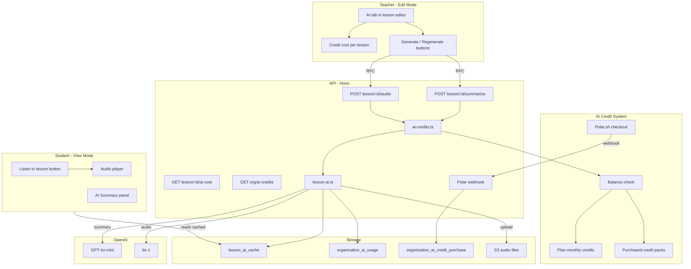

# Lesson AI Features: Listen to Lesson and Summarize

## Architecture



## Credit System Design

### Credit Costs

| Action | Credits | Approx. OpenAI cost |
|--------|---------|---------------------|
| Generate summary | 1 | ~$0.0003 |
| Generate TTS audio | 5 | ~$0.05-0.08 |
| Regenerate (same costs) | same | same |

### Per-Plan Monthly AI Credits

| Plan | Monthly AI Credits |
|------|-------------------|
| BASIC (Free) | 5 |
| EARLY_ADOPTER | 50 |
| ENTERPRISE | 500 |

### Purchased Credits

- One-time credit packs via Polar.sh (e.g., 50 credits, 200 credits)
- Purchased credits never expire
- Plan credits are consumed first each month; purchased credits are used only when plan credits run out
- New Polar products need to be created for credit packs

### Balance Computation

```
planCreditsRemaining = planMonthlyLimit - SUM(ai_usage WHERE source='plan' AND this billing month)
purchasedCreditsRemaining = SUM(ai_credit_purchase.credits) - SUM(ai_usage WHERE source='purchased')
totalAvailable = planCreditsRemaining + purchasedCreditsRemaining
```

When consuming credits: deduct from plan credits first. If plan credits are exhausted, deduct from purchased pool. The `source` column on `organization_ai_usage` tracks which pool was charged.

---

## Phase 1: Backend Infrastructure

### 1a. OpenAI dependency and env config

- Install `openai` (latest) in [apps/api/package.json](apps/api/package.json)
- Add `OPENAI_API_KEY` (optional string) to the Zod env schema in [apps/api/src/config/env.ts](apps/api/src/config/env.ts)

### 1b. Database tables

Add to [packages/db/src/schema.ts](packages/db/src/schema.ts) and generate a migration.

**Enum:**

```typescript
export const lessonAiFeatureType = pgEnum('LESSON_AI_FEATURE_TYPE', ['summary', 'audio']);
export const aiCreditSource = pgEnum('AI_CREDIT_SOURCE', ['plan', 'purchased']);
```

**`lesson_ai_cache`** -- stores generated summaries and audio per lesson+locale:

```typescript
export const lessonAiCache = pgTable('lesson_ai_cache', {
  id: uuid().default(sql`gen_random_uuid()`).primaryKey().notNull(),
  lessonId: uuid('lesson_id').notNull().references(() => lesson.id, { onDelete: 'cascade' }),
  locale: locale().default('en').notNull(),
  featureType: lessonAiFeatureType('feature_type').notNull(),
  content: text(),                              // markdown summary
  audioAssetKey: text('audio_asset_key'),        // S3 key for TTS audio
  contentHash: text('content_hash').notNull(),   // hash of source lesson HTML
  createdAt: timestamp('created_at', { withTimezone: true, mode: 'string' }).defaultNow(),
  updatedAt: timestamp('updated_at', { withTimezone: true, mode: 'string' }).defaultNow(),
}, (table) => [
  unique('unique_lesson_locale_feature').on(table.lessonId, table.locale, table.featureType)
]);
```

**`organization_ai_usage`** -- tracks each AI generation event:

```typescript
export const organizationAiUsage = pgTable('organization_ai_usage', {
  id: uuid().default(sql`gen_random_uuid()`).primaryKey().notNull(),
  organizationId: uuid('organization_id').notNull().references(() => organization.id),
  lessonId: uuid('lesson_id').notNull().references(() => lesson.id, { onDelete: 'cascade' }),
  featureType: lessonAiFeatureType('feature_type').notNull(),
  creditsConsumed: integer('credits_consumed').default(0).notNull(),
  source: aiCreditSource('source').notNull(),    // 'plan' or 'purchased'
  metadata: jsonb('metadata').default({}).$type<Record<string, unknown>>().notNull(),
  createdAt: timestamp('created_at', { withTimezone: true, mode: 'string' })
    .default(sql`timezone('utc'::text, now())`).notNull()
}, (table) => [
  index('idx_org_ai_usage_org_created').on(table.organizationId, table.createdAt)
]);
```

**`organization_ai_credit_purchase`** -- tracks Polar credit pack purchases:

```typescript
export const organizationAiCreditPurchase = pgTable('organization_ai_credit_purchase', {
  id: uuid().default(sql`gen_random_uuid()`).primaryKey().notNull(),
  organizationId: uuid('organization_id').notNull().references(() => organization.id),
  credits: integer('credits').notNull(),
  polarOrderId: text('polar_order_id'),
  metadata: jsonb('metadata').default({}).$type<Record<string, unknown>>().notNull(),
  createdAt: timestamp('created_at', { withTimezone: true, mode: 'string' })
    .default(sql`timezone('utc'::text, now())`).notNull()
});
```

### 1c. Database queries

New file: `packages/db/src/queries/organization/ai-credits.ts`

- `getAiCreditsUsedThisMonth(orgId, source)` -- SUM of `credits_consumed` from `organization_ai_usage` WHERE `source='plan'` AND `createdAt >= billingPeriodStart`
- `getTotalPurchasedCredits(orgId)` -- SUM of `credits` from `organization_ai_credit_purchase`
- `getTotalPurchasedCreditsUsed(orgId)` -- SUM of `credits_consumed` from `organization_ai_usage` WHERE `source='purchased'`
- `recordAiUsage(data)` -- insert into `organization_ai_usage`
- `recordAiCreditPurchase(data)` -- insert into `organization_ai_credit_purchase`

New file: `packages/db/src/queries/lesson/ai-cache.ts`

- `getLessonAiCache(lessonId, locale, featureType)` -- get cached entry
- `upsertLessonAiCache(data)` -- insert or update on conflict

### 1d. AI credit constants

New file: [packages/utils/src/plans/ai-credits.ts](packages/utils/src/plans/ai-credits.ts)

```typescript
export const AI_FEATURE_CREDIT_COST = {
  summary: 1,
  audio: 5,
} as const;

export const AI_CREDITS_BY_PLAN: Record<string, { monthlyCredits: number }> = {
  [PLAN.BASIC]: { monthlyCredits: 5 },
  [PLAN.EARLY_ADOPTER]: { monthlyCredits: 50 },
  [PLAN.ENTERPRISE]: { monthlyCredits: 500 },
};
```

Re-export from `packages/utils/src/plans/index.ts`.

### 1e. Error codes

Add to [packages/utils/src/constants/error-codes.ts](packages/utils/src/constants/error-codes.ts):

```typescript
AI_CREDITS_EXHAUSTED: 'AI_CREDITS_EXHAUSTED',
AI_FEATURE_UNAVAILABLE: 'AI_FEATURE_UNAVAILABLE',
AI_GENERATION_FAILED: 'AI_GENERATION_FAILED',
```

### 1f. AI credit service

New file: `apps/api/src/services/organization/ai-credits.ts`

- `getAiCreditBalance(orgId)` -- computes `planCreditsRemaining`, `purchasedCreditsRemaining`, `totalAvailable`, `monthlyLimit`, and returns the full balance object
- `assertAiCreditsAvailable(orgId, featureType)` -- checks totalAvailable >= cost, throws `AI_CREDITS_EXHAUSTED` (429) if insufficient
- `deductAiCredits(orgId, lessonId, featureType)` -- determines source (plan first, then purchased), inserts usage row
- `addPurchasedCredits(orgId, credits, polarOrderId)` -- inserts into `organization_ai_credit_purchase`

### 1g. Lesson AI service

New file: `apps/api/src/services/lesson/lesson-ai.ts`

**`summarizeLesson(lessonId, locale, orgId)`**
1. Fetch lesson content from `lesson_language` for locale
2. Strip HTML to plain text, compute content hash
3. Check `lesson_ai_cache` -- if hash matches, return cached summary
4. Call `assertAiCreditsAvailable(orgId, 'summary')`
5. Call OpenAI Chat Completions (`gpt-4o-mini`) with summarization prompt
6. Upsert `lesson_ai_cache` with summary + hash
7. Call `deductAiCredits(orgId, lessonId, 'summary')`
8. Return summary

**`generateLessonAudio(lessonId, locale, orgId)`**
1. Fetch lesson content, strip HTML, compute hash
2. Check cache -- if hash matches and audio key exists, return presigned URL
3. Call `assertAiCreditsAvailable(orgId, 'audio')`
4. Chunk text into segments under 4096 chars
5. Call OpenAI TTS (`tts-1`, voice `alloy`) for each chunk
6. Concatenate audio buffers, upload to S3
7. Upsert cache with audio key + hash
8. Call `deductAiCredits(orgId, lessonId, 'audio')`
9. Return presigned URL

**`estimateLessonAiCost(lessonId, locale)`**
1. Fetch lesson content, check what's already cached
2. Return `{ summaryCost, audioCost, totalCost, isStale }` -- 0 if already cached and fresh

**`getLessonAiStatus(lessonId, locale)`**
1. Check cache for both summary and audio
2. Return `{ hasSummary, hasAudio, isSummaryStale, isAudioStale, summary?, audioUrl? }`

Shared util: `stripHtmlToText(html)` using regex or a lightweight lib.

### 1h. API routes

**Extend lesson router** in [apps/api/src/routes/course/lesson.ts](apps/api/src/routes/course/lesson.ts):

- `POST /:lessonId/summarize` -- auth + courseMember, role 1/2 only (teacher/admin), calls `summarizeLesson`
- `POST /:lessonId/audio` -- auth + courseMember, role 1/2 only, calls `generateLessonAudio`
- `GET /:lessonId/ai-status` -- auth + courseMember, calls `getLessonAiStatus` (used by both edit and view mode)
- `GET /:lessonId/ai-cost` -- auth + courseMember, role 1/2 only, calls `estimateLessonAiCost`

**New org AI credit routes** (add to [apps/api/src/routes/organization/organization.ts](apps/api/src/routes/organization/organization.ts) or a new `ai-credits` sub-router):

- `GET /ai-credits` -- auth, returns `getAiCreditBalance(orgId)`

### 1i. Validation schemas

Add to `packages/utils/src/validation/lesson/`:

- `ZLessonAiParam` -- `{ lessonId: z.string().uuid() }`
- `ZLessonAiQuery` -- `{ locale: z.enum([...]).optional().default('en') }`

---

## Phase 2: Polar Credit Purchases

### 2a. Create Polar products

Create credit pack products in Polar dashboard (not code -- manual setup):
- "50 AI Credits" -- one-time purchase
- "200 AI Credits" -- one-time purchase

### 2b. Credit pack constants

Add product IDs to [packages/utils/src/plans/ai-credits.ts](packages/utils/src/plans/ai-credits.ts):

```typescript
export const AI_CREDIT_PACKS = {
  SMALL: { credits: 50, productId: '<polar-product-id>' },
  LARGE: { credits: 200, productId: '<polar-product-id>' },
};
```

### 2c. Polar webhook extension

Extend [apps/dashboard/src/routes/api/polar/webhook/+server.ts](apps/dashboard/src/routes/api/polar/webhook/+server.ts):

- Add a new `order.created` (or `checkout.updated` with `status === 'succeeded'`) handler
- Match product ID against `AI_CREDIT_PACKS` to determine credits
- Call a new API route to add credits: `POST /organization/ai-credits/purchase`
- That route calls `addPurchasedCredits(orgId, credits, polarOrderId)`

### 2d. Checkout flow

Reuse the existing Polar checkout pattern from [apps/dashboard/src/routes/api/polar/subscribe/+server.ts](apps/dashboard/src/routes/api/polar/subscribe/+server.ts) -- create a similar `GET /api/polar/ai-credits` endpoint that creates a one-time checkout (not subscription) with `metadata: { orgId, type: 'ai-credits', credits: N }`.

---

## Phase 3: Frontend -- Teacher Edit Mode

### 3a. Types

Add to [apps/dashboard/src/lib/features/course/utils/types.ts](apps/dashboard/src/lib/features/course/utils/types.ts):

```typescript
export type SummarizeLessonRequest = typeof classroomio.course[':courseId'].lesson[':lessonId'].summarize.$post;
export type GenerateLessonAudioRequest = typeof classroomio.course[':courseId'].lesson[':lessonId'].audio.$post;
export type GetLessonAiStatusRequest = typeof classroomio.course[':courseId'].lesson[':lessonId']['ai-status']['$get'];
export type GetLessonAiCostRequest = typeof classroomio.course[':courseId'].lesson[':lessonId']['ai-cost']['$get'];
```

### 3b. LessonApi extensions

Add to [apps/dashboard/src/lib/features/course/api/lesson.svelte.ts](apps/dashboard/src/lib/features/course/api/lesson.svelte.ts):

- State: `aiStatus`, `aiCost`, `isSummarizing`, `isGeneratingAudio`
- Methods: `getAiStatus(courseId, lessonId, locale)`, `getAiCost(courseId, lessonId, locale)`, `summarize(courseId, lessonId, locale)`, `generateAudio(courseId, lessonId, locale)`

### 3c. AI credit API class

New file: `apps/dashboard/src/lib/features/course/api/ai-credits.svelte.ts`

- State: `balance` (plan remaining, purchased remaining, total)
- Methods: `getBalance()`, `purchaseCredits(packId)` (redirects to Polar checkout)

### 3d. Lesson AI tab (edit mode)

New component: `apps/dashboard/src/lib/features/course/components/lesson/ai/ai-tab.svelte`

This is a new tab (value `5`) added to the lesson edit tabs in [constants.ts](apps/dashboard/src/lib/features/course/components/lesson/constants.ts) alongside Note, Slide, Video, Document. Uses a sparkle/wand icon.

Layout:
- **Credit balance bar** at top: "AI Credits: 42 remaining (plan: 35, purchased: 7)" with a "Buy more" link to settings
- **Summary section:**
  - Status: "Not generated" / "Generated" / "Stale (content changed)"
  - "Generate Summary" button showing cost (e.g., "1 credit")
  - If generated: preview of the summary text, "Regenerate" button
- **Audio section:**
  - Status: same pattern
  - "Generate Audio" button showing cost (e.g., "5 credits")
  - If generated: inline audio player, "Regenerate" button
  - If stale: warning that content has changed since last generation

### 3e. Integrate AI tab

In [lesson.svelte](apps/dashboard/src/lib/features/course/pages/lesson.svelte):
- Add AI tab to the `UnderlineTabs` in edit mode
- Load `aiStatus` and `aiCost` when entering the AI tab (lazy load)
- Load `aiCredits.balance` when entering the AI tab

In [constants.ts](apps/dashboard/src/lib/features/course/components/lesson/constants.ts):
- Add `{ label: 'course.navItem.lessons.materials.tabs.ai.title', icon: SparklesIcon, value: 5, badgeValue: 0 }`

---

## Phase 4: Frontend -- Student View Mode

### 4a. Student toolbar

New component: `apps/dashboard/src/lib/features/course/components/lesson/ai/lesson-ai-toolbar.svelte`

Placed in the lesson view mode block in [lesson.svelte](apps/dashboard/src/lib/features/course/pages/lesson.svelte), between the note content and the Comments section. Shown only when `aiStatus` has generated content.

- **"Listen to lesson"** button (headphones icon, dark bg) -- shown only when `aiStatus.hasAudio` is true. Toggles an inline audio player.
- **"Summarize"** button (zap icon, outline) -- shown only when `aiStatus.hasSummary` is true. Toggles the summary panel below.

### 4b. Audio player

New component: `apps/dashboard/src/lib/features/course/components/lesson/ai/lesson-audio-player.svelte`

- Native `<audio>` with custom play/pause/progress controls
- Receives `audioUrl` from `lessonApi.aiStatus`

### 4c. Summary panel

New component: `apps/dashboard/src/lib/features/course/components/lesson/ai/lesson-summary-panel.svelte`

- Styled card matching the screenshot: rounded corners, "AI SUMMARY" heading in gold/amber, bullet-point list
- Renders markdown bullet points from the cached summary
- Collapsible (toggled by the Summarize button)

### 4d. Auto-load AI status

In [lesson.svelte](apps/dashboard/src/lib/features/course/pages/lesson.svelte), when in view mode and lesson is loaded, call `lessonApi.getAiStatus(courseId, lessonId, locale)` to determine which buttons to show.

---

## Phase 5: Settings -- AI Credits Management

### 5a. AI credits settings section

Either add a section to the existing billing page at [billing.svelte](apps/dashboard/src/lib/features/settings/pages/billing.svelte), or create a new settings tab. Shows:

- Current AI credit balance (plan + purchased breakdown)
- Monthly plan allowance and usage bar
- "Buy Credits" section with credit pack cards (50 / 200) linking to Polar checkout
- Usage history (recent AI generations with lesson name, type, credits, date)

---

## Phase 6: Translations and Polish

Add keys to [en.json](apps/dashboard/src/lib/utils/translations/en.json):

- `course.navItem.lessons.materials.tabs.ai.title` -- "AI"
- `course.navItem.lessons.ai.summary_status_*` -- not generated / generated / stale
- `course.navItem.lessons.ai.audio_status_*` -- same
- `course.navItem.lessons.ai.generate_summary` -- "Generate Summary"
- `course.navItem.lessons.ai.generate_audio` -- "Generate Audio"
- `course.navItem.lessons.ai.regenerate` -- "Regenerate"
- `course.navItem.lessons.ai.credits_remaining` -- "{count} credits remaining"
- `course.navItem.lessons.ai.buy_more` -- "Buy more credits"
- `course.navItem.lessons.ai.credit_cost` -- "{count} credit(s)"
- `course.navItem.lessons.ai.content_stale` -- "Content has changed since last generation"
- `course.navItem.lessons.ai.listen_to_lesson` -- "Listen to lesson"
- `course.navItem.lessons.ai.summarize` -- "Summarize"
- `course.navItem.lessons.ai.summary_heading` -- "AI Summary"
- `settings.billing.ai_credits.*` -- balance, purchase, usage history strings

---

## Key Files to Modify

**New files:**
- `packages/utils/src/plans/ai-credits.ts`
- `packages/db/src/queries/organization/ai-credits.ts`
- `packages/db/src/queries/lesson/ai-cache.ts`
- `apps/api/src/services/organization/ai-credits.ts`
- `apps/api/src/services/lesson/lesson-ai.ts`
- `apps/dashboard/src/lib/features/course/api/ai-credits.svelte.ts`
- `apps/dashboard/src/lib/features/course/components/lesson/ai/ai-tab.svelte`
- `apps/dashboard/src/lib/features/course/components/lesson/ai/lesson-ai-toolbar.svelte`
- `apps/dashboard/src/lib/features/course/components/lesson/ai/lesson-audio-player.svelte`
- `apps/dashboard/src/lib/features/course/components/lesson/ai/lesson-summary-panel.svelte`

**Modified files:**
- `packages/db/src/schema.ts` -- 3 new tables, 2 new enums
- `packages/utils/src/constants/error-codes.ts` -- new error codes
- `packages/utils/src/plans/index.ts` -- re-export ai-credits
- `apps/api/src/config/env.ts` -- OPENAI_API_KEY
- `apps/api/src/routes/course/lesson.ts` -- 4 new routes
- `apps/api/src/routes/organization/organization.ts` -- AI credit balance route
- `apps/dashboard/src/routes/api/polar/webhook/+server.ts` -- credit purchase handler
- `apps/dashboard/src/lib/features/course/pages/lesson.svelte` -- AI tab + student toolbar
- `apps/dashboard/src/lib/features/course/components/lesson/constants.ts` -- new tab entry
- `apps/dashboard/src/lib/features/course/components/lesson/index.ts` -- new exports
- `apps/dashboard/src/lib/features/course/api/lesson.svelte.ts` -- AI methods
- `apps/dashboard/src/lib/features/course/utils/types.ts` -- new request types
- `apps/dashboard/src/lib/utils/translations/en.json` -- new keys
