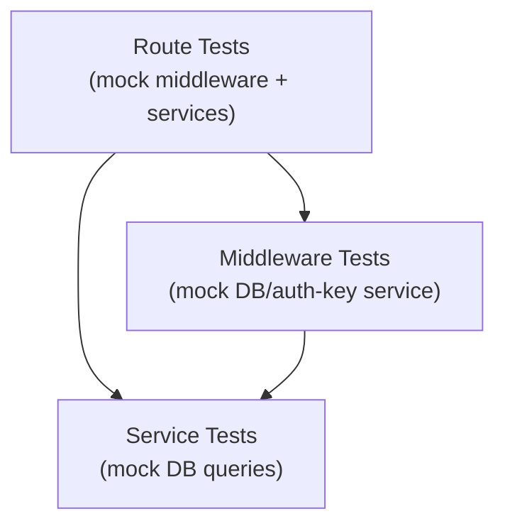

# Public API Test Suite

## Architecture

Three layers of tests, each mocking only the layer below it.




## Coverage vs codebase (audit)

In this repository, **public API** means the org automation key surface at `/public-api/v1` ([apps/api/src/app.ts](apps/api/src/app.ts)). Nothing else is mounted there; [apps/api/src/routes/v1/index.ts](apps/api/src/routes/v1/index.ts) only wires `/audience` and `/courses`. Other Hono routes (for example `/organization`, `/course`) use session or dashboard flows and are out of scope for this plan.

Full endpoint inventory the plan must exercise (paths relative to `/public-api/v1`):

- `GET /courses`, `POST /courses`
- `GET /courses/:courseId/students`, `GET /courses/:courseId/export`, `GET /courses/:courseId/structure`, `PUT /courses/:courseId/structure`
- `GET /courses/:courseId`, `PUT /courses/:courseId`, `DELETE /courses/:courseId`
- `GET /audience`, `POST /audience`, `POST /audience/assign-courses`
- `GET /audience/:memberId`, `PUT /audience/:memberId`, `DELETE /audience/:memberId`

Validation for these lives under [packages/utils/src/validation/public-api/](packages/utils/src/validation/public-api/) (`course.ts`, `audience.ts` only). If new routers are added under `v1/`, extend this inventory and add matching test files.

## Auth, API keys, and middleware enforcement

Public endpoints must never rely on “trust the client.” Tests must prove the following, aligned with [apps/api/src/middlewares/automation-key.ts](apps/api/src/middlewares/automation-key.ts) and [apps/api/src/middlewares/automation-key-scopes.ts](apps/api/src/middlewares/automation-key-scopes.ts).

**Bearer and API key validation (`automationKeyMiddleware`)**

- Missing `Authorization` → **401**, body `success: false`, stable `code` (e.g. `UNAUTHORIZED`).
- Header present but not `Bearer <token>` → **401** (same shape).
- Empty or whitespace-only token after `Bearer` → **401** (authenticate fails).
- `authenticateOrganizationApiKeyService` throws (invalid / unknown key) → **401**, message surfaced from middleware catch path.
- Successful auth → `c.set('orgId', …)`, `c.set('actorId', …)`, `c.set('automationKey', …)`; assert `touchOrganizationApiKeyLastUsedService` is invoked with the resolved key (proves real keys go through the “touch” path). Expiry is enforced inside `authenticateOrganizationApiKeyService` ([apps/api/src/services/organization/automation-key.ts](apps/api/src/services/organization/automation-key.ts)) — add a mock case where the service throws for an expired key and expect **401**.

**Scope enforcement (`automationKeyScopesMiddleware(['public_api:*'])`)**

- No `automationKey` in context (simulating a bug or bypass) → **401**.
- Key present but `scopes` omit `public_api:*` (e.g. only MCP scopes) → **403**, body includes `code: FORBIDDEN` and a clear error string.
- Key includes `public_api:*` → `next()` runs and the handler can execute.

**Full chain (no mocked middleware on the router)**

Route files that mock middleware cannot prove enforcement by themselves. Add **[apps/api/src/routes/v1/__tests__/public-api-auth-chain.test.ts](apps/api/src/routes/v1/__tests__/public-api-auth-chain.test.ts)**:

- Build a small Hono app that mounts a real v1 router (e.g. `v1CoursesRouter` under `/courses`) with **unmocked** `automationKeyMiddleware` and `automationKeyScopesMiddleware`.
- Mock only `@api/services/organization/automation-key` (`authenticateOrganizationApiKeyService`, `touchOrganizationApiKeyLastUsedService`) and the v1 service module.
- Cases: no `Authorization` → 401; `Bearer` + key that authenticates to a record **without** `public_api:*` → 403; `Bearer` + key with `public_api:*` → 200 and JSON matches the mocked service return (see next section).
- Optionally repeat one path on `v1AudienceRouter` so audience is covered by the same guarantees.

**Service-level actor rules**

Several handlers require `actorId` from the key’s `createdByProfileId`. With middleware mocked to `actorId: null`, assert **401** and `AppError` / `handleError` shape for: `POST /courses`, `PUT /courses/:courseId/structure`, `POST /audience`, `PUT /audience/:memberId`. This documents that automation keys without a creator profile cannot perform those mutations.

## Response contracts (data must match expectations)

Do not only assert HTTP status. Parse `await response.json()` and validate **shape and values**.

**Success responses**

- Every happy path: `expect(body.success).toBe(true)`.
- `GET/POST` course list/detail: `data` must **deep-equal** (or `toMatchObject` with explicit fields) the object/array returned by the mocked service — proves the handler forwards the service result, not an accidental empty object or wrong key.
- `GET /audience`: assert `data`, `pagination`, and `query` exist and match the mocked `listAudienceService` return (same values the service produced).
- `POST` create paths: assert **201** where applicable and `data` matches the created entity mock.
- Where services return nested structures (course export / structure), assert at least stable top-level keys and one nested field so refactors do not silently change the contract.

**Error responses**

- Middleware errors: `success: false`, string `error`, string `code` — match actual payloads from middleware (401/403).
- `handleError` / `AppError` paths: `success: false`, `error` message, `code` matching `ErrorCodes.*`, optional `field` when the route sets it. Assert status equals `AppError.statusCode` (404, 401, etc.).
- Validation failures (Zod / hono-openapi): assert **4xx** and that the body documents validation failure in the form the stack returns (status + JSON); do not hand-wave as “400” without reading the response.

**Service unit tests**

- When a function maps or merges arguments (e.g. `createPublicApiCourseService` adds `organizationId`), assert the **exact** arguments passed into the downstream mock (`toHaveBeenCalledWith`).

## Files to Change

### 1. `[apps/api/vitest.config.ts](apps/api/vitest.config.ts)`

Add `resolve.alias` so Vitest resolves `@api/*` without needing `tsc-alias` at runtime:

```ts
import { resolve } from 'path';

export default defineConfig({
  resolve: { alias: { '@api': resolve(__dirname, 'src') } },
  test: { globals: true, environment: 'node', ... }
});
```

(`@cio/*` packages already resolve from `node_modules` at test time.)

### 2. Route tests (mocked middleware — fast handler + validation coverage)

These files focus on **validators**, **handler wiring**, and **error mapping** with middleware stubbed so `orgId` / `actorId` are deterministic.

`**[apps/api/src/routes/v1/__tests__/courses.test.ts](apps/api/src/routes/v1/__tests__/courses.test.ts)**`

- `vi.mock` both middleware modules to inject `orgId`/`actorId` and call `next()`.
- `vi.mock('@api/services/v1/course')` — all service functions as `vi.fn()`.
- One `describe` block per endpoint. For **each** success case: set the mock return to a **concrete** object/array, perform the request, `const body = await res.json()`, then `expect(body).toEqual({ success: true, data: … })` (or `toMatchObject` only where the payload is huge and you document which fields are guaranteed).
- Cases (plus response assertions as above):
  - `GET /` — 200; service throws `AppError` → assert status + `{ success: false, code, error }`
  - `POST /` — 201 + body matches mock; invalid body → validation status + body; middleware mock with `actorId` undefined/null → 401 + error contract
  - `GET /:courseId` — 200 + `data` equals `getCourseService` mock; non-UUID param → 4xx; `AppError` 404 → 404 + `COURSE_NOT_FOUND` (or whatever the service throws)
  - `PUT /:courseId`, `DELETE /:courseId` — same pattern
  - `GET …/students`, `export`, `structure` — 200 + `data` equals mock; structure route shares export service — assert same mock used if both tested
  - `PUT …/structure` — 200 + merged result shape; no `actorId` → 401; invalid JSON → validation error
- Use `v1CoursesRouter.request('/path', { headers, body })`.

`**[apps/api/src/routes/v1/__tests__/audience.test.ts](apps/api/src/routes/v1/__tests__/audience.test.ts)**`

- Same middleware mocks as courses; mock `@api/services/v1/audience`.
- Assert full list payload: `success`, `data`, `pagination`, `query` **equal** mocked `listAudienceService` output fields.
- Other endpoints: same success/error JSON rules as courses.

### 2b. Auth chain tests (real middleware)

`**[apps/api/src/routes/v1/__tests__/public-api-auth-chain.test.ts](apps/api/src/routes/v1/__tests__/public-api-auth-chain.test.ts)**`

- Do **not** mock `automationKeyMiddleware` / `automationKeyScopesMiddleware`.
- Mock `authenticateOrganizationApiKeyService` to return a full key-shaped object (`organizationId`, `createdByProfileId`, `scopes`, `id`, etc. — whatever the middleware reads).
- Mount router under a prefix so paths match production (`/courses` + `GET /` → list).
- Prove **401** without header, **403** when `scopes` is `[]` or MCP-only, **200** when `scopes` includes `public_api:*` and `data` matches mocked `listCoursesService` (or one audience list call).

### 3. Middleware tests

`**[apps/api/src/middlewares/__tests__/automation-key.test.ts](apps/api/src/middlewares/__tests__/automation-key.test.ts)**`

- `vi.mock('@api/services/organization/automation-key')` — mock `authenticateOrganizationApiKeyService` and `touchOrganizationApiKeyLastUsedService`.
- Create a minimal Hono app that mounts the real `automationKeyMiddleware` + a `GET /` handler that returns context values.
- Cases (each: `await res.json()` and assert `success`, `code`, `error` where applicable):
  - No `Authorization` header → 401 + `success: false` + `code: UNAUTHORIZED`
  - Header not `Bearer …` → 401 + same JSON shape
  - `authenticateOrganizationApiKeyService` throws (invalid or expired key; service throws before returning) → 401 + body matches middleware catch behavior
  - Valid key → 200; response reflects `orgId`, `actorId`, `automationKey` from context (echo in test handler)
  - `touchOrganizationApiKeyLastUsedService` called exactly once with the authenticated key

`**[apps/api/src/middlewares/__tests__/automation-key-scopes.test.ts](apps/api/src/middlewares/__tests__/automation-key-scopes.test.ts)**`

- No DB mocking needed; test `organizationApiKeyHasScopes` logic via the scope middleware itself.
- Cases (parse JSON on 401/403):
  - `automationKey` not set in context → 401 + `success: false`
  - Key with `scopes: []` or without `public_api:*` → 403 + `code: FORBIDDEN` + error message string
  - Key with `public_api:*` → handler runs; response body proves `next()` was reached

### 4. Service unit tests

For every exported function, assert **return value** equals the expected object (or key fields) after the mocked dependency returns — not only “did not throw.” Use `expect(fn).toHaveBeenCalledWith(...)` for argument contracts.

`**[apps/api/src/services/v1/__tests__/course.test.ts](apps/api/src/services/v1/__tests__/course.test.ts)**`

Mock: `@cio/db/queries/tag` (`getCourseOrganizationId`), `@api/services/organization` (`getOrganizationCourses`), `@api/services/course/course` (`getCourse`, `updateCourse`, `deleteCourse`, `createCourse`), `@api/services/course/people` (`listCourseMembers`), course-import services.

- `assertCourseBelongsToOrg` helper: course not found → throws `AppError(404, COURSE_NOT_FOUND)`; org mismatch → same
- `listCoursesService` — returns `items` from `getOrganizationCourses`
- `getCourseService` — happy path; unauthorized org
- `listCourseStudentsService` — filters by `ROLE.STUDENT`
- `exportCourseService` — delegates to `getCourseImportStructureService`
- `createPublicApiCourseService` — no `actorId` → 401; calls `createCourse` with `organizationId` merged in
- `updatePublicApiCourseService` — calls `updateCourseService`
- `deletePublicApiCourseService` — calls `deleteCourseService`
- `updatePublicApiCourseStructureService` — no `actorId` → 401; creates draft then publishes

`**[apps/api/src/services/v1/__tests__/audience.test.ts](apps/api/src/services/v1/__tests__/audience.test.ts)**`

Mock: `@api/services/organization` (`getOrgAudience`, `getOrgAudienceMember`, `removeAudienceMember`), `@api/services/organization/audience` (`assignAudienceToCourses`, `importAudienceMembers`, `updatePendingAudienceMemberEmail`).

- `listAudienceService` — delegates to `getOrgAudience`
- `createAudienceService` — no `actorId` → 401; maps payload fields correctly
- `getAudienceMemberService` — passes through
- `assignAudienceCoursesService` — passes through
- `removeAudienceService` — passes through; `actorId` null defaults to `undefined`
- `updateAudienceService` — no `actorId` → 401; calls update then re-fetches member

## Total: 8 new files, 1 updated file

