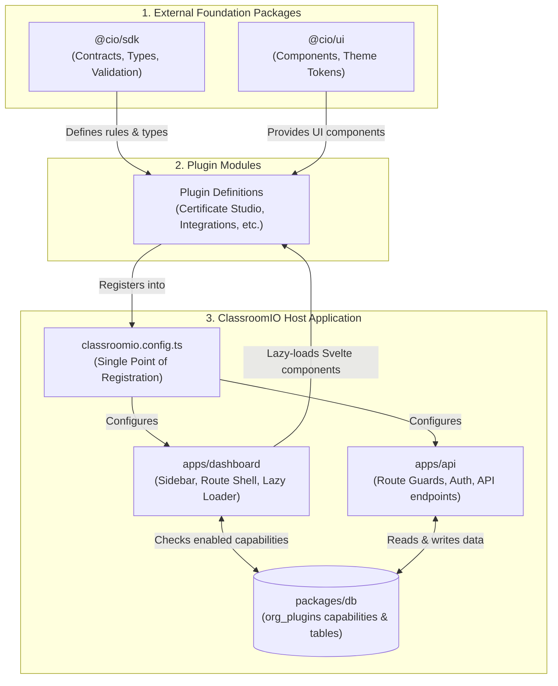
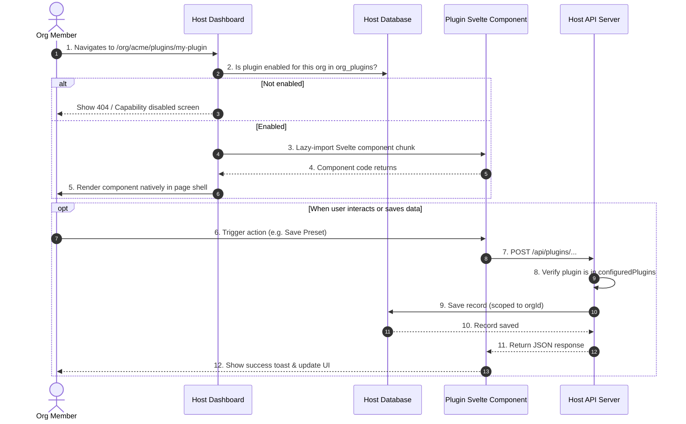

# ClassroomIO Plugin System — Architecture & Guide

---

## Part 1: Answers to Key Questions

### 1. What is an external package (like our SDK and UI packages)?

External packages are **independent, headless foundation libraries** that contain no database logic, no server routes, and no app-specific state. They provide the rules, types, and visual building blocks for building plugins:

* **`@cio/sdk` (`packages/sdk`) — The Rules, Types & Contracts:**
  * Contains helper functions like `definePlugin()` and `defineConfig()`.
  * Defines TypeScript interfaces (`PluginDefinition`, `PluginNavDefinition`, `SlotName`) and Zod validation schemas.
  * Contains resolution logic such as `resolveDynamicPluginNav()` which filters plugin navigation against active organization capabilities.
  * **Completely headless:** It has zero dependencies on SvelteKit or PostgreSQL. Anyone (internal team or third-party developers) can install it in an isolated repository or npm package to create plugins independently.
* **`@cio/ui` (`packages/ui`) — The Design System:**
  * Contains reusable visual components (`Button`, `Card`, `Dialog`, `Input`, `Table`, `Select`, `Dropdown`).
  * Provides CSS design tokens (themes, custom brand colors, border radiuses, dark mode).
  * Enforces the `ui:` Tailwind prefix so plugin styles never collide with host styles.
  * **Why it matters:** Plugins render natively inside the DOM (no slow, isolated `<iframe>`s). Using `@cio/ui` guarantees that plugin interfaces automatically inherit the active organization's theme, typography, and light/dark theme.

---

### 2. What is tied to our app (our host runtime)?

These are the parts that **belong to ClassroomIO itself** and manage security, execution, routing, and data persistence:

* **`classroomio.config.ts` (Central Configuration):**
  * The single configuration file for a deployment.
  * It imports `configuredPlugins` from `plugins/index.ts` and configures the instance's theme, layout, and active extensions.
* **`apps/dashboard` (Host Frontend):**
  * Houses the SvelteKit app shell (navigation bar, layout, user session, active organization context).
  * Houses the **dynamic catch-all route** ([`/org/[slug]/plugins/[pluginId]/...`](file:///c:/Users/c/Desktop/classroom.io/apps/dashboard/src/routes/(app)/org/[slug]/plugins/[pluginId]/+page.svelte)). When a user visits a plugin page, this host route verifies permissions and dynamically loads the plugin component.
  * Renders dynamic sidebar navigation links based on active capabilities.
* **`apps/api` (Host Backend):**
  * The Hono HTTP server that enforces user authentication (`authMiddleware`) and tenancy context.
  * Contains a dynamic route guard ([`apps/api/src/routes/plugins/plugins.ts`](file:///c:/Users/c/Desktop/classroom.io/apps/api/src/routes/plugins/plugins.ts)) that blocks requests to `/api/plugins/...` if that plugin is not listed in `configuredPlugins`.
* **`packages/db` (Host Database):**
  * Stores multi-tenant data, including the `org_plugins` table which tracks whether an organization has enabled or disabled a particular capability.

---

### 3. How do they build a plugin and load it into our app?

Building and loading a plugin follows a clear, step-by-step developer workflow:

#### Step 1: Create the Plugin Folder
Place the plugin in `plugins/<category>/<plugin-name>` (or an external npm module):
```bash
plugins/
  analytics/
    traffic-inspector/
      components/
        traffic-page.svelte
      index.ts
```

#### Step 2: Define the Plugin (`index.ts`)
Use `definePlugin` from `@cio/sdk`. Point to Svelte components using lazy dynamic imports:

```ts
import { definePlugin, type PluginDefinition } from '@cio/sdk';

export function trafficInspector(): PluginDefinition {
  return definePlugin({
    id: 'analytics_traffic_inspector',
    name: 'Traffic Inspector',
    version: '1.0.0',
    category: 'activity',
    description: 'Real-time learner activity analytics',

    // Two-Tier Activation Strategy
    // 'always' = always available; 'org-capability' = toggled per organization
    activation: {
      kind: 'org-capability',
      capabilityId: 'traffic_inspector',
      nameKey: 'traffic_inspector.title',
      descriptionKey: 'traffic_inspector.description'
    },

    // Sidebar navigation entry
    pluginNav: {
      titleKey: 'traffic_inspector.nav_title',
      path: 'traffic-inspector',
      icon: 'activity',
      group: 'tools',
      adminOnly: true
    },

    // Lazy dynamic Svelte component loaders (code-split)
    routes: {
      '/': () => import('./components/traffic-page.svelte')
    },

    // Optional UI slot injection into existing core views
    slots: {
      'course.sidebar': () => import('./components/course-badge.svelte')
    }
  });
}
```

#### Step 3: Implement Native UI (`components/traffic-page.svelte`)
Import components from `@cio/ui` and build native Svelte markup:

```svelte
<script lang="ts">
  import { Button } from '@cio/ui/base/button';
  import { Card } from '@cio/ui/base/card';
</script>

<div class="p-6 space-y-4">
  <Card.Root>
    <Card.Header>
      <Card.Title>Traffic Inspector</Card.Title>
      <Card.Description>Live student telemetry</Card.Description>
    </Card.Header>
    <Card.Content>
      <Button variant="default">Refresh Stream</Button>
    </Card.Content>
  </Card.Root>
</div>
```

#### Step 4: Register in `plugins/index.ts` (Single Point of Connection)
Add the factory function call to `configuredPlugins`:

```ts
// plugins/index.ts
import { trafficInspector } from './analytics/traffic-inspector/index.js';

export const configuredPlugins: PluginDefinition[] = [
  linkedinCertificate(),
  certificateStudio(),
  trafficInspector() // <--- Single point of registration
];
```
`classroomio.config.ts` automatically imports `configuredPlugins` and activates it across the dashboard and API.

#### Step 5: Verification & Runtime Behavior
* **Validation**: Run `pnpm --filter @cio/sdk test` to ensure all plugin contracts, route paths, and navigation definitions pass validation.
* **Build**: Run `pnpm --filter @cio/dashboard build` and `pnpm --filter @cio/api build`.
* **Runtime**:
  1. The bundler code-splits `traffic-page.svelte` into a separate chunk. Inactive plugins add zero weight to the initial bundle.
  2. The sidebar dynamically shows the navigation link if the organization has enabled the capability.
  3. Visiting `/org/[slug]/plugins/traffic-inspector` dynamically fetches and renders the Svelte component in the app shell.
  4. If the plugin is commented out or removed from `configuredPlugins`, its navigation disappears, its page returns 404, and its API routes immediately return 404 without breaking core files.

---

### 4. How does data flow in the plugin architecture?

Data flows across five clear stages:

#### Stage 1: Build-Time Compilation & Code-Splitting
* The developer declares lazy component loaders: `routes: { '/': () => import('./page.svelte') }`.
* Vite/Rollup compiles each plugin component into an isolated chunk.
* **Result**: Inactive or unvisited plugins impose zero JavaScript bundle weight on the core application.

#### Stage 2: Runtime Boot & App Configuration
* `classroomio.config.ts` imports `configuredPlugins` from `plugins/index.ts`.
* The dashboard and API boot using this single array as the ledger of active extensions on this deployment.

#### Stage 3: User Navigation & Dynamic Sidebar Resolution
* The user opens the dashboard.
* The sidebar fetches the organization's enabled capabilities from the database (`org_plugins`).
* The sidebar runs the SDK helper `resolveDynamicPluginNav(configuredPlugins, orgSlug, enabledCapabilityIds)`.
* If the plugin is in `configuredPlugins` AND the capability is enabled (or `activation.kind === 'always'`), the sidebar renders the navigation link (e.g. Award icon). Otherwise, it is omitted.

#### Stage 4: Route Access & In-Process Component Rendering
* The user clicks `/org/[slug]/plugins/traffic-inspector`.
* The SvelteKit host route (`/org/[slug]/plugins/[pluginId]/+page.svelte`) intercepts the request.
* The host verifies:
  1. Is the plugin registered in `configuredPlugins`?
  2. Is the capability enabled in the database for this organization?
  3. Does the user meet `adminOnly` requirements?
* If checks pass, the host calls `routes['/']()`, dynamically imports the Svelte component, and mounts it into the DOM inside the app shell.

#### Stage 5: Backend API Routing & Tenant Data Isolation
* The plugin UI calls `/api/plugins/traffic-inspector/data`.
* The host API router checks if `traffic_inspector` exists in `configuredPlugins`. If not, it immediately returns a 404.
* If registered, the request passes through `authMiddleware` to establish the user session and tenant `orgId`.
* The plugin sub-router executes Drizzle ORM queries scoped to `orgId` and returns the JSON payload.

---

## Part 2: Simplified Architectural Diagrams

### Diagram 1: System Structure & Relationships

A clean view showing how the foundation packages feed into plugins, and how plugins plug into the host application:

```txt
   +-------------------------------------------------------------------------+
   |                  EXTERNAL / FOUNDATION PACKAGES                         |
   |                                                                         |
   |   ┌──────────────────────────────┐     ┌────────────────────────────┐   |
   |   │           @cio/sdk           │     │          @cio/ui           │   |
   |   │  - definePlugin() helper     │     │  - Buttons, Cards, Inputs  │   |
   |   │  - PluginDefinition types    │     │  - Theme tokens & colors   │   |
   |   │  - nav-resolver algorithms   │     │  - 'ui:' Tailwind prefix   │   |
   |   └──────────────┬───────────────┘     └─────────────┬──────────────┘   |
   +------------------│-----------------------------------│------------------+
                      │                                   │
                      │ Imports contracts & UI components │
                      └─────────────────┬─────────────────┘
                                        ▼
   +-------------------------------------------------------------------------+
   |                     PLUGIN EXTENSIONS (In-Tree or npm)                  |
   |                                                                         |
   |   ┌─────────────────────────────────────────────────────────────────┐   |
   |   │  plugins/                                                       │   |
   |   │  ├── certificate-studio/   --> (Pages: '/', '/editor')          │   |
   |   │  ├── linkedin-certificate/ --> (Slot: 'certificate.actions')    │   |
   |   │  └── custom-plugin/        --> (Custom routes & UI slots)       │   |
   |   └────────────────────────────────┬────────────────────────────────┘   |
   +------------------------------------│------------------------------------+
                                        │
                                        │ Exported into configuredPlugins
                                        ▼
   +-------------------------------------------------------------------------+
   |                     CLASSROOMIO HOST APPLICATION                        |
   |                                                                         |
   |   ┌─────────────────────────────────────────────────────────────────┐   |
   |   │  classroomio.config.ts  (Instance-level single config file)     │   |
   |   └────────────────┬───────────────────────────────┬────────────────┘   |
   |                    │                               │                    |
   |          Loads UI  │                     Loads API │                    |
   |                    ▼                               ▼                    |
   |   ┌────────────────────────────────┐  ┌─────────────────────────────┐   |
   |   │ apps/dashboard (SvelteKit)     │  │ apps/api (Hono Backend)     │   |
   |   │                                │  │                             │   |
   |   │ • Dynamic Sidebar Resolver     │  │ • Dynamic Route Guard       │   |
   |   │ • Host Router (/plugins/...)   │  │ • Plugin Routers (/api/...) │   |
   |   │ • Lazy Component Mount         │  │ • Auth Middleware           │   |
   |   └────────────────┬───────────────┘  └────────────┬────────────────┘   |
   |                    │                               │                    |
   |                    │ Checks capability status      │ Reads/Writes data  |
   |                    └───────────────┬───────────────┘                    |
   |                                    ▼                                    |
   |   ┌─────────────────────────────────────────────────────────────────┐   |
   |   │ packages/db (PostgreSQL & Drizzle ORM)                          │   |
   |   │ • org_plugins (Enabled capabilities per organization)           │   |
   |   │ • Plugin domain tables (e.g. presets, certificates, logs)       │   |
   |   └─────────────────────────────────────────────────────────────────┘   |
   +-------------------------------------------------------------------------+
```

#### Simple Mermaid Diagram



---

### Diagram 2: Simple Data & Execution Flow

This flowchart shows what happens when a user clicks and uses a plugin:

```txt
 [ 1. USER CLICKS SIDEBAR ]
             │
             ▼
 [ 2. HOST CHECKS DATABASE ]
    Is capability enabled in 'org_plugins'?
             │
             ├──► NO  ──► Display 404 / "Plugin Disabled"
             │
             └──► YES
                   │
                   ▼
 [ 3. HOST LOADS PLUGIN COMPONENT ]
    Executes lazy dynamic import: routes['/']()
                   │
                   ▼
 [ 4. COMPONENT MOUNTED IN APP SHELL ]
    Svelte component renders natively in the page
    Inherits active organization colors, typography & dark mode
                   │
                   ▼
 [ 5. USER SAVES DATA / CALLS API ]
    Sends HTTP request to /api/plugins/...
                   │
                   ▼
 [ 6. API VALIDATES & PERSISTS ]
    API checks if plugin is in configuredPlugins
    Saves record to database scoped to current orgId
                   │
                   ▼
 [ 7. UI UPDATES ]
    Data returned as JSON; page updates instantly
```

#### Simple Mermaid Sequence Diagram


