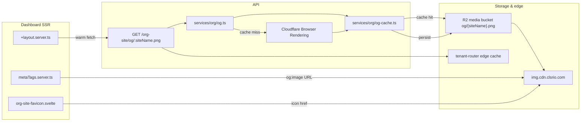

This document describes how ClassroomIO generates **Open Graph preview images** and **favicons** for public org-site routes (`*.myclassroomio.com`, BYOD custom domains, and self-hosted single-org mode). It covers caching layers, invalidation, and why crawlers such as Discord need a fast, stable image URL.

For admin-facing behavior, see [Sharing Your Academy (Open Graph & Favicon)](/academy-sharing-and-branding).

## Overview



| Concern | Location |
| --- | --- |
| OG HTML template | `apps/api/src/utils/org-site-og.ts` |
| OG generation service | `apps/api/src/services/org/og.ts` |
| R2 read/write cache | `apps/api/src/services/org/og-cache.ts` |
| API route | `apps/api/src/routes/org-site/og.ts` → mounted at `/org-site/og` in `apps/api/src/app.ts` |
| Meta tags (SSR) | `apps/dashboard/src/lib/utils/functions/metaTags.server.ts` |
| OG public URL resolution | `apps/dashboard/src/lib/utils/functions/org-site-og-url.ts` |
| Shared URL helpers | `packages/utils/src/org-site/og-public-url.ts` |
| Favicon component | `apps/dashboard/src/lib/features/app/org-site-favicon.svelte` |
| Favicon href helper | `apps/dashboard/src/lib/utils/functions/org-branding.ts` |
| OG warm on page load | `apps/dashboard/src/routes/+layout.server.ts` |
| Proxy / edge cache | `apps/tenant-router/src/index.ts` |
| Plan gating (watermark, tagline) | `packages/utils/src/plans/org-plan.ts` (`isOrgOnFreePlan`) |

## Open Graph image generation

### Endpoint

```
GET /org-site/og/:siteName.png
```

The `.png` suffix is optional; `normalizeOrgOgSiteName()` strips it before lookup.

The handler returns `image/png` with `ETag`, `Cache-Control: public, max-age=3600, stale-while-revalidate=86400`, and falls back to `https://brand.cdn.clsrio.com/og/classroomio-opengraph.jpg` on 404 or render errors.

### Render pipeline

1. Load org by `siteName` from the database.
2. Resolve plan via `getActiveOrganizationPlan` + `isOrgOnFreePlan`.
3. Build render input:
   - `orgName`, `logoUrl` (avatar), `themeColor`, `showWatermark` (free plan)
   - `tagline` — **paid plans only**; from `extractOrgTagline(landingpage)` (footer brand tagline, else hero subheading)
4. Compute a **content etag** (16-char SHA-256 prefix) from `{ siteName, orgName, logoUrl, tagline, themeColor, showWatermark }`.
5. Check R2 cache (see below). On miss, render HTML via `renderOrgSiteOg()` and screenshot with **Cloudflare Browser Rendering** (`getCloudflarePngBuffer`, viewport 1200×630).
6. Persist PNG to R2 and return bytes.

### Template behavior

- **Logo present:** image fills the logo container; no theme-color background behind the logo (avoids washing out light logos).
- **No logo:** initials fallback on a theme-colored rounded square.
- **Free plan:** no tagline on image; **Powered by ClassroomIO** watermark.
- **Paid plan:** tagline under org name; no watermark.

## Caching

OG images pass through several cache layers. Understanding them explains stale Discord previews and regeneration timing.

### 1. R2 object cache (source of truth for CDN URL)

| Property | Value |
| --- | --- |
| **Bucket** | Media bucket (`CLOUDFLARE_IMAGE_BUCKET_DOMAIN` / `OBJECT_STORAGE_MEDIA_PUBLIC_BASE_URL`) |
| **Key** | `og/{siteName}.png` |
| **Invalidation** | Object metadata field `og-etag` compared to computed content etag; mismatch → regenerate and overwrite |
| **Object Cache-Control** | `public, max-age=3600, stale-while-revalidate=86400` |

The public URL served in meta tags (cloud default):

```
https://img.cdn.clsrio.com/og/{siteName}.png
```

Same path on every request — no query-string cache bust. Updates rely on overwrite + CDN TTL expiry.

### 2. API in-memory / response cache

The API route sets `ETag` and honors `If-None-Match` (304). Rendered bytes may be served from R2 without calling Cloudflare Browser Rendering when the content etag matches.

**Cold generation** (Cloudflare screenshot) can take several seconds. Social crawlers (Discord ~3–5s timeout) fail if the first fetch is too slow — this motivated CDN-backed URLs and warming.

### 3. Dashboard OG warm

On every org-site `+layout.server.ts` load, a **fire-and-forget** `fetch()` hits the internal OG API URL (`resolveOrgSiteOgWarmUrl`) so the PNG is generated and written to R2 before crawlers request the CDN object.

This is best-effort (not awaited). It does **not** run at org-save time.

### 4. Tenant-router edge cache (cloud)

For `*.myclassroomio.com`, requests to `/proxy/org-site/og/*` are proxied to the API. The worker applies:

- `cf.cacheEverything: true`, `cacheTtl: 3600`
- Response `Cache-Control: public, max-age=3600, stale-while-revalidate=86400`

Meta tags in cloud production prefer the **CDN URL**, not `/proxy/…`, so crawlers usually skip this hop. The edge cache remains a fallback for legacy or self-hosted proxy paths.

### 5. Crawler / chat app caches

Discord, Slack, iMessage, etc. cache **embed metadata** and **images** independently of ClassroomIO. Failed embeds may be cached for minutes. Users must often **re-post** a link to see updates even after R2 and CDN have fresh content.

## Meta tag resolution

`getBaseMetaTags()` in `metaTags.server.ts` sets title, description, and `og:image` for org sites.

**OG image URL priority** (`resolveOrgSiteOgImageUrl`):

1. `PUBLIC_OG_IMAGE_URL` — global override (self-hosted branding)
2. **Cloud CDN** — `PUBLIC_MEDIA_CDN_URL` or default `https://img.cdn.clsrio.com` → `/og/{siteName}.png`, only when a `HEAD` request confirms the object exists
3. `PUBLIC_SERVER_URL` — direct API URL `/org-site/og/{siteName}.png` (used until the CDN object is available)
4. Tenant origin — `{origin}/proxy/org-site/og/{siteName}.png`

Title and description come from `org-site-meta.ts` (hero heading/subheading, org name). These update on every SSR response and do not depend on the PNG cache.

## Favicon

### Scope

Rendered from root `+layout.svelte` via `OrgSiteFavicon` when `data.isOrgSite` is true. Default ClassroomIO favicons in `app.html` are omitted for org sites; non-org routes inject `/favicon.ico` and `/logo-32.png` from the root layout.

### Resolution (`getOrgFaviconHref`)

1. Custom `org.favicon` if set (uploaded under **Settings → Organization → Custom Domain**)
2. Else `org.avatarUrl`
3. Relative URLs resolved against `page.url.origin`

## Invalidation matrix

| Org field changed | Content etag changes? | Meta text updates | PNG regen |
| --- | --- | --- | --- |
| `name` | Yes | Yes (title) | Yes |
| `theme` | Yes | No | Yes |
| `avatarUrl` | Yes | No | Yes |
| Landing tagline / hero subheading | Yes (paid tagline on image) | Yes (description) | Yes (paid only on image) |
| Plan (free ↔ paid) | Yes (`showWatermark`, tagline) | No | Yes |
| `siteName` | N/A (different object key) | N/A | New key `og/{newSiteName}.png` |

Regeneration runs on the next OG API request or warm fetch after the etag mismatch.

:::info[No save-hook regen]
There is no background job on organization `PUT`. Regen depends on a page visit (warm) or an external fetch of the OG endpoint.
:::

## Self-hosted notes

- Set `PUBLIC_IS_SELFHOSTED=true` in both dashboard and API for consistent behavior.
- Without `CLOUDFLARE_IMAGE_BUCKET_DOMAIN` / `OBJECT_STORAGE_MEDIA_PUBLIC_BASE_URL`, OG images are not persisted to R2; meta tags fall back to `PUBLIC_SERVER_URL` or `/proxy/…`.
- Cloudflare Browser Rendering credentials (`CLOUDFLARE_RENDERING_API_KEY`, account ID) are required for PNG generation.
- Optional: `PUBLIC_MEDIA_CDN_URL` on the dashboard to override the CDN base for `og:image`.
- BYOD custom domains hit the dashboard Render service directly (not tenant-router); `/proxy/*` forwarding in `hooks.server.ts` mirrors tenant-router behavior.

## Local development

- Org sites locally: `http://localhost:5173/?org={siteName}` (sets `_orgSiteName` cookie).
- OG endpoint: `http://localhost:3002/org-site/og/{siteName}.png` or via dashboard proxy `http://localhost:5173/proxy/org-site/og/{siteName}.png`.
- CDN URLs point at production `img.cdn.clsrio.com` when not self-hosted; local previews use proxy/API URLs unless you override env vars.

## Related docs

- [Sharing Your Academy (Open Graph & Favicon)](/academy-sharing-and-branding) — admin-facing guide
- [Cloudflare Setup](/contributor-guides/cloudflare-setup) — R2 media bucket and `CLOUDFLARE_IMAGE_BUCKET_DOMAIN`
- [Customize Your Organization](/customize-organization) — logo, name, theme (user docs)
