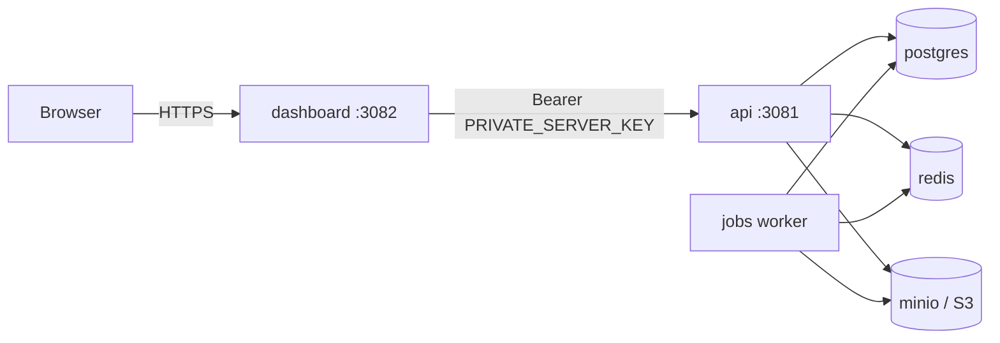

Every install path — Docker, DigitalOcean, Railway, Coolify, Dokploy — runs the same topology.
Understanding it makes sizing, debugging, and scaling decisions obvious.

## The services



| Service | Image | Port | Role |
|---------|-------|------|------|
| `dashboard` | `classroomio/dashboard` | 3082 | The SvelteKit web app. Server-side renders pages and proxies browser API calls, so user traffic is same-origin. |
| `api` | `classroomio/api` | 3081 | The backend. Runs **database migrations on boot**, then serves the API. |
| `jobs` | `classroomio/jobs` | — | Background worker (BullMQ). Drains the Redis queues: video processing, transcription, AI course generation, emails, notifications, maintenance. Ships with ffmpeg. |
| `postgres` | `postgres:16-alpine` | internal | The database. All state lives here (volume `postgres-data`). |
| `redis` | `redis:7-alpine` | internal | Job queues and caching, persisted with AOF (volume `redis-data`). |
| `minio` | `minio/minio` | 9000/9001 | S3-compatible object storage for uploads (volume `minio-data`). Swappable for AWS S3 / Cloudflare R2. |
| `minio-init` | `minio/mc` | — | One-shot: creates the `videos`, `documents`, and `media` buckets, makes `media` publicly downloadable, then exits. |

The app services are pinned by one variable, `CIO_VERSION` — see
[Versions & upgrades](/self-hosted/configuration/versions).

## Startup order

The compose file encodes the dependency chain with healthchecks:

1. **postgres** and **redis** start first. Postgres only reports healthy once it answers a real
   query (`SELECT 1`) — not just `pg_isready` — because Postgres can accept connections while still
   in crash recovery, which would surface as
   [57P03 sign-in errors](/self-hosted/troubleshooting#sign-in-fails-with-57p03-right-after-startup).
2. **api** starts, runs any pending database migrations, then listens. A failed migration exits the
   container instead of serving a half-migrated database.
3. **dashboard** starts only after the API is healthy.

This is why a first boot takes a minute or two: the API is migrating before anything responds.

## The api ↔ dashboard handshake

The dashboard's server side calls the API over the internal container network
(`PRIVATE_SERVER_URL`, default `http://api:3081`) and authenticates every request with:

```
Authorization: Bearer <PRIVATE_SERVER_KEY>
```

The API rejects requests where the key is missing or wrong (401), and refuses to operate without
one configured (500). Two consequences for operators:

- **The value must be identical in the api and dashboard services.** The compose file passes the
  same `.env` value to both, and `./classroomio.sh` generates a strong one automatically. On PaaS
  platforms where you set env per service, a mismatch is the classic cause of a dashboard that
  renders but can't load any data.
- The compose file **fails fast** if `PRIVATE_SERVER_KEY` (or `BETTER_AUTH_SECRET`) is empty —
  see [Environment & secrets](/self-hosted/configuration/secrets).

## The jobs worker and your RAM

The jobs worker is why the [server requirements](/self-hosted#server-requirements) recommend 8 GB.

It processes queues for media (probe → thumbnail → audio extraction), transcription (Whisper),
emails, notifications, AI course generation, and periodic maintenance (including reaping stuck
jobs). Video work runs **ffmpeg as a subprocess**, streaming files via disk rather than holding
whole videos in memory — but transcodes still spike RAM well above the stack's idle usage. A server
that looks comfortable at idle can OOM-kill Postgres the first time someone uploads a lecture
video; see [Troubleshooting → OOM kills](/self-hosted/troubleshooting#containers-are-oom-killed).

Two operational notes:

- **The worker is required, not optional.** Without it (or without Redis), uploads queue forever at
  "processing" and most emails never send —
  [details](/self-hosted/troubleshooting#uploads-stuck-at-processing).
- **It scales independently.** The image runs all workers in one process by default; override the
  container command to run e.g. media processing on separate hardware from email sending.
