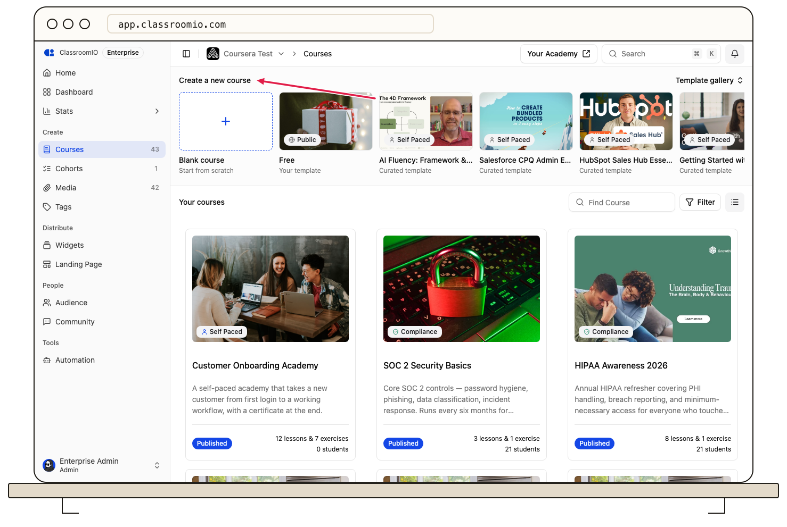
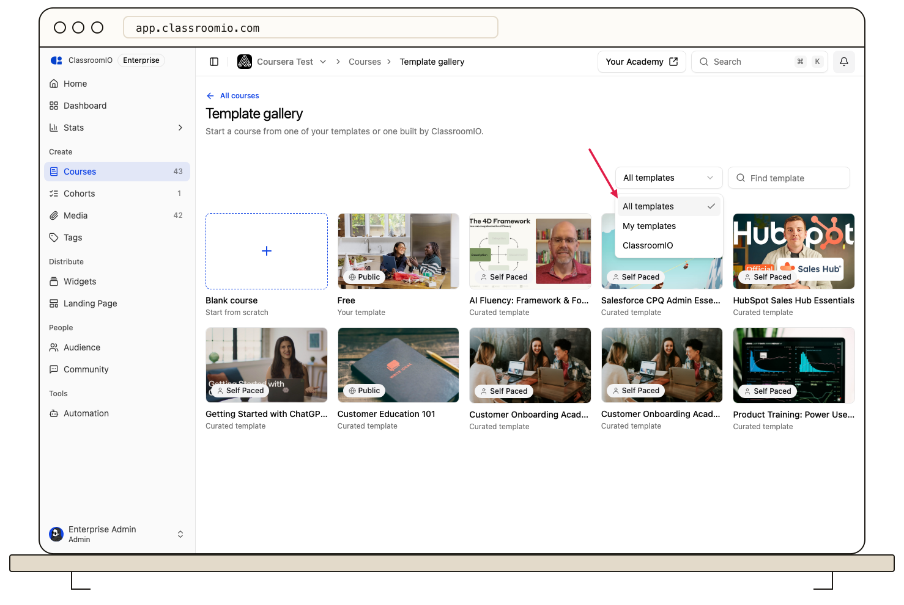
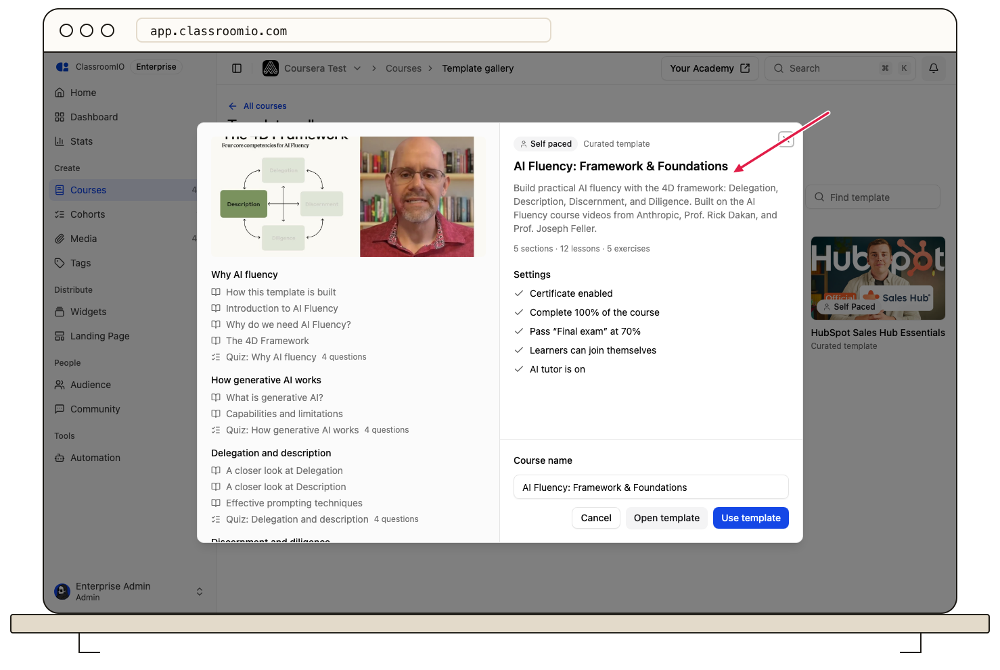

To start a course from a template, open **Courses**, pick a template in **Create a new course** or the **Template gallery**, check the preview, and click **Use template**. ClassroomIO copies the template's sections, lessons, exercises, and settings into a new course that you can edit and publish.

## Before you start

:::info[Administrators create courses from templates]
Tutors can browse templates and open previews. Only administrators see **Blank course** and **Use template**.
:::

You need at least one template to choose from. Every organization can use the **Curated template** set that ClassroomIO provides. To turn one of your own courses into a template, see [Save a course as a template](/build-courses/save-a-course-as-a-template).

## Create the course

### 1. Open Courses

Select **Courses** in the sidebar. The **Create a new course** row at the top shows **Blank course** and up to five templates. Your organization's templates appear first, marked **Your template**, followed by **Curated template** cards from ClassroomIO.

Click a template card to open its preview, and continue with step 3.

### 2. Find a template in the gallery

To see every template, click **Template gallery** on the right of the row. The gallery lists all the templates your organization can use.

- Use the filter to show **All templates**, **My templates**, or **ClassroomIO** templates.
- Type in **Find template** to search by title.

Click a card to open its preview.

### 3. Check the preview

The preview shows what the course will contain before anything is created:

- the course type and whether it's **Your template** or a **Curated template**;
- the number of sections, lessons, and exercises, and the outline of each section;
- for curated templates, **Shows off**, a short list of the ClassroomIO features the course uses, and a summary of its settings, such as whether lessons unlock in order or a certificate is enabled.

For your own templates, **Open template** opens the template itself so you can edit it. Editing the template doesn't change courses you already created from it until you pull the changes.

### 4. Name the course and create it

**Course name** starts with the template's title. Change it to the name students should see, then click **Use template**.

ClassroomIO shows the progress while it copies the content, then displays **Course created from** followed by the template name, and opens the new course's lessons.

## What happens next

- The new course is **unpublished** and has no students. You're added to it as a tutor.
- Lessons, exercises, the landing page, certificate settings, and other course settings are copied. Reviews on the template's landing page are not copied.
- The course stays linked to its template. When the template changes later, you can choose which changes to bring in. See [Update a course from its template](/build-courses/update-a-course-from-its-template).
- Edit, add students, and publish the course the same way as any other course.

## Troubleshooting

### I can't see Use template or Blank course

Only administrators can create courses. Ask an administrator of your organization to create the course or to change your role.

### The gallery says no templates match

The search only matches template titles. Clear **Find template**, and check that the filter isn't set to **My templates** or **ClassroomIO** when you meant **All templates**.

### My organization has no templates of its own

With **My templates** selected, the gallery shows "You haven't made any templates yet." Save an existing course as a template from its ⋯ menu, or use a **Curated template**.

## Related guides

- [Course templates](/reference/course-templates) — what templates are, what's copied, and plan limits
- [Save a course as a template](/build-courses/save-a-course-as-a-template) — make a reusable template from one of your courses
- [Update a course from its template](/build-courses/update-a-course-from-its-template) — bring template changes into a course you created
- [Course types](/create-and-deliver/course-types) — understand the type each template uses
- [Create a course landing page](/publish-and-brand/course-landingpage) — adjust the landing page before you publish
