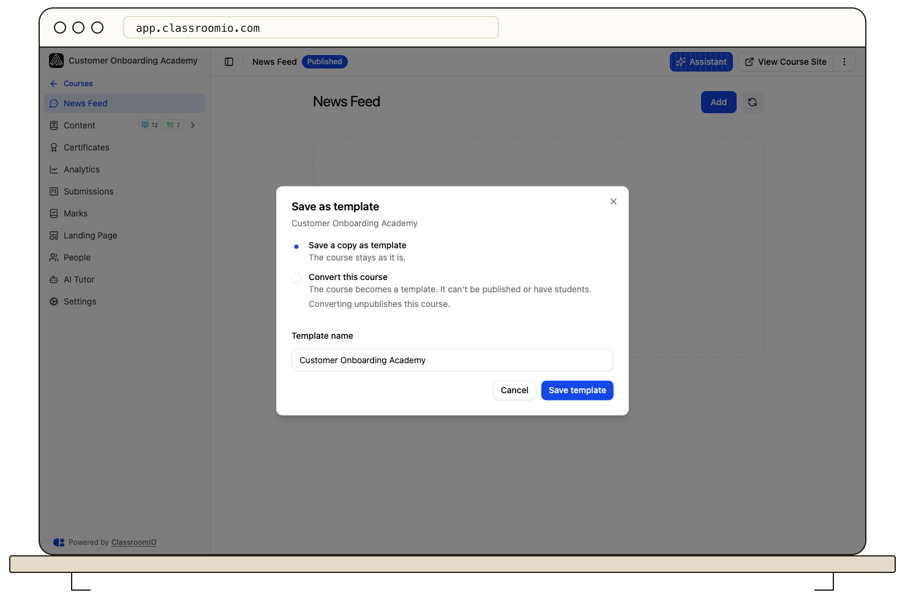
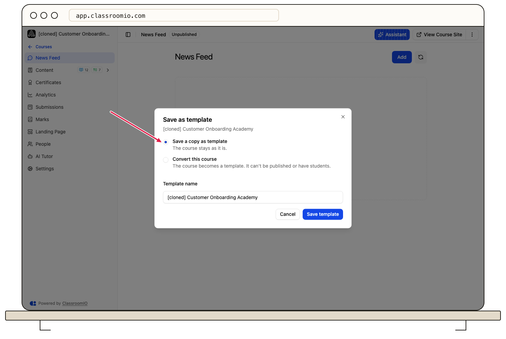
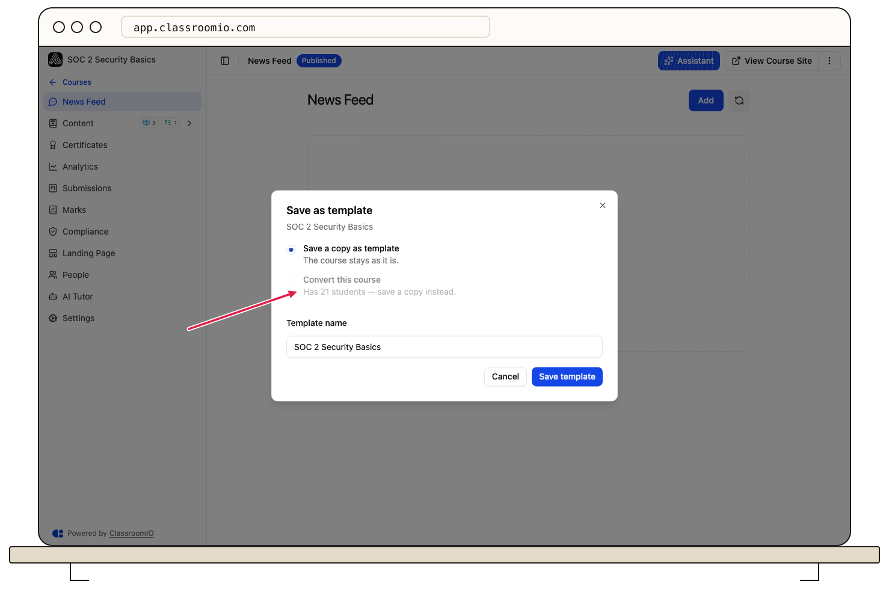
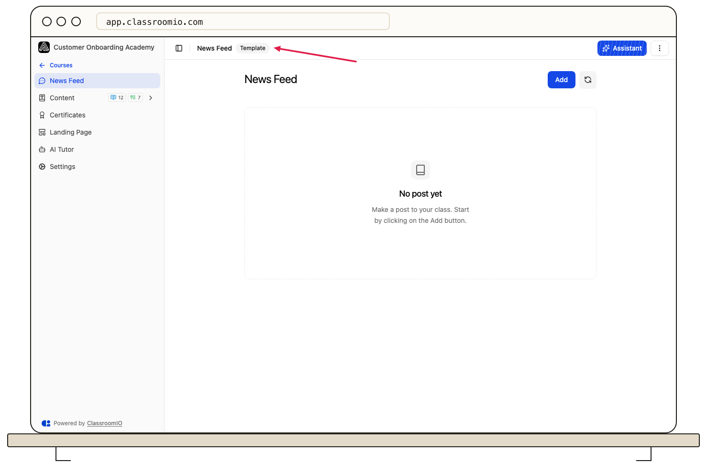

To make a template from a course, open the course's ⋯ menu, choose **Save as template…**, and pick **Save a copy as template** or **Convert this course**. Saving a copy leaves the original course untouched; converting turns the course itself into a template.

## Before you start

:::info[Plan limits]
The Free plan includes 1 template, Early Adopter includes 25, and Enterprise has no limit. Only your organization's own templates count. ClassroomIO's curated templates never count toward the limit.
:::

Only administrators can save, convert, duplicate, or delete templates.

## Save the course as a template

### 1. Open Save as template

On **Courses**, open the ⋯ menu on the course card and choose **Save as template…**. You can also use the ⋯ menu in the course header while the course is open.

### 2. Choose how to save it

The **Save as template** dialog offers two options:

| Option                      | What it does                                                                                       |
| --------------------------- | -------------------------------------------------------------------------------------------------- |
| **Save a copy as template** | Creates a new template from the course. The course stays as it is, with its students and settings. |
| **Convert this course**     | The course itself becomes a template. It can't be published or have students.                      |

:::warning[Converting changes the course]
Converting a published course unpublishes it. A course that has students can't be converted: the option shows "Has 1 student — save a copy instead" with the actual number. Save a copy instead.
:::

### 3. Name it and save

For **Save a copy as template**, enter a **Template name**. It starts with the course title. Click **Save template**.

For **Convert this course**, click **Convert to template**. The template keeps the course's name.

ClassroomIO shows **Template saved** with a **View templates** link, or **Course converted to a template**.

## Manage your templates

Your templates appear in the **Template gallery** under **My templates**. Each card's ⋯ menu offers:

- **Open**: edit the template.
- **Duplicate**: make a second template from it. Administrators only; counts toward your plan limit.
- **Delete**: remove the template. Administrators only.

A template opens like any course, with a **Template** badge in the header.

Sections that only make sense for a live course, such as People, Submissions, Marks, and Analytics, are hidden, and the publish and self-enrollment settings aren't available. To start a course from it, choose **Create course from template** in the header's ⋯ menu.

:::danger[Deleting a template can't be undone]
Courses already created from the template keep all their content, but they can no longer pull updates from it.
:::

## What happens next

- The template appears in the **Create a new course** row and in the **Template gallery** for everyone in your organization who creates courses.
- Edits you make to the template don't change courses created from it until an administrator pulls the changes. See [Update a course from its template](/build-courses/update-a-course-from-its-template).

## Troubleshooting

### A dialog says my plan includes a limited number of templates

You've reached your plan's template limit. Click **Manage templates** to delete a template you no longer need, or **Upgrade** to raise the limit.

### Convert this course is greyed out

The course has students, and a template can't have students. Choose **Save a copy as template** instead; the course and its students stay as they are.

### I don't see Save as template in the menu

Only administrators see it, and it doesn't appear on a course that is already a template.

## Related guides

- [Course templates](/reference/course-templates) — plan limits, what's copied, and who can do what
- [Create a course from a template](/build-courses/create-a-course-from-a-template) — start a new course from your template
- [Update a course from its template](/build-courses/update-a-course-from-its-template) — bring template changes into existing courses
- [Create your first course](/get-started/create-first-course) — build a course from a blank start
