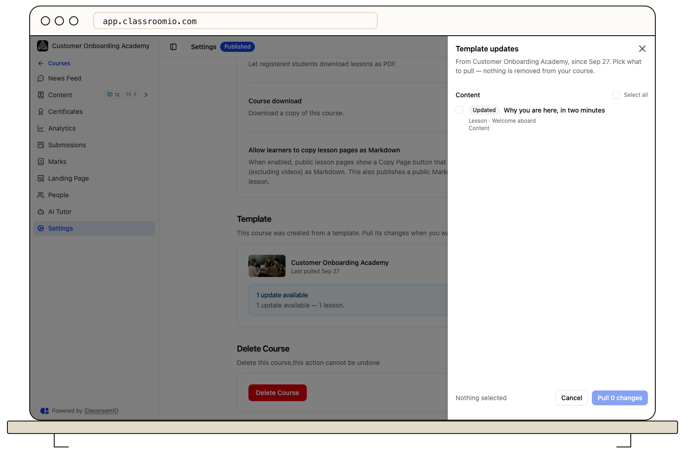
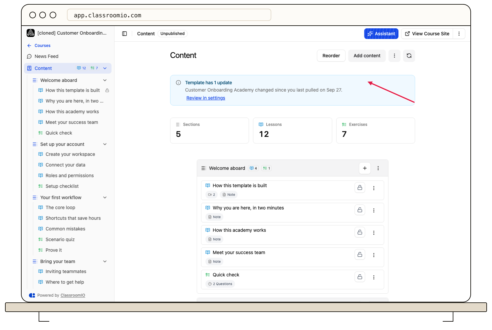
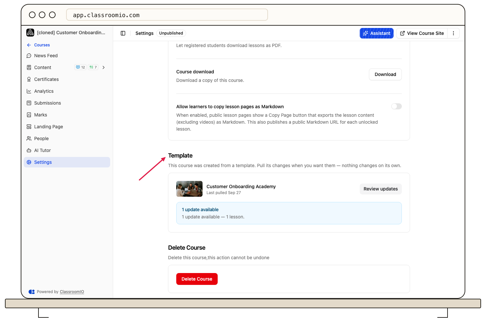
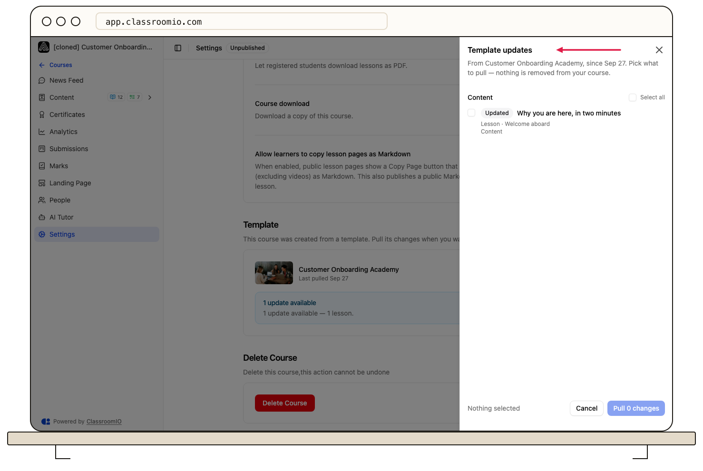

When a template changes, courses created from it stay exactly as they are. To bring changes in, open the course's **Settings**, click **Review updates** in the **Template** section, tick the changes you want, and click **Pull**.

## Before you start

This applies only to courses created with **Use template**. Courses copied with **Clone** aren't linked to a template. Only administrators can review and pull updates.

## What counts as an update

ClassroomIO compares your course with its template each time an administrator opens the course. There's no email or notification, and nothing changes until you pull.

| Change in the template                                                      | What you see in **Template updates**                                                 |
| --------------------------------------------------------------------------- | ------------------------------------------------------------------------------------ |
| A section, lesson, or exercise is added                                     | A **New** row. When pulled, it's placed next to the item it follows in the template. |
| A lesson's title, content, videos, slides, or documents are edited          | An **Updated** row.                                                                  |
| A new language is added to a lesson                                         | An **Updated** row that says which language was added.                               |
| An exercise's title, questions, answer options, or question sections change | An **Updated** row.                                                                  |
| A section is renamed                                                        | An **Updated** row.                                                                  |
| A course setting is saved and now differs from yours                        | A row under **Settings**, such as "Template: Sequential · Yours: Free".              |
| An item you deleted from your course still exists in the template           | A **New** row marked "You deleted this from your course."                            |

These don't create an update:

- reordering lessons or exercises, or moving them between sections;
- deleting a section, lesson, or exercise in the template, because sync never removes anything from your course;
- changes to the template's title, course link, publish state, course type, or students;
- edits you make in your own course.

:::note[Skipped changes wait for you]
ClassroomIO remembers, for each item and each setting, when you last pulled it. A change you skip keeps appearing until you pull it. A change you pull stops appearing until the template changes that item again.
:::

The template's administrators decide when it changes. ClassroomIO updates its own curated templates.

## Pull changes from the template

### 1. Find the update

When the template has changed, the course's **Content** page shows **Template has** followed by the number of updates, with a **Review in settings** link.

You can also open **Settings** and scroll to the **Template** section. It shows the template, **Last pulled** with a date, and how many updates are available. If nothing changed, it says "Up to date with the template."

### 2. Open the review

Click **Review updates**. The **Template updates** panel groups the changes under **Content** and **Settings**. Nothing is selected until you choose.

Each row shows:

- **New** or **Updated**, and where the item lives, such as **Lesson** followed by its section;
- what changed, such as **Title**, **Content**, or a language that was added;
- for settings, the template's value and yours.

### 3. Choose what to pull

Tick each change you want, or use **Select all** in a group. When you tick a new lesson or exercise whose section is also new, the section is ticked too, and the row says "Also adds" followed by the section.

Some rows need a closer look:

- **"You edited this"**: your course's copy of this item has changed since it was last pulled. Pulling it replaces your changes.
- **Submissions — can't be updated**: the exercise already has student submissions, so it's locked and can't be pulled. This protects submitted work and grades.

:::warning[Pulling replaces your version of each item]
A pulled lesson or exercise is replaced with the template's version, including any edits you made to it in this course. Pulling an exercise replaces all of its questions.
:::

### 4. Pull the changes

Click **Pull** followed by the number of changes. ClassroomIO shows **Pulled** with the number of changes and the template name, and **Last pulled** updates. Changes you didn't tick stay in the list for next time.

## What never changes

- Sync never deletes a section, lesson, or exercise from your course.
- Exercises with submissions can't be updated.
- The course title, course link, publish state, course type, and students are never changed.

## Troubleshooting

### There's no alert on the Content page

Either the course is up to date, or its template was deleted. Open **Settings → Template** to check. If the template was deleted, the section says "Template deleted" and the course keeps all its content.

### I can't tick a row

The exercise has student submissions and is locked. To change it, edit the exercise in your course directly.

### Pulling fails with a message that changes are out of date

Someone pulled or the template changed while the panel was open. Close the panel and click **Review updates** again.

### I don't see the Template section in Settings

The course wasn't created from a template, or you aren't an administrator.

## Related guides

- [Course templates](/reference/course-templates) — the full list of settings that can be pulled
- [Create a course from a template](/build-courses/create-a-course-from-a-template) — create a course that stays linked to its template
- [Save a course as a template](/build-courses/save-a-course-as-a-template) — edit and manage the templates your courses come from
