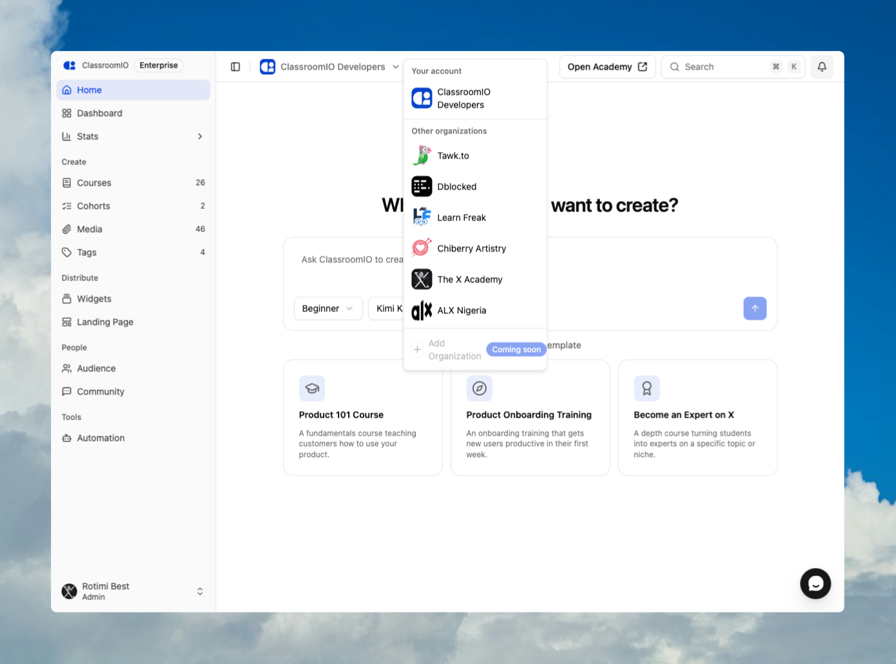

A ClassroomIO account can include one or more organizations. Enterprise accounts can have up to four organizations under one subscription; Free / Basic and Early Adopter accounts have one.

:::info[Current organization-management availability]
The organization switcher can switch between organizations you already belong to, but the current Settings navigation does not expose the screen for creating or deleting additional organizations. **Add Organization** in the switcher is also marked **Coming soon**. Contact [ClassroomIO support](mailto:help@classroomio.com) if you need to add or remove an organization from an Enterprise account.
:::

## Primary and additional organizations

The first organization in the account is the **primary organization**. Every organization linked to the same subscription after that is an **additional organization**.

| Behavior                      | Primary organization                            | Additional organization                         |
| ----------------------------- | ----------------------------------------------- | ----------------------------------------------- |
| Subscription                  | Owns the account subscription                   | Inherits the primary organization's plan        |
| Billing management            | Available from **Settings → Billing**           | Directs you to the primary organization         |
| Deletion                      | Cannot be deleted as an additional organization | Can be permanently deleted                      |
| Courses, people, and settings | Separate from every other organization          | Separate from every other organization          |
| Academy address               | Has its own site name or verified custom domain | Has its own site name or verified custom domain |

The account can summarize usage across its organizations, but content and membership are not copied between them. Adding a course, student, tutor, domain, or brand setting to one organization does not add it to another.

## Organization allowances

| Plan          | Total organizations allowed | Can create an additional organization?    |
| ------------- | --------------------------: | ----------------------------------------- |
| Free / Basic  |                           1 | No                                        |
| Early Adopter |                           1 | No                                        |
| Enterprise    |                           4 | Yes, until the account reaches four total |

The primary organization counts as the first organization. An Enterprise account can therefore have the primary organization and up to three additional organizations.

## Switch between organizations

### 1. Open the organization switcher

In the admin dashboard sidebar, select the current organization name and avatar.

### 2. Choose an organization

Select the organization you want to manage. ClassroomIO reloads the admin dashboard with that organization's theme, courses, people, and settings.

Organizations covered by the current account appear under **Your account**. Separate organization memberships appear under **Other organizations** and have their own subscription relationship.

### 3. Confirm the active organization

Check the organization name in the sidebar before creating content, changing settings, inviting people, or opening billing. Changes apply only to the active organization.

## Billing and plan inheritance

The subscription is attached to the primary organization. Additional organizations inherit that active plan, so you do not purchase a separate plan for each one.

To manage the subscription:

1. Switch to the primary organization.
2. Open **Settings → Billing**.
3. Select **Open billing** for an active paid plan, or **Upgrade** for a Free plan.

See [Manage your subscription and billing](/get-started/manage-your-subscription-and-billing) for the complete billing flow.

## Read-only additional organizations

If a plan change leaves the account above its organization allowance, ClassroomIO can mark additional organizations **Read-only**. You can still view a read-only organization, but actions that change its data are blocked. The primary organization remains writable.

Switch to the primary organization and review the account plan if you see the **Read-only** badge. Restoring an eligible plan or reducing the number of organizations resolves the allowance problem.

## Before removing an organization

:::danger[Organization deletion is permanent]
Deleting an additional organization permanently removes that organization, its members, and its courses. It cannot be undone. The primary organization cannot be deleted through additional-organization management.
:::

Before requesting removal, confirm the organization name and academy site name, export any records you must retain, and tell affected administrators and students. Deleting one organization does not delete the primary organization or its other additional organizations.

## Related guides

- [What is ClassroomIO?](/get-started/what-is-classroomio) — understand organizations, academies, courses, and the LMS
- [Compare plans and feature limits](/get-started/compare-plans-and-feature-limits) — compare organization allowances and Enterprise features
- [Understand usage and plan limits](/get-started/understand-usage-and-plan-limits) — see how organization counts and read-only states work
- [Manage your subscription and billing](/get-started/manage-your-subscription-and-billing) — manage the shared subscription from the primary organization
- [Roles and permissions](/organization-and-team/roles-and-permissions) — decide who should administer each organization
