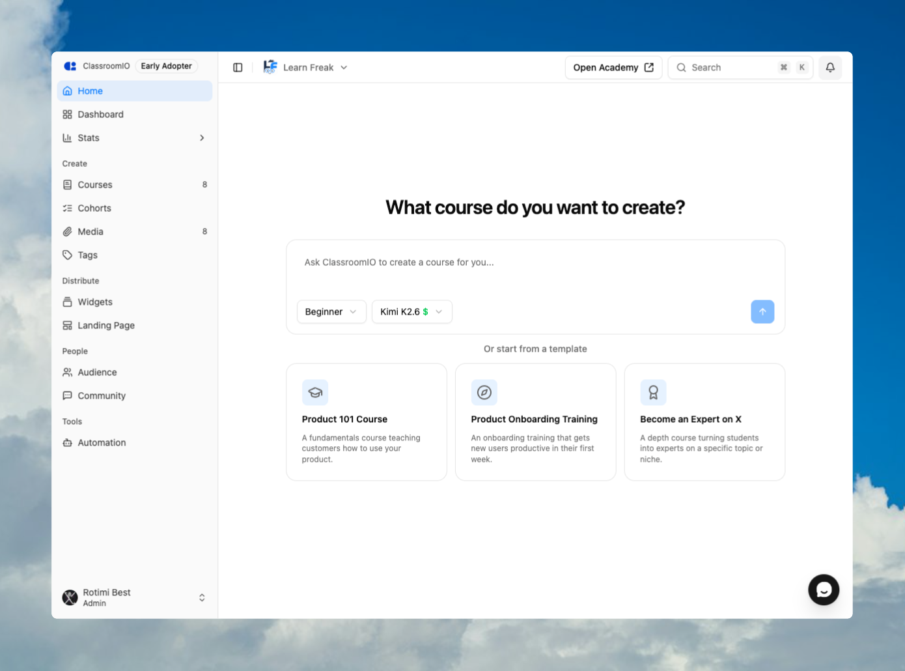
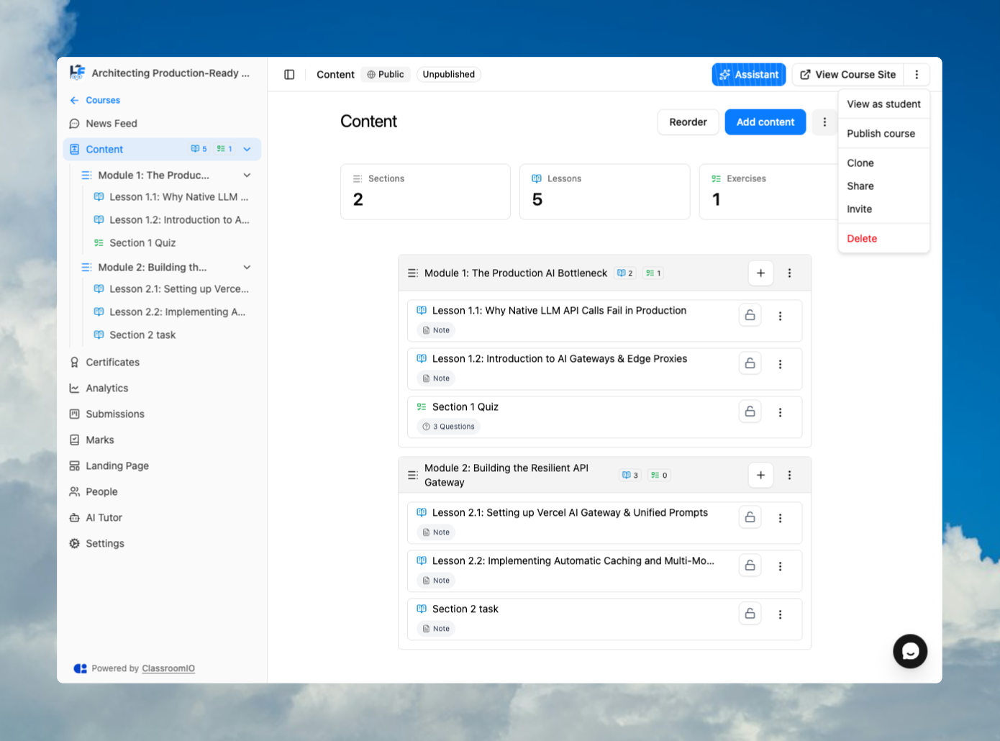

Use **Open Academy** to inspect your public site and **View as student** to open a course in its learner layout. These views help you review presentation and progression, but they use your current account and do not replace a final test with a separately enrolled student.

## Before you start

- Save the organization branding and academy landing-page changes you want to review.
- Give each course a saved course slug. ClassroomIO cannot open a public course page without one.
- Publish a course before checking how visitors discover it on your academy or course landing page.
- Prepare a separate test-student account if you need to verify enrollment, invitations, or role-specific access.

:::warning[Previewing does not impersonate a student]
**View as student** signs your current account into the academy domain and displays the learner interface. It does not become another person's account or prove that an uninvited student can enroll and open the same content.
:::

## Open the public academy

### 1. Select Open Academy

From the organization admin dashboard, select **Open Academy** in the page header. ClassroomIO opens the academy homepage in a new tab.

The link uses your verified custom domain when one is active. Otherwise, it uses your ClassroomIO academy subdomain.

### 2. Review the visitor journey

Check the academy landing page, navigation, course catalog, and any published course landing pages. Confirm that:

- the organization name, logo, colors, and calls to action are correct;
- only the navigation items you intend to show are visible;
- published courses appear where expected;
- course titles, images, descriptions, pricing, and enrollment actions are accurate;
- links open the correct destination.

**Open Academy** opens the live public site. It is not an isolated draft preview. If you are already signed in on the academy domain, you may see account-aware navigation instead of the exact signed-out visitor state.

## Open a course as a learner

### 1. Open the course

From the admin dashboard, select **Courses**, then open the course you want to check.

### 2. Select View as student

Open the three-dot actions menu in the course header and select **View as student**. In the confirmation dialog, select **Go to LMS**.

ClassroomIO opens a new tab, signs your current account into the academy domain, and takes you to the course's learner view. The admin dashboard remains open in the original tab.

The learner layout applies student-facing content locks and progression navigation. Review lesson order, exercises, completion controls, downloads, and certificate information that the course exposes.

### 3. Return to administration

Close the learner-view tab when you finish. Your original admin-dashboard tab stays signed in and unchanged.

## Preview the public course page

Select **View Course Site** in the course header to open the public course landing page.

- If the course is published and has a slug, ClassroomIO opens its public page in a new tab.
- If the course has no slug, ClassroomIO takes you to course settings so you can generate and save one.
- If the course is unpublished, ClassroomIO asks you to publish it before opening the site.

:::warning[Publishing changes the live academy]
Publishing can make a course discoverable to visitors. Review the course landing page, price, and enrollment settings before selecting **Publish Course** from the prompt.
:::

## Verify the real student experience

Use a separate test-student account for the final check. This is the only reliable way to confirm the complete access path for the role and enrollment method you plan to use.

1. Open the academy in a private window or a separate browser profile.
2. Sign in as the test student, or follow the same invitation or enrollment link that real students will receive.
3. Confirm that the student can join only through the intended method.
4. Open the LMS and verify that the course appears in **My Learning**.
5. Check locked content, lesson completion, exercise submission, and certificate behavior with test data.

Do not use a real student's account or private student records for this check.

## If the preview differs from what students see

- **A course is missing from the academy:** confirm that it is published and that its visibility and catalog settings allow it to appear.
- **A student cannot join:** check publish state, **Students can enroll themselves**, price, invite validity, and the organization's student limit.
- **Your admin preview opens content that a student cannot:** test with a separately enrolled student. Your administrator role can have access that a student does not.
- **Branding or links look old:** confirm that you saved the relevant settings, then reload the public tab.

## Related guides

- [What is ClassroomIO?](/get-started/what-is-classroomio) — understand the academy, LMS, organization, and course relationship
- [Customize your organization](/organization-and-team/customize-organization) — update the academy name, logo, and brand color
- [Customize your academy landing page](/publish-and-brand/org-landing-page) — control the public homepage
- [How course enrollment works](/manage-students/course-enrollment) — choose and test the correct enrollment path
- [Student dashboard](/reference/student-dashboard) — understand the signed-in LMS navigation
