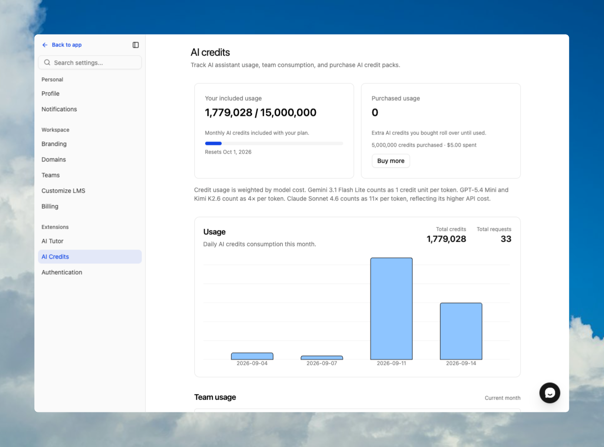

ClassroomIO limits three account resources: students, included monthly AI credits, and organizations. Student and organization limits do not reset; included AI credits reset on the first day of each calendar month.

## Current limits

| Resource                                                            | Free / Basic | Early Adopter | Enterprise |
| ------------------------------------------------------------------- | -----------: | ------------: | ---------: |
| Students                                                            |           20 |        10,000 |  Unlimited |
| Included AI credits each month                                      |      500,000 |     3,000,000 | 15,000,000 |
| Organizations under one account, including the primary organization |            1 |             1 |          4 |

For plan features and current prices, see [Compare plans and feature limits](/get-started/compare-plans-and-feature-limits).

## How the student limit works

ClassroomIO counts every non-archived organization member whose role is **Student**. The count is organization-wide rather than the sum of course enrollments, so the same student in several courses occupies one plan seat.

Member status changes affect seats differently:

| Action         | Access result                              | Plan seat result                   |
| -------------- | ------------------------------------------ | ---------------------------------- |
| **Deactivate** | The student loses access until reactivated | The student keeps the seat         |
| **Archive**    | The student loses access until unarchived  | The seat is freed                  |
| **Reactivate** | The student regains access                 | The existing seat remains occupied |
| **Unarchive**  | The student regains access                 | A seat is required again           |

ClassroomIO checks capacity before direct additions, invitations that create a student, self-enrollment, course joins, cohort assignments, and imports. An action can fill the final available seat, but an action that would exceed the limit is blocked.

Administrators receive a one-time notification when an addition crosses half of a finite student allowance and another when it reaches the allowance.

On the Free plan, the **Upgrade** control in the organization sidebar shows the current student count and the 20-student limit. The count can change after you add, archive, or unarchive a student.

## How AI credits work

AI credits measure the organization's use of ClassroomIO AI features. Usage is weighted by the model's cost, so the displayed credit total is not always the raw number of text tokens sent and received.

Open **Settings → AI credits** to see:

- included credits used and the plan allowance;
- the next reset date;
- daily usage for the current month;
- team usage and request counts;
- purchased-credit balance and purchase history.

Included credits reset on the first day of the next calendar month. Unused included credits do not roll over.

Purchased credits are different: they roll over until used. ClassroomIO uses the included monthly allowance first, then drains the purchased balance for usage beyond that allowance. AI actions stop when both sources have no remaining credits.

:::note[Model choice changes credit usage]
The **AI credits** page shows the current model-cost weighting. A request made with a higher-cost model can consume more credit units than the same raw token count on the baseline model.
:::

## How the organization limit works

The allowance includes the primary organization:

- Free / Basic and Early Adopter accounts have one organization.
- Enterprise accounts can have up to four total organizations.

Only Enterprise can create additional organizations. The limit does not reset, and deleting an additional organization permanently frees one organization slot.

Primary and additional organizations share the account's subscription, but keep separate courses, people, academy settings, and addresses. The organization switcher groups organizations that belong to the same account.

If a plan change leaves the account above its organization allowance, additional organizations can be marked **Read-only**. A read-only organization remains viewable, but changes are blocked. The primary organization is not locked by this overage rule.

See [Create and manage organizations](/get-started/create-and-manage-organizations) before adding or removing an organization.

## What changes when the plan changes

An upgrade applies the new capacity and feature entitlements after the subscription becomes active. It does not automatically add students, create organizations, connect a custom domain, or configure a paid feature.

When a paid subscription ends, Free plan limits apply:

- existing students are not automatically deleted, but new additions above the limit are blocked;
- the included monthly AI-credit allowance uses the Free amount;
- paid feature controls become unavailable;
- accounts above the one-organization allowance can have additional organizations placed in read-only mode.

Review usage before canceling or changing a subscription. See [Manage your subscription and billing](/get-started/manage-your-subscription-and-billing) for the billing flow.

## If a count looks wrong

- **Student count is higher than expected:** check for deactivated students. Deactivation keeps a seat; archiving frees it.
- **A student appears in several courses:** course enrollments do not create extra organization seats for the same person.
- **AI usage is higher than raw token counts:** model-cost weighting is included in the credit total.
- **AI credits did not roll over:** only purchased credits roll over. The plan's included allowance resets monthly.
- **An organization is read-only:** switch to the primary organization and review the account plan and organization allowance.

## Related guides

- [Compare plans and feature limits](/get-started/compare-plans-and-feature-limits) — compare capacity and feature access
- [Manage your subscription and billing](/get-started/manage-your-subscription-and-billing) — upgrade or review when a cancellation takes effect
- [Create and manage organizations](/get-started/create-and-manage-organizations) — understand primary, additional, and read-only organizations
- [Find and remove inactive students](/manage-students/find-and-remove-inactive-students) — review student activity before freeing seats
