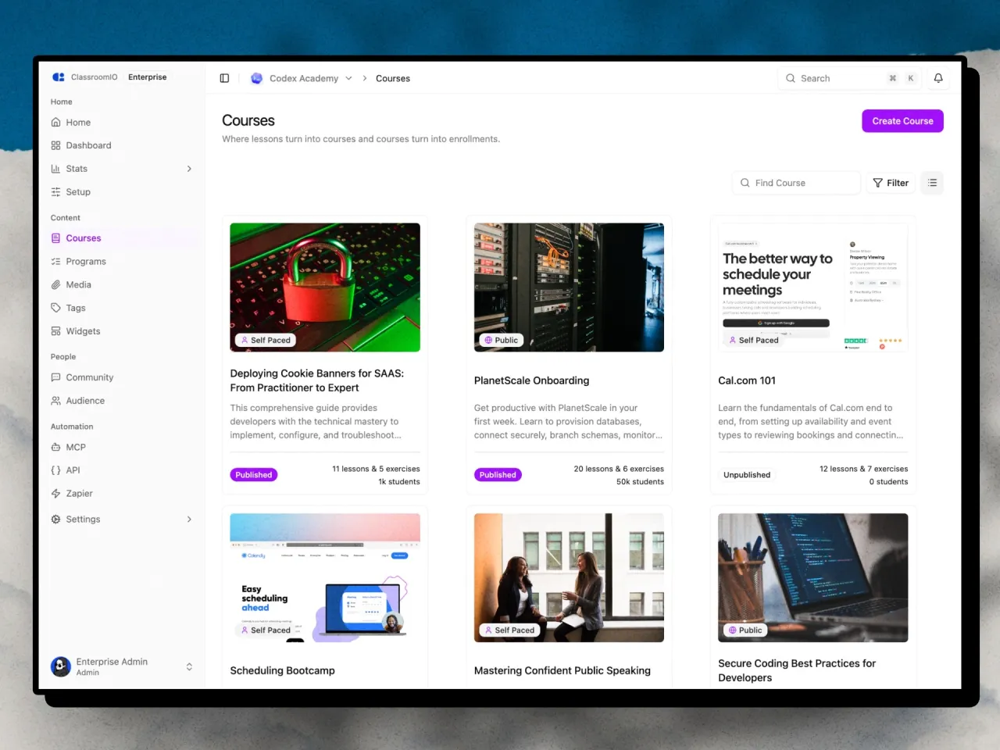

ClassroomIO is a learning platform for creating courses, publishing a branded academy, enrolling students, delivering lessons and exercises, and tracking results. Administrators and tutors manage learning from the admin dashboard, while students use your academy and its learning management system (LMS).

## How ClassroomIO is organized

Four parts work together:

| Part             | Who uses it                                   | What it does                                                                                                                              |
| ---------------- | --------------------------------------------- | ----------------------------------------------------------------------------------------------------------------------------------------- |
| **Organization** | Administrators and tutors                     | Owns courses, people, settings, branding, billing, and reports                                                                            |
| **Academy**      | Visitors and prospective students             | Presents your public homepage, course catalog, and published course landing pages                                                         |
| **Course**       | Administrators, tutors, and enrolled students | Contains lessons, exercises, people, delivery settings, and completion rules                                                              |
| **LMS**          | Signed-in students                            | Shows assigned and discoverable courses, lessons, exercises, certificates, cohorts, and community features that your organization enables |

Eligible accounts can include more than one organization under the same subscription. Each organization keeps its own courses, people, academy address, and settings. See [Create and manage organizations](/get-started/create-and-manage-organizations) for the account relationship.

## The administrator experience

Administrators and tutors sign in through the ClassroomIO admin app. The organization dashboard provides management areas for courses, people, analytics, cohorts, community, distribution, and organization settings.

Roles determine what each person can change:

- **Administrators** can create courses and manage organization-wide settings, team access, and billing.
- **Tutors** can use the admin dashboard and manage the courses assigned to them, but they cannot create courses or change organization-wide settings.
- **Students** use the LMS instead of the admin dashboard.

For the exact permissions, see [Roles and permissions](/organization-and-team/roles-and-permissions).

## The student experience

Your academy is the student-facing side of ClassroomIO. It uses your ClassroomIO academy subdomain or a verified custom domain.

Visitors can see your academy landing page, browse courses that you make public, and open published course landing pages. After signing in and enrolling, students use the LMS to open course content, submit exercises, follow progression rules, and view certificates when those features are available.

The academy and LMS are related, but they are not the same screen:

- The **academy** helps visitors discover your organization and courses.
- The **LMS** is the signed-in learning area for enrolled students.

Use [Preview your academy as a learner](/get-started/preview-your-academy-as-a-learner) to check both experiences before inviting students.

## A typical ClassroomIO journey

### 1. Create your account and organization

[Create a ClassroomIO account](/get-started/signup), then provide your name, organization name, and academy site name during onboarding. ClassroomIO creates the organization and its public academy address.

### 2. Set up your academy

Add your organization name and logo, choose its visual identity, and prepare the academy landing page. Your academy is where visitors learn about your organization and discover published courses.

Start with [Complete your onboarding checklist](/get-started/onboarding).

### 3. Build and publish a course

Create a course, add lessons and exercises, choose delivery and enrollment settings, and publish it when it is ready. Publishing controls whether the course can appear on your academy; enrollment settings separately control who can join.

See [Create your first course](/get-started/create-first-course) and [How course enrollment works](/manage-students/course-enrollment).

### 4. Add students

Depending on the course, students can join through public self-enrollment, an email invitation, a reusable invite link, a direct add, or a paid enrollment flow. Once enrolled, the course appears in their LMS.

### 5. Deliver learning and review results

Students complete lessons and exercises according to the course's progression and completion rules. Administrators and tutors can then review course participation, progress, submissions, marks, and certificates in the relevant course or reporting area.

## Plans and usage

Every organization has a plan. The plan controls student capacity, included monthly AI credits, the number of organizations an account can manage, and access to features such as video uploads, certificates, custom domains, the public API, and Single Sign-On (SSO).

- [Compare plans and feature limits](/get-started/compare-plans-and-feature-limits) to choose a plan.
- [Understand usage and plan limits](/get-started/understand-usage-and-plan-limits) to see how ClassroomIO counts students, AI credits, and organizations.
- [Manage your subscription and billing](/get-started/manage-your-subscription-and-billing) to upgrade or open the billing portal.

## Related guides

- [Create your ClassroomIO account](/get-started/signup) — create your first organization
- [Understand the admin dashboard](/organization-and-team/admin-dashboard) — interpret the organization overview and activity metrics
- [Customize your organization](/organization-and-team/customize-organization) — update your organization name, logo, domain, and brand color
- [Student dashboard](/reference/student-dashboard) — see the signed-in LMS from a student's perspective
