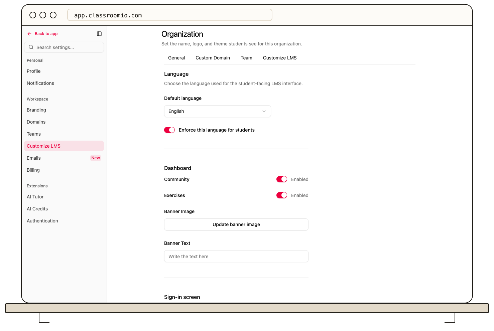
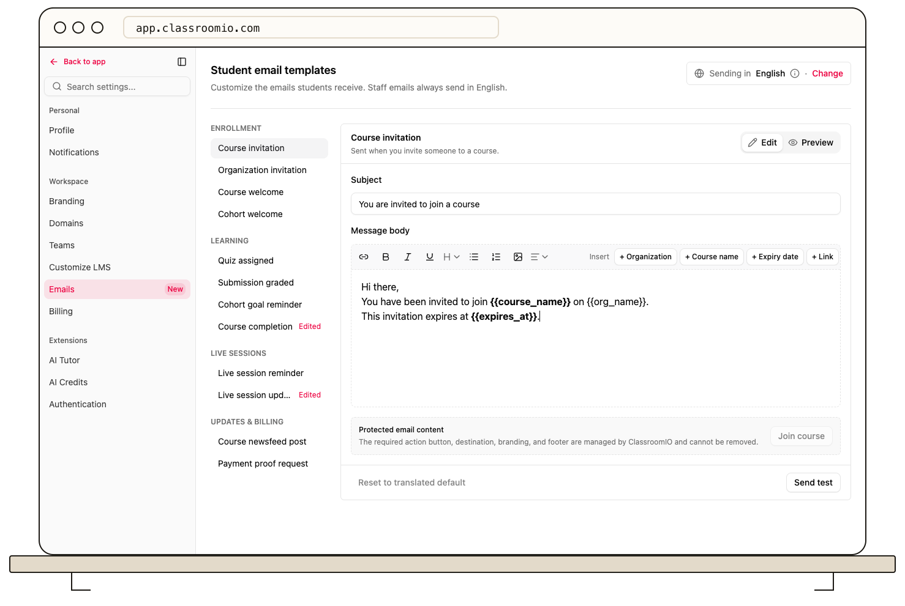
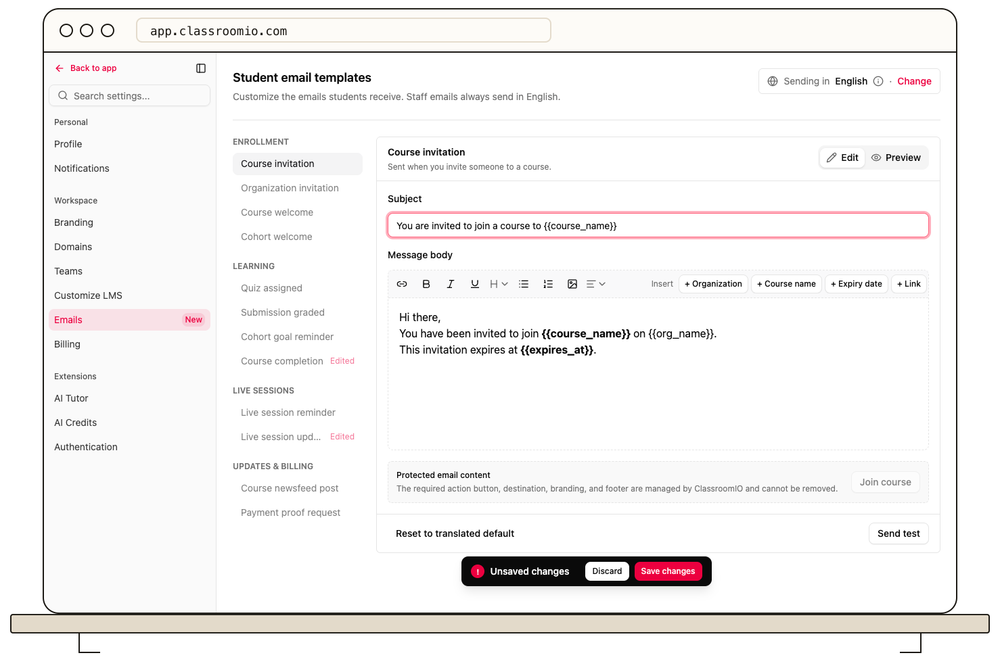

Go to **Settings → Emails** to rewrite the emails your students receive, such as course invitations, welcome emails, quiz assignments, and live session reminders. Your version replaces ClassroomIO's default for every student in your organization, and it's sent in the language you enforce for students.

## Before you start

:::info[Available on paid plans]
Customizing and translating student emails needs the Early Adopter or Enterprise plan. Self-hosted organizations have it on every plan. On the Free plan, the page is locked and students get the default emails in English.
:::

- Only organization administrators can edit student emails.
- Emails to administrators and tutors aren't affected. They're always sent in English with the default wording.

## Choose the language students receive

Student emails use your organization's enforced language. When the language isn't enforced, they're sent in English.

To change it, go to **Settings → Customize LMS**. Under **Language**, choose a **Default language** and turn on **Enforce this language for students**. The **Emails** page shows the current language next to **Sending in**, and **Change** takes you back to this setting.

You edit each language separately. If you change the enforced language later, the **Emails** page shows that language's version, and the edits you made in the earlier language stay saved for when you switch back.

## Edit a student email

### 1. Open the email

Go to **Settings → Emails** and select the email in the list. The emails are grouped by **Enrollment**, **Learning**, **Live sessions**, and **Updates & billing**, and each one says when it's sent.

### 2. Change the subject and message

Edit the **Subject** and the **Message body**. The toolbar has bold, italic, underline, links, headings, bulleted and numbered lists, images, and text alignment.

To add a value that changes for each student, place your cursor and select it next to **Insert**, for example **+ Course name**. It appears in the message as a placeholder in double braces, such as `{{course_name}}`, and ClassroomIO replaces it with the real value when the email is sent. You can type placeholders into the subject too.

To add a link to the page the email is about, select **+ Link**. It takes students to the same place as the email's button, such as the course or the quiz.

:::warning[Keep placeholders exactly as inserted]
Don't change the text or braces inside a placeholder. ClassroomIO won't save a message that contains a placeholder this email doesn't support, and it shows which placeholder to fix.
:::

### 3. Check the result

Select **Preview** to read the email without the toolbar. Placeholders still show in braces.

To see the finished email, select **Send test**. In **Send to**, keep your own address or enter up to 5 addresses separated by commas, then select **Send test**. ClassroomIO emails the current draft with example values in place of the placeholders. The draft doesn't need to be saved first. You can send a test 5 times every 15 minutes.

### 4. Save your changes

Select **Save changes** in the bar at the bottom of the page, or **Discard** to undo your edits. You can't open another email until you save or discard.

After you save, the email shows **Edited** in the list. Students receive your version from then on.

## What you can't change

The action button, its destination, your organization's branding, and the email footer are added by ClassroomIO and can't be removed. The **Protected email content** box shows the button students will see.

Some values only appear when they exist:

- `{{course_message}}` is the course's own welcome message. Set it in the course's **Settings** under **Welcome email**.
- In **Submission graded**, a paragraph that contains `{{score}}` or `{{lesson_title}}` is left out when the submission has no score or isn't part of a lesson.

## Available placeholders

Every email can use **Organization** (`{{org_name}}`). These emails also support:

| Email                       | When it's sent                              | Placeholders                                                           |
| --------------------------- | ------------------------------------------- | ---------------------------------------------------------------------- |
| **Course invitation**       | You invite someone to a course              | Course name, Expiry date                                               |
| **Organization invitation** | You invite someone to your organization     | Expiry date, Courses                                                   |
| **Course welcome**          | A student gets access to a course           | Course name, Instructor message                                        |
| **Cohort welcome**          | A student gets access to a cohort           | Cohort name                                                            |
| **Quiz assigned**           | A quiz is assigned to a student             | Course name, Exercise title                                            |
| **Submission graded**       | A student's exercise submission is reviewed | Student name, Exercise title, Course name, Status, Score, Lesson title |
| **Cohort goal reminder**    | A cohort goal is due or overdue             | Cohort name, Goal, Due status, Completed count, Required count         |
| **Course completion**       | A student completes a course                | Course name, Student name, Instructor message                          |
| **Live session reminder**   | Before a scheduled live session             | Course name, Session title, Session time, Start time                   |
| **Live session updated**    | Live session details change                 | Course name, Session title, Session time                               |
| **Course newsfeed post**    | A new course post is published              | Course name, Teacher name, Post content                                |
| **Payment proof request**   | A student needs to send proof of payment    | Course name, Student name, Teacher email                               |

**Payment proof request** has no button or **+ Link**, because students reply by email.

## Go back to the default email

Open the email and select **Reset to translated default**, then **Save changes**. Students receive ClassroomIO's default wording again, in your organization's language. This only resets the email in the current language.

If your organization moves to the Free plan, every student email goes back to the English default. Your edits stay saved and apply again if you upgrade.

## Related guides

- [Customize the welcome email](/manage-students/welcome-email) — write the course message that fills `{{course_message}}`
- [Invite students](/manage-students/invite-students) — send the course invitation email
- [Manage your notification preferences](/account-team-security/manage-your-notification-preferences) — choose which emails you receive yourself
