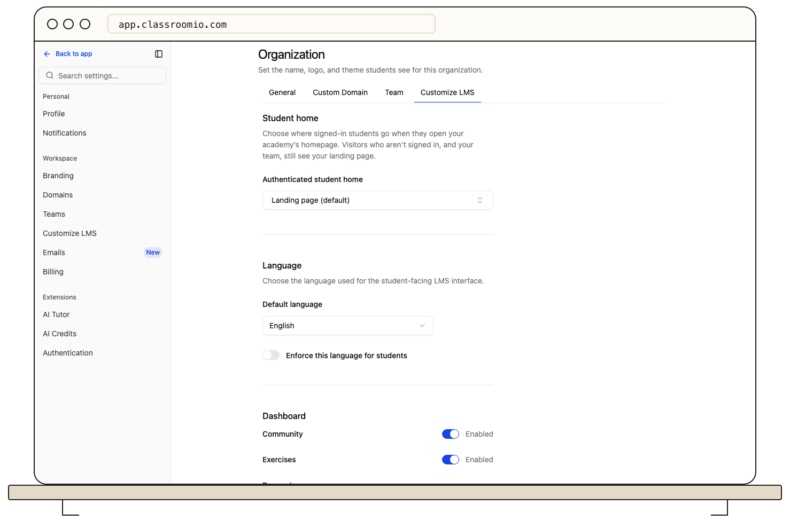

If your academy works as a private learning portal, your signed-in students should not have to click through marketing copy first. **Student home** picks where they land when they open your academy homepage: your Dashboard, My Learning, Certificates, or a specific course.

## Before you start

You need an admin role in the organization. Open **Settings → Customize LMS**; **Student home** is the first section.

## Choose the student home

Open the **Authenticated student home** menu and pick one option:

- **Landing page (default)** — keep today's behavior. Everyone sees the landing page first.
- A page under **Learning portal** — Dashboard, My Learning, Certificates, Explore, Cohorts, Exercises, Community, or Settings. Names match the student sidebar exactly.
- A course under **Courses** — search by title. New courses appear here once published.

Click **Save changes**. The choice applies immediately.

## Who is redirected

Only **signed-in students** of your academy skip the landing page. Everyone else sees it exactly as before:

- Visitors who are not signed in.
- Signed-in people who have not joined your academy.
- Your admins and tutors, who need the landing page for their own checks.

Students who open an explicit link — a course, a lesson, or a page under `/lms` — always go where the link points. The student home only handles visits to your academy homepage (`/`).

## What students see for a course destination

When you pick a course, each student lands as close to it as they are allowed:

| Student                                               | Destination                                                                  |
| ----------------------------------------------------- | ---------------------------------------------------------------------------- |
| Already enrolled in the course                        | Their first unfinished lesson                                                |
| New to a free course that is open for self-enrollment | A focused **Join course** screen — one click, then straight into the lessons |
| New to a paid, invite-only, or closed course          | The Dashboard                                                                |

Joining from the student home never enrolls anyone by itself. New students click **Join course** to confirm, so teachers are not emailed about enrollments nobody asked for.

## When a destination becomes unavailable

If a saved destination later breaks, students go to the **Dashboard** instead of a dead page:

- The course is unpublished, deleted, or turned into a template.
- Exercises or Community is turned off in **Customize LMS → Dashboard**.
- Certificates is picked and the academy moves to the free plan.

The menu keeps the saved choice with an **Unavailable** badge and explains the fallback, so you can pick another destination or turn the page back on. To stop redirecting entirely, pick **Landing page (default)** and save.

:::info[Turned-off pages also close by direct link]
Turning off Exercises or Community in **Customize LMS → Dashboard** hides the sidebar link and also closes those pages to anyone who opens them by a saved link or bookmark — they land on the Dashboard instead. The same applies to Certificates on the free plan.
:::

## Related guides

- [Choose which LMS navigation tabs learners see](/publish-and-brand/choose-which-lms-navigation-tabs-learners-see) — turn student pages on or off
- [Customize Your Academy Landing Page](/publish-and-brand/org-landing-page) — the page everyone else still sees first
