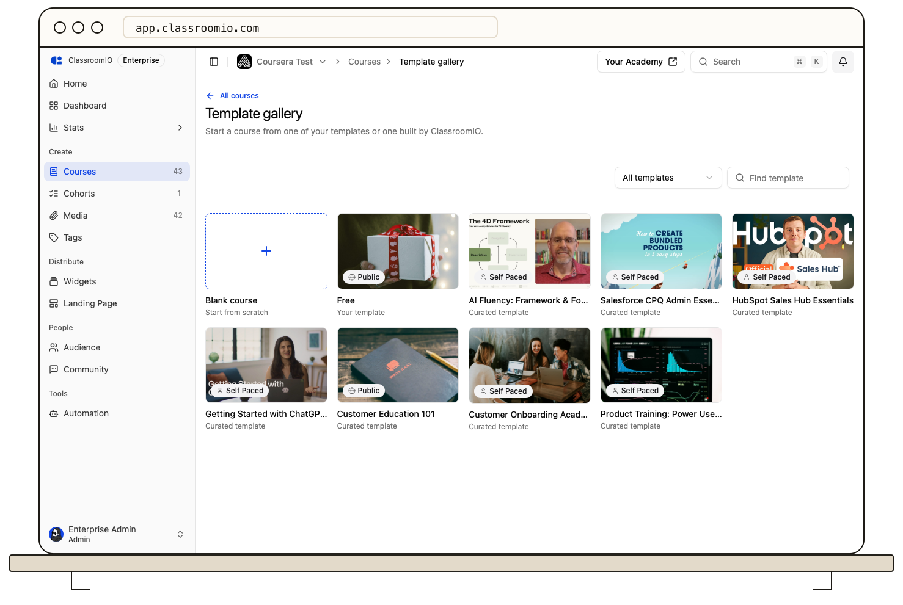

A **template** is a course used as a starting point. You build and edit it like any course, but it can't be published or have students. Instead, administrators create new courses from it, and those courses can pull later changes from the template when they choose.

## Your templates and curated templates

|                    | Your templates                                       | Curated templates                         |
| ------------------ | ---------------------------------------------------- | ----------------------------------------- |
| Label on the card  | **Your template**                                    | **Curated template**                      |
| Who makes them     | Administrators in your organization                  | ClassroomIO                               |
| Where they appear  | **Create a new course** row and **Template gallery** | The same places, after your own templates |
| Can you edit them? | Yes                                                  | No; you can preview them and use them     |
| Plan limit         | Counts toward your limit                             | Never counts                              |

## Plan limits

| Plan          | Templates you can have |
| ------------- | ---------------------- |
| Free          | 1                      |
| Early Adopter | 25                     |
| Enterprise    | No limit               |

The limit applies when you save, convert, or duplicate a template. Creating courses from templates has no limit.

## What's copied when you use a template

| Copied into the new course                                                       | Not copied                                     |
| -------------------------------------------------------------------------------- | ---------------------------------------------- |
| Sections, and lessons in every language with their videos, slides, and documents | Students and their progress                    |
| Exercises, questions, and answer options                                         | Reviews on the landing page                    |
| Course settings, landing page content, certificate, and AI tutor                 | Published state; the course starts unpublished |

The course is linked to its template so it can pull updates later. Courses made with **Clone** aren't linked.

## What can be synced from a template

When a template changes, an administrator can pull the changes into each course created from it. Nothing changes automatically. For the full list of what triggers an update and how to pull, see [Update a course from its template](/build-courses/update-a-course-from-its-template).

Content that can be pulled: new and updated sections, lessons, and exercises.

Settings that can be pulled, with the names used in the **Template updates** panel:

| Area         | Settings                                                                                      |
| ------------ | --------------------------------------------------------------------------------------------- |
| Details      | Description, Cover image, Welcome email                                                       |
| Completion   | Completion deadline, Completion threshold, Final exercise                                     |
| Content      | Lesson tabs, Content grouping, Progression, Lesson comments, Lesson download, Markdown export |
| Access       | Self-enrollment                                                                               |
| Landing page | Landing requirements, Landing description, Landing goals, Skills, Tools, Instructor, Pricing  |
| Certificate  | Certificate design, Certificate rules                                                         |
| AI tutor     | AI tutor                                                                                      |

Syncing never changes the course title, course link, publish state, course type, or students, never deletes anything from the course, and can't update an exercise that already has student submissions.

## Who can do what

| Action                                 | Tutor | Administrator |
| -------------------------------------- | ----- | ------------- |
| Browse the gallery and open previews   | Yes   | Yes           |
| Create a course from a template        | No    | Yes           |
| Save or convert a course as a template | No    | Yes           |
| Duplicate or delete a template         | No    | Yes           |
| Review and pull template updates       | No    | Yes           |

Students never see templates.

## Related guides

- [Create a course from a template](/build-courses/create-a-course-from-a-template) — start a course from a template
- [Save a course as a template](/build-courses/save-a-course-as-a-template) — make and manage your own templates
- [Update a course from its template](/build-courses/update-a-course-from-its-template) — review and pull template changes
- [Course](/reference/course) — how courses work in ClassroomIO
