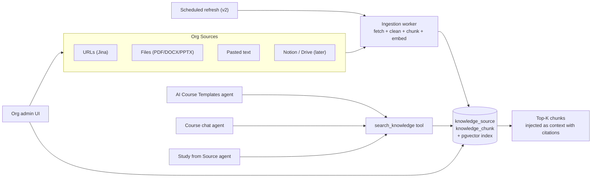

# Agent Knowledge Base PRD

## Status

- Draft

## Date

- May 13, 2026

## Purpose

Give the AI agent a **persistent, searchable, org-scoped knowledge base** of the org's product, docs, and reference material. Today every chat starts from a cold context — even if a colleague fetched the same docs site yesterday in another course's chat, the agent can't reuse it. This PRD designs the storage and retrieval layer that lets the agent "know about the org" across every chat, lesson, and course.

## Problem Statement

Three current and planned features all need the same thing — persistent ingestion of org content the agent can pull from later:

1. **AI Course Templates** ([plan](.cursor/plans/course_templates_on_org_home_63a7b19a.plan.md)) — when a teacher creates a course from a template and provides a docs URL, the agent fetches it via Jina. Today: cached for 7 days in Redis, then disappears.
2. **Study from Source** ([prd/study-from-source/](../study-from-source/README.md)) — already designs persistent `study_source` and `study_source_segment` tables for one-source-at-a-time course creation. But the data is scoped to a single course.
3. **Onboarding AI Bootstrap** ([prd/onboarding-ai-bootstrap/](../onboarding-ai-bootstrap/README.md)) — paste website URL during signup → 2 starter courses. Same fetch happens; same data is thrown away.

Each feature reinvents fetching, chunking, and "what's good context to give the agent." The result is duplicated infrastructure, missed reuse opportunities, and high recurring fetch cost.

The user-facing symptom: a creator builds three courses about their product, and the agent re-reads the same docs from scratch every time. There is no "the agent learns about us over time."

## Goals

1. Single org-scoped knowledge store that all agent interactions can search.
2. Reuse fetched docs across chats, courses, and features (no duplicate Jina calls within an org for 30+ days).
3. Reuse the same ingestion plumbing for files, URLs, and pasted text.
4. Give the agent a `search_knowledge(query)` tool that returns top-K relevant chunks instead of (or in addition to) `fetch_documentation_url`.
5. Surface a management UI so org admins can see what the agent "knows" and curate it.
6. Be source-grounded — every retrieved chunk carries a citation (source URL/file + segment locator).
7. Don't break the per-conversation `aiAssistantApi.uploadDocument` flow; this complements it.

## Non-Goals (v1)

- Cross-org knowledge sharing.
- Automated discovery (the agent crawls the open web hunting for sources).
- Real-time sync with external systems (Notion, Google Drive, Confluence) — manual sync only in v1.
- Image/audio/video understanding inside fetched content.
- Per-user knowledge (knowledge is org-scoped only).
- Public knowledge base for students.
- Replacing the Tier-2 Redis cache shipped with AI Course Templates (the cache continues to exist as a hot layer in front of the KB).

## Confirmed Decisions

These came out of the Tier-1/2/3 conversation that produced the AI Course Templates plan:

1. **Tier 2 ships first** as part of AI Course Templates: org-scoped Redis cache for `fetch_documentation_url`, 7-day TTL. No DB changes. This PRD is Tier 3.
2. **Org-scoped, not user-scoped.** Knowledge belongs to the organization. Any team member's agent chat benefits.
3. **Sourced, not generated.** Knowledge entries are fetched/uploaded source content, not LLM-generated summaries. Summaries can be derived later but don't replace the source.
4. **Hybrid retrieval, not pure vector.** Vector + keyword/BM25, because product docs have lots of identifier-style strings that embeddings handle poorly.
5. **Reuse `study_source` infrastructure if Study from Source ships first.** Otherwise design `knowledge_source` so it can absorb `study_source` later.
6. **Manual refresh in v1, scheduled refresh in v2.** Don't over-engineer the freshness loop before we know what users actually do.
7. **Paid plan only** — same gate as document upload today.

## Related PRDs

| PRD | Relationship |
|---|---|
| [AI Course Templates plan](../../.cursor/plans/course_templates_on_org_home_63a7b19a.plan.md) | Ships Tier-2 cache. This PRD is the Tier-3 promotion. |
| [Study from Source](../study-from-source/README.md) | Defines `study_source` and `study_source_segment` tables that this KB should either extend or absorb. Open question 1 below. |
| [Onboarding AI Bootstrap](../onboarding-ai-bootstrap/README.md) | First place a fresh org gets a website URL. Should write into the KB so subsequent courses inherit that ingestion. |
| [AI Course Assistant](../ai-course-assistant%20%5BDONE%5D/README.md) | The agent that consumes this KB. |
| [MCP Course Authoring](../mcp-course-authoring%20%5BDONE%5D/README.md) | External MCP consumers may also want to query KB; design tool surface to be MCP-friendly. |

## Architecture overview



## Data model

Open Question 1 (below) decides whether this is new tables or an extension of `study_source`. Sketch assuming new tables; the migration path if we extend `study_source` is a rename.

### `knowledge_source`

| Field | Type | Notes |
|---|---|---|
| `id` | uuid | PK |
| `organizationId` | uuid | FK, org-scoped |
| `kind` | enum | `url` / `file` / `text` |
| `originUrl` | text nullable | for `url` kind |
| `assetId` | uuid nullable | for `file` kind, FK into existing assets |
| `title` | text | display title |
| `status` | enum | `pending` / `ingesting` / `ready` / `failed` / `archived` |
| `lastFetchedAt` | timestamp nullable | for refresh logic |
| `etag` | text nullable | from Jina/HTTP for cheap staleness checks |
| `wordCount` | integer | |
| `tokenCount` | integer | for cost meter |
| `metadata` | jsonb | fetch metadata, errors, warnings |
| `createdByProfileId` | uuid | who added it |
| `createdAt` / `updatedAt` | timestamp | |

Indexes: `(organizationId, status)`, unique `(organizationId, kind, originUrl)` to dedupe URLs per org.

### `knowledge_chunk`

| Field | Type | Notes |
|---|---|---|
| `id` | uuid | PK |
| `sourceId` | uuid | FK |
| `organizationId` | uuid | denormalized for fast org-scoped retrieval |
| `order` | integer | within source |
| `text` | text | chunk body |
| `tokenCount` | integer | |
| `embedding` | `vector(1536)` | pgvector; OpenAI text-embedding-3-small dims |
| `headingPath` | text nullable | e.g. "Webhooks > Retries" for citation rendering |
| `locator` | jsonb | page/anchor/character offset for deep links |

Indexes: `(organizationId)` for KB scope; HNSW or IVFFlat on `embedding` for vector search.

### Optional: `knowledge_query_log`

For evals, cost tracking, and "what does the agent search for?" debugging. Can be Tinybird-only (no DB table) if we want to avoid bloat.

## Ingestion pipeline

```
sourceCreated -> enqueue ingestion job
  -> fetch (Jina for url; existing parser for file; passthrough for text)
  -> normalize whitespace + strip nav/footers
  -> chunk by headings, fall back to ~500-token windows with 50-token overlap
  -> embed in batch (OpenAI)
  -> upsert into knowledge_chunk
  -> mark source `ready`
```

Use the existing job runner (`apps/jobs/`). Retries with exponential backoff. On failure, mark source `failed` with error in `metadata`.

## Retrieval

### Tool: `search_knowledge`

```typescript
inputSchema: z.object({
  query: z.string().min(3).max(500),
  k: z.number().int().min(1).max(15).default(6),
  sourceIds: z.array(z.string().uuid()).optional()  // narrow to specific sources
})

returns: {
  results: Array<{
    chunkId: string,
    sourceId: string,
    sourceTitle: string,
    sourceOriginUrl: string | null,
    headingPath: string | null,
    text: string,
    score: number
  }>,
  truncated: boolean
}
```

Implementation: hybrid search.

1. Vector search: cosine similarity on `embedding`, top 30.
2. Keyword search: Postgres `tsvector` on `text`, top 30.
3. Reciprocal Rank Fusion to merge.
4. Take top `k`. Return with citation fields.

### When the agent uses it

The teacher system prompt (today restricts internet access entirely; updated in templates plan to allow `fetch_documentation_url`) gets a new clause:

> Before generating lesson content or planning a course, call `search_knowledge` with terms relevant to the topic. Treat returned chunks as authoritative source material; cite them in your output. Only fall back to your general knowledge when search returns no relevant results.

`fetch_documentation_url` remains for ad-hoc URL ingestion. The natural progression is: agent fetches → result is auto-promoted into the KB → next time, `search_knowledge` returns it for free.

## Auto-promotion from Tier-2 cache

When `fetch_documentation_url` succeeds and the URL is **not** already a `knowledge_source` for the org, write the fetched content as a new source in status `ingesting` and enqueue the ingestion job. This means the KB grows naturally as people use templates, with zero extra friction.

Edge cases:

- User fetches a URL that returns garbage (404, login wall, empty body) — don't promote.
- User fetches the same URL across many orgs — that's fine, each org gets its own copy. We do not share across orgs (privacy/legal).
- Throttle promotions to avoid embedding cost spikes (e.g., max 50 auto-promotions per org per day).

## Management UI

Route: `/org/[slug]/settings/knowledge` (gated to org admins).

Sections:

- **Sources list** — table of all `knowledge_source` rows with title, kind icon (URL/file/text), word count, status, last fetched, "Used N times by agent (last 30d)".
- **Add source** — three buttons: "Add URL", "Upload file", "Paste text".
- **Source detail panel** — opens on row click. Shows extracted text preview, chunk count, sample chunks, citation locators, "Refresh" button (re-runs ingestion), "Delete" button.
- **Settings** — per-org defaults: max chunks per source, embedding model, retrieval `k`. (Stretch.)

Frontend feature folder: `apps/dashboard/src/lib/features/knowledge-base/`.

## Permissions

| Action | Org Admin | Tutor | Student |
|---|---|---|---|
| List sources | yes | yes (read-only) | no |
| Add source | yes | yes | no |
| Refresh source | yes | yes | no |
| Delete source | yes | no | no |
| Agent uses KB during chat | yes | yes | (only when student chat ships) |

Same model as the existing teacher-vs-student split in `AgentRole`.

## Cost & metering

- Embedding cost: OpenAI text-embedding-3-small is ~$0.02 / 1M input tokens (May 2026). A 100k-token doc costs ~$0.002 to embed once. Cheap.
- Retrieval cost: each `search_knowledge` call uses negligible tokens itself but injects retrieved chunks into the agent's context, which is metered by existing `recordTokenUsage`.
- Storage cost: pgvector indexes add ~6 KB per chunk (1536 floats × 4 bytes). 10k chunks ≈ 60 MB. Trivial at MVP scale; revisit at 1M chunks.
- Per-org limits (env-configurable, mirror existing fetch quotas):
  - Max sources per org: 1000
  - Max chunks per org: 100,000
  - Max embedding tokens per org per day: 5,000,000

Surface usage in the existing AI credits UI (`apps/dashboard/src/routes/(app)/org/[slug]/settings/ai-credits/`).

## Refresh policy

- v1: manual refresh button on each source. Show "Last refreshed N days ago" badge after 30 days; show "Stale" badge after 90.
- v2: nightly cron that refreshes any source older than its per-org TTL. Use HTTP `ETag`/`Last-Modified` to skip re-embedding when nothing changed.

## Tracing & evals

- Log every `search_knowledge` call (query, top-K chunk IDs, scores, agent message id) to Tinybird via `trackAgentEvent`.
- Add a one-page eval harness later: replay logged queries against new embedding models and measure rank correlation. Out of scope for v1 build but allow for it in the schema.

## Open Questions

1. **Reuse `study_source` or build `knowledge_source`?** They model essentially the same thing. If Study from Source ships first, extend it (add `organizationId` + remove `lessonId` requirement). If this KB ships first, build `knowledge_source` and migrate `study_source` to be a course-scoped view of the KB.
2. **Embedding model**: OpenAI text-embedding-3-small (cheap, 1536d) vs. text-embedding-3-large (better quality, 3072d, more expensive). Start with small.
3. **Auto-promotion default ON or OFF?** Auto-on means the KB fills itself up; org admins discover their KB has stuff in it without doing anything. Off means more deliberate but higher friction.
4. **Should the agent ALWAYS try `search_knowledge` before answering, or only when the system prompt explicitly directs it?** Always-on is simpler but adds latency to every turn.
5. **Do we expose KB via MCP** so external clients can also search it? Probably yes, but design v1 with that in mind.
6. **Chunk strategy**: heading-aware vs. fixed-window. Pick one for v1; instrument the other for A/B later.
7. **PII**: do we need a redaction pass before embedding (e.g., strip emails, account ids)? Probably not v1, but call it out.
8. **Refresh trigger when source URL changes its content significantly**: ETag is cheap but unreliable for SPAs that always serve the same shell. Need a content-hash fallback.

## Phasing

### Phase 1 — Foundations (this PRD's MVP)

1. Decide Open Question 1 (reuse vs. new tables); migrate accordingly.
2. Build `knowledge_source` + `knowledge_chunk` schema with pgvector.
3. Ingestion worker for URL + file + text.
4. `search_knowledge` tool, hybrid retrieval.
5. Auto-promotion from `fetch_documentation_url` cache.
6. Minimal management UI: list, add URL, delete.
7. Paid-plan gate.

### Phase 2 — Quality

1. Manual refresh + stale badges.
2. Source detail panel with chunk preview.
3. Eval harness for retrieval quality.
4. MCP tool surface.

### Phase 3 — Automation

1. Scheduled refresh.
2. Notion / Google Drive connectors.
3. Per-source freshness TTL settings.
4. Cross-source deduplication.

## Acceptance Criteria (Phase 1)

1. An org admin can add a documentation URL on the KB settings page; it appears as `ingesting` then `ready` within a minute for typical docs sites.
2. The agent, when asked about a topic the KB covers, calls `search_knowledge` and uses returned chunks as source material in its response, with citations linking back to the source.
3. Two different chats in the same org searching the same topic both retrieve the same chunks.
4. Re-fetching a URL that's already a `knowledge_source` updates that source instead of creating a duplicate.
5. Deleting a source removes its chunks and the agent stops returning them.
6. Free-plan orgs see an upgrade modal when trying to add KB sources.
7. Embedding token cost is recorded and visible in the existing AI credits UI.

## Risks & Mitigations

| Risk | Mitigation |
|---|---|
| Embedding cost runs away on a single bad source | Per-source token cap (200k tokens). Surface as `SOURCE_TOO_LARGE` error. |
| Vector search returns irrelevant junk for short queries | Hybrid search (keyword + vector) handles this better than vector alone. Surface scores in the UI for debugging. |
| KB fills with stale or wrong info | Manual delete + refresh in v1; scheduled refresh in v2. Stale-source UI badge after 90 days. |
| Prompt injection inside ingested content | Same `<external_untrusted_document>` delimiter pattern used in the templates plan. |
| Cross-org leakage via shared cache or shared embeddings | Strict `organizationId` scoping at every layer (table, query, tool). Add a unit test that proves another org's chunks never appear in retrieval. |
| Schema regret if Study from Source ships first | Resolve Open Question 1 BEFORE either feature builds tables. |
| Index bloat at scale | Choose IVFFlat for write-heavy phase, HNSW once data settles; revisit at 100k chunks. |

## What success looks like 6 months in

- An org with 5+ courses sees the agent generating consistently-on-brand content across all of them, citing the same source material, without the org admin doing anything special after the initial onboarding URL.
- Net Jina spend per org plateaus or drops over time, even as course count grows, because the cache→KB pipeline removes duplicate fetches.
- "Where did the agent get this from?" is answerable for every claim in generated lesson content.
