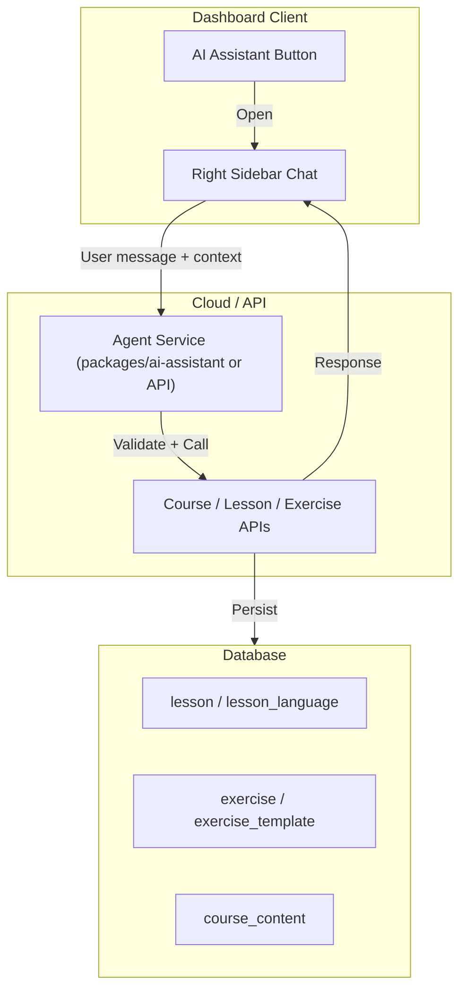

# AI Course Assistant

## Purpose

Deliver an AI assistant inside the course UI that teachers can use to:

- **Update content**: "Update this piece of text in this lesson"
- **Tag exercises**: Tag an exercise and provide context
- **Generate questions**: "Given this text, come up with 5 new questions"
- **Draft lessons**: Ask the agent to write the initial draft of a lesson

The assistant operates in a right sidebar chat interface, triggered by an "AI Assistant" button in the course navigation.

## Goals

- Help teachers organize and author course content faster
- Operate strictly within the current org/course context (no cross-org access)
- Integrate natively with existing ClassroomIO APIs (lessons, exercises, content)
- Cloud-only; self-hosted users cannot use the AI assistant

## Non-Goals (v1)

- Student-facing AI (tutors/teachers only)
- Cross-course or cross-org operations
- Offline or fully local execution without API
- Custom model selection or fine-tuning

---

## Architecture Overview



---

## 1. Execution Model: API vs Local

**Open question**: How does the agent apply changes—via API directly, or by suggesting edits locally in the UI?

### Option A: API-First (Recommended for v1)

- Agent sends **structured intents** (e.g. `{ type: "update_lesson_text", lessonId, locale, payload }`) to a dedicated **agent API**
- Agent API validates permissions, calls existing services (`updateLessonService`, `updateLessonLanguageService`, etc.), returns results
- Client receives success/failure and refreshes or updates the relevant store
- **Pros**: Single source of truth, audit trail, reuses existing safeguards
- **Cons**: Slightly more latency; requires agent backend

### Option B: Local-First

- Agent returns **edit suggestions** as structured data (e.g. JSON patches)
- Client applies changes in the editor UI; user must explicitly accept (e.g. "Apply" button)
- Actual persistence happens through existing APIs when user saves
- **Pros**: Lower latency, no new backend routes
- **Cons**: More complex client logic; risk of sync drift; harder to audit

### Recommendation

**Start with Option A (API-First)**:

1. Reuse existing `courseTeamMemberMiddleware`, `orgMemberMiddleware`, and org/course checks
2. Agent executes actions via the same services used by the UI
3. Simpler mental model: agent is a "programmatic teacher" that talks to the same API
4. Easier to add rate limits, logging, and abuse prevention later

---

## 2. UI Specification

### Placement

- **Button**: "AI Assistant" in the **course header** (alongside Search, Notifications), visible only to teachers (not students)
- **Panel**: Right sidebar implemented with `@cio/ui` Sheet (`side="right"`), ~400px width on desktop
- **Mobile**: Full-screen sheet or drawer (reuse `lesson-version-history.svelte` pattern)

### Chat Interface

- Message list with user/assistant turns
- Text input at bottom with send button
- Optional: quick actions / suggested prompts (e.g. "Draft a lesson", "Generate 5 questions")
- Loading state while agent processes
- Error states with retry

### Context Awareness

- Pass `courseId`, `orgId`, `lessonId` (if viewing a lesson), `exerciseId` (if viewing an exercise) to the agent
- Agent can reference: "Update the text in the lesson you're viewing" without the user specifying IDs

---

## 3. Safeguards

### Authorization (Reuse Existing Middleware)

All agent API routes must use:

| Middleware | Purpose |
|------------|---------|
| `authMiddleware` | Require authenticated user |
| `orgMemberMiddleware` | Require `cio-org-id` and org membership |
| `courseTeamMemberMiddleware` | Require course team (ADMIN/TUTOR) or org admin |

### Scoping Rules

1. **Org scope**: Every action is scoped to the org in `cio-org-id` header
2. **Course scope**: Lesson/exercise edits must belong to a course where the user is a team member
3. **No cross-org**: Agent must never accept or execute requests for lessons/exercises in another org

### Implementation

- Agent API extracts `courseId`, `lessonId`, `exerciseId` from request payload
- Before any mutation, verify:
  - Course belongs to the org
  - User is `courseTeamMember` or `orgAdmin`
- Reuse `isCourseTeamMemberOrOrgAdmin` and `isUserOrgTeamMember` from `@cio/db/queries`

---

## 4. Self-Hosted vs Cloud

### Cloud (ClassroomIO-Hosted)

- AI assistant is **enabled** for teachers (within plan limits, if any)
- ClassroomIO provides the LLM API keys; no user configuration needed

### Self-Hosted

- AI assistant is **not available**. Self-hosters cannot use this feature.
- **Implementation**: Hide the "AI Assistant" button when `PUBLIC_IS_SELFHOSTED === 'true'`. Agent API routes return `403` or are not registered when self-hosted.

---

## 5. Package Design: `packages/ai-assistant`

The agent should live in a **package** that works natively with ClassroomIO APIs.

### Package Responsibilities

- **SDK / client**: Types and helpers for calling the agent API from the dashboard
- **Shared types**: Intent schemas, message formats
- **No UI**: UI stays in `apps/dashboard`; package is backend + types

### Suggested Structure

```
packages/ai-assistant/
  src/
    index.ts           # Public exports
    types.ts           # Message, intent, response types
    client.ts          # Agent API client (optional; dashboard may use classroomio RPC)
  package.json
  tsconfig.json
```

### Agent API (in `apps/api`)

- New routes under e.g. `/course/:courseId/agent` or `/organization/agent`
- Routes: `POST /chat` (stream or non-stream), `POST /execute` (for structured intents)
- Agent service: interpret user message, map to intents, call lesson/exercise services, return result

### Complexity Estimate

| Component | Complexity | Notes |
|-----------|------------|-------|
| Package scaffold | Low | Thin wrapper around types + optional client |
| Agent API routes | Medium | Auth, validation, orchestration |
| LLM integration | Medium–High | Depends on provider (OpenAI, Anthropic, etc.) |
| Chat UI | Medium | Standard chat + Sheet |
| Self-host gate | Low | Env check + conditional render |

---

## 6. Data Sources & APIs (Existing)

| Action | API / Service | Auth |
|--------|---------------|------|
| Update lesson text | `PUT /course/:courseId/lesson/:lessonId/language/:locale` | courseTeamMember |
| Update lesson metadata | `PUT /course/:courseId/lesson/:lessonId` | courseTeamMember |
| Tag exercise (template tag) | Exercise template has `tag`; create/update exercise | courseTeamMember |
| Tag course (org tags) | `PUT /course/:courseId/tags` | courseTeamMember |
| Create lesson | `POST /course/:courseId/lesson` | courseTeamMember |
| Create exercise | Exercise creation flow | courseTeamMember |
| Get lesson content | `GET /course/:courseId/lesson/:lessonId` | courseMember |

Agent actions should call these through the existing service layer, not bypass them.

---

## 7. Suggested Implementation Phases

### Phase 1: Foundation

1. Add "AI Assistant" button to course header (hidden when self-hosted)
2. Add right Sheet with placeholder chat UI (no backend)
3. Create `packages/ai-assistant` with types and client stubs
4. Add agent API route skeleton with `courseTeamMemberMiddleware`

### Phase 2: Chat + Execution

1. Implement agent API `POST /chat` with LLM integration
2. Implement intent parsing: update lesson, generate questions, draft lesson
3. Wire agent to `updateLessonService`, `createLesson`, exercise services
4. Connect chat UI to API; display responses and errors

### Phase 3: Polish

1. Add quick-action prompts
2. Add context injection (current lesson/exercise)
3. Rate limiting and usage tracking (if needed)

---

## 8. Open Questions

1. **Streaming**: Should responses stream (SSE/WebSocket) or be non-streaming for v1?
2. **LLM provider**: OpenAI, Anthropic, or configurable per deployment?
3. **Rate limits**: Per-user, per-org, or per-course? Needed for cloud cost control?
4. **Exercise tagging**: Does "tag an exercise" mean org-level course tags, or exercise-template tags (e.g. mcq, coding)? Clarify semantics.
5. **Draft persistence**: When agent drafts a lesson, does it create a draft immediately or return text for user to paste? Recommendation: create draft via API, user reviews before publishing.

---

## 9. Success Criteria

- Teachers can open the AI assistant from the course header and chat in a right sidebar
- Agent can update lesson text, create draft lessons, and generate questions (as defined in Phase 2)
- No user can modify another org's data; all actions pass permission checks
- Self-hosted instances cannot use the assistant; UI and API are gated
- Agent package integrates cleanly with existing API and dashboard structure
