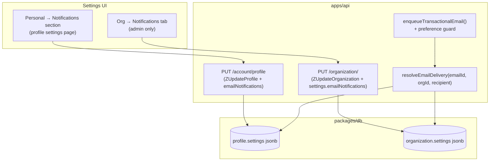

# Email Notification Preferences PRD

## Purpose

Let people control which emails ClassroomIO sends them. Today every email is
**fire-and-forget per event** — there is no preference table, no opt-out, and no
settings UI anywhere in the product. This PRD adds notification preferences in
**Settings**, at two scopes:

1. **Personal** — each user enables/disables the notification emails *they*
   receive, from their own settings.
2. **Organization** — admins set org-wide defaults for the notification emails
   the org sends to its members.

An email sends only when **both** the org default and the recipient's personal
preference allow it. Transactional emails (auth, invites, payment steps, account
lifecycle) are always sent and never appear as toggles.

## Confirmed decisions

1. **Two scopes:** org-level defaults (admin) **and** personal per-user overrides.
2. **Opt-out defaults:** every toggle ships **on**. Nothing changes for existing
   orgs until someone turns an email off — behavior is identical to today until
   a user acts.
3. **Personal preferences are profile-global** (one setting per user, not per
   org) for v1. Per-org personal preferences are a possible future extension
   (see Out of Scope).
4. **Storage reuses `jsonb` settings columns** — `organization.settings`
   (exists) and a new `profile.settings` column. No new tables.
5. **Enforcement at a single chokepoint:** the preference check lives in the
   email enqueue layer so individual call sites stay unchanged.
6. **Transactional emails are never toggleable.**

## The governing rule

> Emails the recipient is **expecting** or **must act on** stay mandatory.
> Ambient "FYI" emails become opt-out.

## Current state audit

| Capability | Status | Location |
| --- | --- | --- |
| Email templates | 24 templates | `packages/email/src/emails/` |
| Email dispatch (API) | queued | `enqueueTransactionalEmail()` in `apps/api/src/services/jobs/email-jobs.ts` → `apps/jobs/src/processors/emails/send.ts` |
| Email dispatch (auth) | direct | `sendEmail()` in `packages/db/src/auth/*` |
| Email preferences (any) | **not implemented** | — |
| Unsubscribe / opt-out | **not implemented** | — |
| `organization.settings` jsonb | exists, deep-merged on update | `packages/db/src/schema.ts:2007`; merge in `updateOrganization()` `packages/db/src/queries/organization/organization.ts:1065` |
| `profile.settings` jsonb | **does not exist** (profile has only untyped `metadata`) | `packages/db/src/schema.ts:392` |
| Personal settings UI | exists | settings index renders `ProfilePage` — `apps/dashboard/src/lib/features/settings/pages/profile.svelte`, route `apps/dashboard/src/routes/(app)/org/[slug]/settings/+page.svelte` |
| Org settings UI + tabs | exists | tabs in `apps/dashboard/src/lib/features/settings/components/org-settings-inline-tabs.svelte`; sub-routes under `apps/dashboard/src/routes/(app)/org/[slug]/settings/` |
| Profile update endpoint | exists | `PUT /account/profile` (`ZUpdateProfile`) → `updateUser()` |
| Org update endpoint | exists (admin) | `PUT /organization/` (`ZUpdateOrganization`, `orgAdminMiddleware`) |

## Email classification

Recipient legend: 🎓 student · 🧑‍🏫 tutor/admin · 👤 account owner.

### Never toggleable (mandatory)

| Email id | Recipient | Trigger | Why mandatory |
|---|---|---|---|
| `verifyEmail` | 👤 | Signup / email-change verification | Security |
| `forgotPassword` | 👤 | Password reset requested | Security |
| `onPasswordReset` | 👤 | Password changed | Security |
| `welcome` | 👤 | Account created | Account lifecycle |
| `studentLimitReached` | 🧑‍🏫 admin | Free-plan student cap hit | Must know students are turned away |
| `inviteTeacher` | 🧑‍🏫 | Invited to org as staff | The invite *is* the email |
| `studentOrgInvite` | 🎓 | Invited to the org | The invite *is* the email |
| `studentCourseInvite` | 🎓 | Invited to a course | The invite *is* the email |
| `studentProvePayment` | 🎓 | Must send proof of payment | Required next step |
| `teacherStudentBuyRequest` | 🧑‍🏫 | Student requests to buy a paid course | Requires admin action |

### Toggleable

Each toggle maps to one or more template ids. `key` is the stable identifier
stored in the settings JSON.

| Toggle key | UI label | Email id(s) | Recipient | Org default | Personal |
|---|---|---|---|---|---|
| `newStudent` | New student joins | `teacherStudentJoined` | 🧑‍🏫 | ✅ | ✅ |
| `newSubmission` | New submissions to grade | `submissionReceived` | 🧑‍🏫 | ✅ | ✅ |
| `gradingResult` | Grading results | `submissionGraded` | 🎓 | ✅ | ✅ |
| `newsfeed` | Course announcements & comments | `newsfeedPost`, `newsfeedComment` | 🎓/🧑‍🏫 | ✅ | ✅ |
| `quizAssigned` | Quiz / exercise assigned | `quizAssigned` | 🎓 | ✅ | ✅ |
| `cohortReminder` | Cohort goal reminders | `cohortGoalReminder` | 🎓 | ✅ | ✅ |
| `session` | Live session reminders & updates | `sessionReminder`, `sessionUpdated` | 🎓 | ✅ | ✅ |
| `enrollmentWelcome` | Enrollment welcome emails | `studentCourseWelcome`, `studentCohortWelcome`, `teacherCourseWelcome` | 🎓/🧑‍🏫 | ✅ | — (org only) |
| `courseCompletion` | Course completion / certificate | `studentCourseCompletion` | 🎓 | ✅ | ✅ |

Notes:
- **`enrollmentWelcome` is org-scoped only.** It fires when *staff* add/enroll
  someone, so the org owns the choice, not the recipient.
- **`session` groups reminder + update.** Muting it also stops "the time
  changed" alerts. Intentional grouping for v1; split later if needed.

## Architecture



Send decision:

```
send(emailId, orgId, recipient) =
    isMandatory(emailId)
    OR ( orgAllows(toggleFor(emailId), orgId)
         AND personalAllows(toggleFor(emailId), recipient) )
```

Absent keys resolve to `true` (opt-out default).

## Data model

### `profile.settings` (new column)

Add a typed `settings` jsonb column to `profile`
(`packages/db/src/schema.ts:392`), mirroring `organization.settings`:

```ts
settings: jsonb().default({}).$type<{
  emailNotifications?: {
    newStudent?: boolean;
    newSubmission?: boolean;
    gradingResult?: boolean;
    newsfeed?: boolean;
    quizAssigned?: boolean;
    cohortReminder?: boolean;
    session?: boolean;
    courseCompletion?: boolean;
  };
}>(),
```

> Migrations are handled outside this workflow — the schema edit stops at a
> passing `@cio/db` build (no hand-authored migration).

### `organization.settings.emailNotifications` (extend existing type)

Extend the existing `organization.settings` `$type<>()` at
`packages/db/src/schema.ts:2007` (which already carries `signup`,
`internalEnrollmentOnly`, and `studentLimitNotified` — this addition is purely
additive):

```ts
emailNotifications?: {
  newStudent?: boolean;
  newSubmission?: boolean;
  gradingResult?: boolean;
  newsfeed?: boolean;
  quizAssigned?: boolean;
  cohortReminder?: boolean;
  session?: boolean;
  enrollmentWelcome?: boolean;
  courseCompletion?: boolean;
};
```

`updateOrganization()` already deep-merges `settings`, so partial updates work
without clobbering other keys.

## Phase 1 — Preference resolution (backend core)

### 1a. Toggle map

New `packages/utils/src/notifications/email-toggles.ts` (or colocated in
`@cio/email`): a static, exhaustive map from template id → toggle key, plus the
set of mandatory ids. This is the single source of truth for "which toggle
governs which email".

```ts
export const EMAIL_TOGGLE_MAP: Partial<Record<EmailId, EmailToggleKey>> = {
  teacherStudentJoined: 'newStudent',
  submissionReceived: 'newSubmission',
  submissionGraded: 'gradingResult',
  newsfeedPost: 'newsfeed',
  newsfeedComment: 'newsfeed',
  quizAssigned: 'quizAssigned',
  cohortGoalReminder: 'cohortReminder',
  sessionReminder: 'session',
  sessionUpdated: 'session',
  studentCourseWelcome: 'enrollmentWelcome',
  studentCohortWelcome: 'enrollmentWelcome',
  teacherCourseWelcome: 'enrollmentWelcome',
  studentCourseCompletion: 'courseCompletion'
};
// ids absent from the map are mandatory → always send.
// 'enrollmentWelcome' is org-only (skip the personal check).
```

### 1b. Queries

- `getOrganizationEmailNotificationSettings(orgId)` in
  `packages/db/src/queries/organization/` — returns the org's
  `settings.emailNotifications` object.
- `getProfileEmailNotificationSettingsByEmail(email)` (and/or `...ById`) in
  `packages/db/src/queries/auth/profile.ts` — returns a profile's
  `settings.emailNotifications`.

### 1c. Resolver service

`apps/api/src/services/notification/email-preferences.ts`:

```ts
export async function shouldSendEmail(input: {
  emailId: EmailId;
  organizationId?: string;
  recipientEmail?: string;
  recipientProfileId?: string;
}): Promise<boolean>
```

- Mandatory id (not in map) → `true`.
- Look up the org toggle; `false` (explicitly disabled) → `false`.
- If the toggle is personal-capable and a recipient is known, look up the
  personal toggle; explicitly `false` → `false`.
- Missing settings / unknown recipient → `true` (opt-out default; never
  silently drop mail we can't reason about).

### 1d. Enqueue guard

Extend `EnqueueTemplateEmailInput` in
`apps/api/src/services/jobs/email-jobs.ts` with an optional preference context:

```ts
preference?: {
  organizationId?: string;
  recipientProfileId?: string; // recipient resolved from `to` when omitted
};
```

In `enqueueTransactionalEmail()`, before enqueueing each recipient, call
`shouldSendEmail()` and skip recipients whose preference is off. When
`preference` is omitted the email is treated as mandatory and always sends
(backward-compatible). Toggleable call sites (§Phase 3) pass the context.

## Phase 2 — Settings API

### 2a. Personal

Extend `ZUpdateProfile` (`packages/utils/src/validation/account/account.ts`)
with an optional `emailNotifications` object (all keys optional booleans). The
existing `PUT /account/profile` route and `updateUser()` service carry it
through to a `profile.settings` merge in the profile update query.

- The profile update query must **deep-merge** `settings.emailNotifications`
  (like `updateOrganization` does) so a partial toggle update doesn't wipe
  other keys.
- Extend the `GET /account/profile` response to include
  `settings.emailNotifications` so the UI can hydrate current values.

### 2b. Org

Extend `ZUpdateOrganization.settings`
(`packages/utils/src/validation/organization/organization.ts:110`) with
`emailNotifications`. No route changes — `PUT /organization/` already validates
`settings` and deep-merges. Admin-only via `orgAdminMiddleware` (already
applied).

## Phase 3 — Wire preference context into toggleable sends

For each toggleable send call site, pass `preference: { organizationId,
recipientProfileId? }`. These are the only call sites that change:

| File | Email id(s) |
|---|---|
| `apps/api/src/services/course/people.ts` | `teacherStudentJoined`, `teacherCourseWelcome`, `studentCourseWelcome` |
| `apps/api/src/services/course/invite.ts` | `teacherStudentJoined`, `studentCourseWelcome` |
| `apps/api/src/services/organization/audience.ts` | `studentCourseWelcome`, `studentCohortWelcome` |
| `apps/api/src/services/submission/submission.ts` | `submissionReceived`, `submissionGraded` |
| `apps/api/src/services/newsfeed/newsfeed.ts` | `newsfeedPost`, `newsfeedComment` |
| `apps/api/src/services/cohort/goal.ts` | `cohortGoalReminder` |
| `apps/api/src/utils/course-completion.ts` | `studentCourseCompletion` |
| `apps/jobs/src/processors/notifications/notify-course-exercise.ts` | `quizAssigned` |
| `apps/jobs/src/processors/notifications/session-reminder-scan.ts` | `sessionReminder` |
| `apps/jobs/src/processors/notifications/notify-session-update.ts` | `sessionUpdated` |

`apps/jobs` scans already load org + member context, so they can resolve
preferences directly (or call `shouldSendEmail()` before enqueuing).

Mandatory-email call sites (onboarding, invites, payment-request, org invite,
student-limit) are **not** touched.

## Phase 4 — Frontend

### 4a. Personal — Notifications section on the settings page

Add a **Notifications** section to the personal settings page
(`apps/dashboard/src/lib/features/settings/pages/profile.svelte`, rendered by the
`/org/[slug]/settings` index) — or a sibling personal page if the profile page
is too crowded. Use the `Field.Group` / `Field.Set` + `Switch` pattern from
CLAUDE.md ("Form Structure"). Each personal toggle is a horizontal switch row.

Reuse the profile API flow: the toggles bind to a `$state` object and save
through the existing profile-update API class
(`apps/dashboard/src/lib/features/auth/api/profile.svelte.ts` → `updateProfile()`
→ `classroomio.account.profile.$put`), sending `emailNotifications` in the
payload. Server side, `PUT /account/profile` → `updateUser()`
(`apps/api/src/services/account/profile.ts`) → `updateProfile()` query.

**UI precedent:** `apps/dashboard/src/lib/features/settings/components/auth-general.svelte`
is the closest existing panel — multiple `Switch` toggles in
`Field.Group` / `Field.Set` / `Field.Field orientation="horizontal"` that
read from and merge-write a `settings` jsonb. Mirror its client-side
merge-then-save convention.

### 4b. Org — Notifications tab (admin)

Add a `notifications` tab to `org-settings-inline-tabs.svelte` and a route
`apps/dashboard/src/routes/(app)/org/[slug]/settings/notifications/+page.svelte`
rendering a new `features/settings/pages/notifications.svelte`. Admin-only
(match how other org tabs are gated). Toggles save via the org API class
(`apps/dashboard/src/lib/features/org/api/org.svelte.ts`) using the existing
`PUT /organization/` update with `settings.emailNotifications`.

### 4c. Types & translations

- Request/response types inferred in
  `apps/dashboard/src/lib/features/settings/utils/types.ts` (never import from
  `@cio/db/queries`).
- All labels/descriptions in
  `apps/dashboard/src/lib/utils/translations/en.json` under a
  `settings.notifications.*` namespace; run `pnpm --filter @cio/dashboard translate`
  (via `cd apps/dashboard && pnpm translate`) and verify `{}` placeholders.

## Relationship to `prd/notification-system`

The unbuilt `prd/notification-system` PRD introduces in-app notifications and a
`notify()` service. This preferences layer is complementary: when that lands,
`shouldSendEmail()` / the toggle map should also gate whether an in-app
notification is created, so users control both channels from one setting. Build
the resolver so `notify()` can reuse it.

## Files to create

| File | Purpose |
|---|---|
| `packages/utils/src/notifications/email-toggles.ts` | Template id → toggle key map + mandatory set |
| `packages/db/src/queries/organization/*` (fn) | `getOrganizationEmailNotificationSettings()` |
| `packages/db/src/queries/auth/profile.ts` (fn) | `getProfileEmailNotificationSettingsByEmail()` / `...ById` |
| `apps/api/src/services/notification/email-preferences.ts` | `shouldSendEmail()` resolver |
| `apps/dashboard/src/lib/features/settings/pages/notifications.svelte` | Org notifications tab UI |
| `apps/dashboard/src/routes/(app)/org/[slug]/settings/notifications/+page.svelte` | Org tab route |

## Files to modify

| File | Change |
|---|---|
| `packages/db/src/schema.ts` | Add typed `profile.settings` jsonb; extend `organization.settings` type with `emailNotifications` |
| `packages/db/src/queries/auth/profile.ts` | Deep-merge `settings.emailNotifications` in profile update |
| `packages/utils/src/validation/account/account.ts` | Add `emailNotifications` to `ZUpdateProfile` |
| `packages/utils/src/validation/organization/organization.ts` | Add `emailNotifications` to `ZUpdateOrganization.settings` |
| `apps/api/src/services/jobs/email-jobs.ts` | Add `preference` context + guard in `enqueueTransactionalEmail()` |
| `apps/api/src/routes/account/account.ts` | Include `settings.emailNotifications` in `GET /account/profile` response |
| Phase 3 send call sites (table above) | Pass `preference` context |
| `apps/dashboard/src/lib/features/settings/pages/profile.svelte` | Add personal Notifications section |
| `apps/dashboard/src/lib/features/settings/components/org-settings-inline-tabs.svelte` | Add `notifications` tab |
| `apps/dashboard/src/lib/features/auth/api/profile.svelte.ts` | Send `emailNotifications` on save |
| `apps/dashboard/src/lib/features/org/api/org.svelte.ts` | Send `settings.emailNotifications` on save |
| `apps/dashboard/src/lib/features/settings/utils/types.ts` | Inferred request/response types |
| `apps/dashboard/src/lib/utils/translations/en.json` | `settings.notifications.*` strings (+ translate) |

## Out of scope (v1)

- **Per-org personal preferences** — v1 personal prefs are profile-global. If a
  user is staff in one org and a student in another, one setting governs both.
- **One-click unsubscribe** links in email footers (CAN-SPAM / RFC 8058) —
  would later map an unsubscribe token to the personal toggle.
- **Digest / batching** (one daily summary instead of per-event emails).
- **Per-course granularity** — toggles are org-wide and account-wide.
