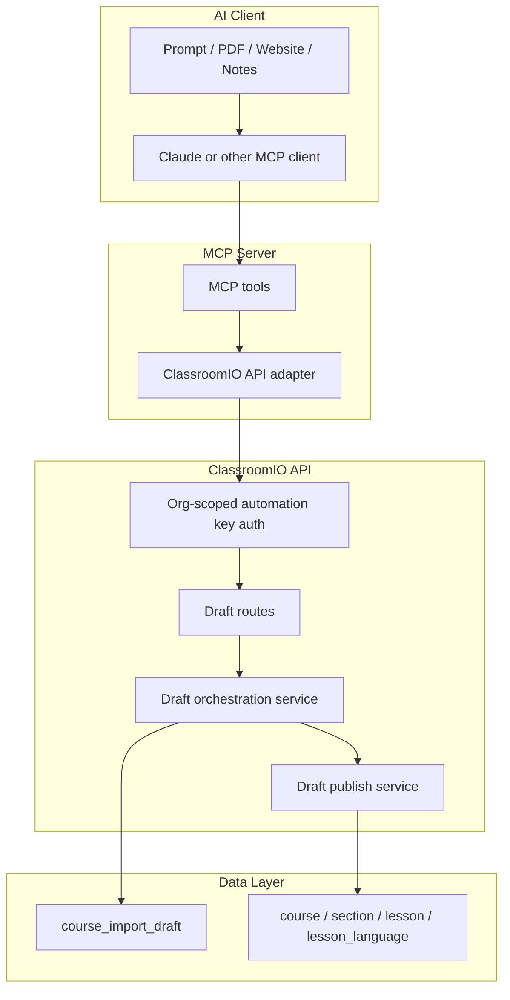

# MCP Course Authoring from Structured Payloads

## Status

- Draft

## Date

- March 12, 2026

## Purpose

Enable external AI clients such as Claude to create and edit ClassroomIO courses through MCP by sending normalized course structures into ClassroomIO.

The key product outcome is:

1. Claude or another agent reads source material externally
2. Claude turns that material into structured course JSON
3. MCP sends that JSON to ClassroomIO
4. ClassroomIO stores it as a draft
5. the user reviews and explicitly publishes it

This supports prompts like:

- "Create a complete course on exponential functions in Classroom."
- "Read this PDF, extract the course structure, and publish it into Classroom."

with one important boundary:

**In v1, ClassroomIO does not parse or extract PDFs itself.**

## Problem Statement

ClassroomIO already has the core CRUD primitives needed to create courses and content, but it does not yet expose a clean automation layer for external AI agents.

Current limitations:

- external AI clients have no MCP-compatible tool surface
- there is no normalized course payload contract for external agents
- there is no first-class draft persistence model for AI-generated course structures
- there is no explicit review/publish workflow for machine-generated content
- there is no stable API contract for "here is a complete course structure, store it safely"

This means agents can only create ClassroomIO content through brittle, record-by-record automation instead of a deliberate authoring pipeline.

## Core Product Decision

**Claude or the external agent is responsible for extraction. ClassroomIO is responsible for validation, persistence, review, authorization, and publish.**

That means:

- if the source is a PDF, Claude reads it
- if the source is a website, Claude reads it
- if the source is a prompt, Claude expands it
- ClassroomIO only receives structured payloads

## Primary Use Cases

### Use Case 1: Prompt to Structured Draft

A teacher asks Claude to create a course on a topic. Claude reasons about the content and sends a normalized course payload to ClassroomIO through MCP.

### Use Case 2: PDF to Structured Draft

A teacher provides one or more PDFs to Claude. Claude extracts the material and converts it into a normalized course payload. MCP sends that payload to ClassroomIO.

### Use Case 3: Draft Revision

After initial creation, Claude updates the draft by:

1. renaming sections
2. rewriting lesson content
3. reordering lessons
4. adding or removing lessons
5. publishing when the teacher confirms

## Goals

1. Provide an MCP-compatible authoring surface for external AI clients.
2. Keep ClassroomIO as the source of truth for auth, permissions, validation, persistence, and publishing.
3. Standardize a normalized course payload that any external agent can submit.
4. Make draft review mandatory before publish in v1.
5. Ensure org-scoped, permission-safe authoring with no direct DB access from the MCP server.
6. Support both prompt-derived and PDF-derived content through one shared payload contract.
7. Preserve human control by returning warnings and requiring explicit publish.

## Non-Goals (v1)

- Student-facing AI workflows
- Direct DB writes from the MCP server
- Full autonomous publishing without a review step
- ClassroomIO-side PDF extraction, OCR, or parsing
- Async PDF extraction workers
- Cross-organization or cross-course content access
- Full LMS migration parity with Teachable/Thinkific/SCORM in this PRD
- Perfect fidelity for tables, diagrams, formulas, or source formatting

## Confirmed Product Decisions

1. MCP is an orchestration layer, not the persistence layer.
2. ClassroomIO API owns validation, authorization, draft storage, and publish.
3. Draft-first is required; AI-generated content is not published immediately in v1.
4. External agents submit structured payloads; ClassroomIO does not ingest raw PDFs in v1.
5. The MCP server should start as a thin tool adapter and not require its own model provider.
6. Lesson long-form content should be stored in lesson language content, not only `lesson.note`.
7. Publish remains an explicit second step.

## Current-State Audit

| Capability | Current State | Notes |
| --- | --- | --- |
| Course creation | Exists via `POST /course` | Creates course shell only |
| Section creation | Exists via `POST /course/:courseId/section` | One section at a time |
| Lesson creation | Exists via `POST /course/:courseId/lesson` | One lesson at a time |
| Lesson language content | Exists via lesson-language routes | Good fit for generated lesson body |
| Course content reorder | Exists via content/section/lesson reorder routes | Useful after generation |
| Document upload | Exists for lesson documents | Not needed for v1 MCP ingestion |
| AI course assistant | PRD exists | Focused on in-app chat, not MCP |
| Public API keys | PRD exists | Likely dependency for auth model |
| Draft persistence for AI-generated course structures | Does not exist yet | Must be added |

## Data Sources Checked

- [apps/api/src/routes/course/course.ts](/Users/rotimibest/_pros/classroomio/apps/api/src/routes/course/course.ts)
- [apps/api/src/routes/course/section.ts](/Users/rotimibest/_pros/classroomio/apps/api/src/routes/course/section.ts)
- [apps/api/src/routes/course/lesson.ts](/Users/rotimibest/_pros/classroomio/apps/api/src/routes/course/lesson.ts)
- [apps/api/src/routes/course/lesson-language.ts](/Users/rotimibest/_pros/classroomio/apps/api/src/routes/course/lesson-language.ts)
- [apps/api/src/services/course/course.ts](/Users/rotimibest/_pros/classroomio/apps/api/src/services/course/course.ts)
- [apps/api/src/services/course/section.ts](/Users/rotimibest/_pros/classroomio/apps/api/src/services/course/section.ts)
- [apps/api/src/services/lesson/lesson.ts](/Users/rotimibest/_pros/classroomio/apps/api/src/services/lesson/lesson.ts)
- [apps/api/src/services/lesson-language.ts](/Users/rotimibest/_pros/classroomio/apps/api/src/services/lesson-language.ts)
- [packages/utils/src/validation/course/course.ts](/Users/rotimibest/_pros/classroomio/packages/utils/src/validation/course/course.ts)
- [packages/utils/src/validation/lesson/lesson.ts](/Users/rotimibest/_pros/classroomio/packages/utils/src/validation/lesson/lesson.ts)
- [packages/utils/src/validation/lesson/language.ts](/Users/rotimibest/_pros/classroomio/packages/utils/src/validation/lesson/language.ts)
- [prd/ai-course-assistant/README.md](/Users/rotimibest/_pros/classroomio/prd/ai-course-assistant/README.md)
- [prd/public-api/README.md](/Users/rotimibest/_pros/classroomio/prd/public-api/README.md)

## User Personas

### Persona A: Solo Teacher

Wants to turn source material into a structured first course quickly, then lightly edit before publish.

### Persona B: Training Operator

Uses Claude to convert internal manuals or SOPs into structured staff training without rebuilding content manually.

### Persona C: Content Team

Uses Claude as an operator to draft or refactor course structures programmatically across multiple organizations and topics.

## Jobs To Be Done

1. Convert source intent or material into a usable draft course structure.
2. Persist AI-generated course structures safely before publish.
3. Review machine-generated content before it affects learner-facing content.
4. Keep content generation inside org permissions and audit boundaries.
5. Avoid brittle record-by-record automation from external agents.

## Product Principles

1. Draft before publish.
2. API-first, not DB-first.
3. One normalized course payload regardless of how the agent derived it.
4. External agents think; ClassroomIO validates and persists.
5. Warnings are first-class output, not hidden logs.

## Proposed Architecture



## Scope Overview

### In Scope

- MCP tool surface for structured course authoring workflows
- organization-scoped authentication for MCP clients
- draft persistence and preview APIs
- publish flow from draft to real course content
- warnings, audit logging, and idempotency

### Out of Scope

- raw PDF ingestion by ClassroomIO
- OCR, parsing, or extraction jobs
- rich in-dashboard chat UX
- student preview or learner-side AI guidance

## Functional Requirements

### FR-1 MCP Tool Surface

The MCP server must expose a minimal, stable set of tools for AI clients:

- `create_course_draft`
- `get_course_draft`
- `update_course_draft`
- `publish_course_draft`
- `list_org_courses`
- `get_course_structure`

The MCP server must not write directly to the database.

### FR-2 Authentication and Scoping

All MCP actions must be authenticated and scoped to an organization.

Requirements:

- use organization-scoped automation keys
- reuse the same underlying key system as the Public API
- allow MCP to use a narrower scope preset than generic API access
- every request resolves a single org context
- mutations require org admin or authorized course team membership
- cross-org access must be rejected

### FR-3 Normalized Course Payload

All external agents must submit the same normalized course payload.

Minimum payload shape:

- course metadata
- sections
- lessons
- lesson content by locale
- optional exercises
- source references
- warnings

### FR-4 Draft Review

Generated content must remain in draft state until explicitly published.

The draft API must allow:

- fetching current draft
- patching draft metadata
- adding/removing/reordering sections and lessons
- updating lesson titles and language content
- inspecting warnings before publish

### FR-5 Structured Payload Ingestion

Users must be able to create a draft course by submitting a normalized course payload.

The API must not care whether the payload came from:

- a direct prompt
- a PDF processed by Claude
- a website processed by Claude
- manually authored JSON

### FR-6 Publish Flow

Publishing a draft must create or update real ClassroomIO content through the existing service layer.

Publish orchestration should:

1. create course shell
2. create sections
3. create lessons
4. create lesson-language content
5. optionally create exercises in later scope
6. return created IDs and publish summary

### FR-7 Idempotency and Retry Safety

MCP-triggered operations must be safe to retry.

Requirements:

- accept idempotency key on draft creation and publish
- prevent duplicate course creation on publish retries

### FR-8 Observability

The system must expose enough detail for debugging and support.

Requirements:

- structured logs per draft create/update/publish action
- audit trail for actor, org, tool, and created course IDs
- warning list available to the AI client and internal admins
- rate limits per org and per key

## Data Model

### New Table: `course_import_draft`

Fields:

- `id`
- `organizationId`
- `createdByProfileId`
- `sourceType`
- `status`
- `title`
- `locale`
- `idempotencyKey`
- `summary`
- `draft`
- `warnings`
- `sourceArtifacts`
- `publishedCourseId`
- timestamps

This table stores the normalized draft payload and the publish result.

## Normalized Payload Contract

```ts
type CourseDraft = {
  course: {
    title: string;
    description: string;
    type: 'LIVE_CLASS' | 'SELF_PACED';
    locale: string;
    metadata?: Record<string, unknown>;
  };
  sections: Array<{
    externalId: string;
    title: string;
    order: number;
  }>;
  lessons: Array<{
    externalId: string;
    sectionExternalId: string;
    title: string;
    order: number;
    isUnlocked?: boolean;
    public?: boolean;
  }>;
  lessonLanguages: Array<{
    lessonExternalId: string;
    locale: string;
    content: string;
  }>;
  exercises?: Array<Record<string, unknown>>;
  sourceReferences?: Array<{
    type: 'prompt' | 'pdf';
    label: string;
    pageStart?: number;
    pageEnd?: number;
  }>;
  warnings: Array<{
    code: string;
    message: string;
    severity: 'info' | 'warning' | 'error';
  }>;
};
```

## Proposed API Design

### Validation

Add:

- `packages/utils/src/validation/course-import/course-import.ts`

Schemas:

- `ZCourseImportDraftCreate`
- `ZCourseImportDraftGetParam`
- `ZCourseImportDraftUpdate`
- `ZCourseImportDraftPublish`

### Routes

Add organization-scoped route group:

- `apps/api/src/routes/organization/course-import.ts`

Suggested endpoints:

| Method | Path | Purpose |
| --- | --- | --- |
| `POST` | `/organization/course-import/drafts` | Create draft from normalized payload |
| `GET` | `/organization/course-import/drafts/:draftId` | Get draft |
| `PUT` | `/organization/course-import/drafts/:draftId` | Update draft |
| `POST` | `/organization/course-import/drafts/:draftId/publish` | Publish draft into course |

All routes must return a single response shape and follow existing route conventions.

### Services

Add:

- `apps/api/src/services/course-import/course-import.ts`

Responsibilities:

- draft persistence
- validation of structured payloads
- publish orchestration using current course/section/lesson/language services

## MCP Server Design

### Placement

Recommended:

- `apps/mcp`
or
- `packages/mcp`

Start with stdio transport for Claude Desktop and local agent usage.

### Responsibilities

- expose MCP tools
- validate tool input
- forward requests to ClassroomIO API
- format structured responses for the AI client

### Non-Responsibilities

- direct DB access
- authorization decisions independent of ClassroomIO
- content extraction from source materials
- PDF parsing or OCR

### Tool Contracts

#### `create_course_draft`

Input:

- `organizationId`
- normalized `draft`
- `sourceType`
- `idempotencyKey?`
- `summary?`
- `sourceArtifacts?`

Output:

- `draftId`
- `summary`
- `warnings`

#### `get_course_draft`

Input:

- `draftId`

Output:

- stored draft payload
- summary
- warnings
- publish status

#### `update_course_draft`

Input:

- `draftId`
- patch payload

Output:

- updated summary
- warnings

#### `publish_course_draft`

Input:

- `draftId`
- optional overrides for title/description/type/metadata

Output:

- `courseId`
- `createdSections`
- `createdLessons`
- `localeCount`

## Shared API Key Design

MCP and Public API should reuse the same underlying key infrastructure.

They should not reuse the same default secret for every use case.

Recommended model:

- one shared `organization_api_key` table
- one shared bearer-auth middleware
- different key presets by integration type

Recommended key fields:

- `id`
- `organizationId`
- `type`: `mcp | api | zapier`
- `label`
- `secretPrefix`
- `secretHash`
- `scopes`
- `createdByProfileId`
- `lastUsedAt`
- `expiresAt`
- `revokedAt`
- `createdAt`
- `updatedAt`

Recommended key handling:

- show raw secret once on creation
- store only the hash
- allow multiple active keys per organization
- encourage one key per integration or agent

Recommended preset policy:

- `mcp` preset:
  - draft create/read/update
  - draft publish
- `api` preset:
  - broader route-specific scopes selected by admin

## Route Design

Shared management routes should live under organization automation, not a separate MCP-only surface.

Recommended management routes:

- `GET /organization/automation/keys`
- `POST /organization/automation/keys`
- `DELETE /organization/automation/keys/:keyId`
- `POST /organization/automation/keys/:keyId/rotate`

Recommended request fields for create:

- `type`
- `label`
- `preset`
- `scopes` optional for custom API keys
- `expiresAt` optional

Recommended auth flow for machine requests:

1. client sends `Authorization: Bearer <key>`
2. middleware hashes key
3. API resolves organization from stored key row
4. API attaches scopes and key metadata to context
5. route checks scope and org permissions

## Automation UI Design

The management UI should live in the org sidebar as `Automation`.

Tabs:

- `MCP`
- `Zapier` disabled, coming soon
- `API` disabled, coming soon until public API ships

MCP tab responsibilities:

- explain what MCP does
- generate org-scoped MCP keys
- list active MCP keys
- revoke or rotate keys
- show setup snippets for:
  - Claude Code
  - Codex
  - Cursor

Permissions:

- org admins can create, rotate, revoke
- teachers can open the page but see the controls disabled
- all server mutations remain admin-only

## UX and Review Model

The review loop is:

1. external agent creates draft
2. user inspects summary and warnings
3. external agent revises draft if needed
4. user explicitly publishes

The AI client should never assume silent publish in v1.

## Failure Modes and Warnings

The system must capture and expose at least these issues:

- duplicate external IDs
- lessons referencing missing sections
- lesson-language entries referencing missing lessons
- empty or invalid titles/content
- invalid metadata shape
- duplicate publish attempts

Publishing should be blocked on validation errors. Informational warnings may still allow publish.

## Security Considerations

1. Reject cross-org access for all draft and publish routes.
2. Enforce org admin or equivalent authoring permissions.
3. Log key ID, key type, organization, and output course IDs for all MCP-triggered publishes.
4. Apply rate limits per org and per key.
5. Keep the MCP server outside the database trust boundary.

## Success Metrics

### Product Metrics

1. Time from agent output to first draft available
2. Draft-to-publish conversion rate
3. Average manual edits before publish
4. Percentage of generated drafts published within 24 hours

### Quality Metrics

1. Percentage of drafts requiring no structural edits
2. Publish failure rate
3. Duplicate publish rate
4. Support tickets related to malformed structure payloads

## Rollout Plan

### Phase 1: Draft and Publish API

Ship:

- normalized payload schema
- draft create endpoint
- draft update endpoint
- publish endpoint

### Phase 2: MCP Server

Ship:

- stdio MCP server
- auth wiring
- tool contracts for create/get/update/publish

### Phase 3: Hardening

Ship:

- idempotency keys
- richer warnings
- observability
- docs and examples

## Dependencies

1. Existing course, section, lesson, and lesson-language services remain the publish target.
2. Shared organization automation key infrastructure must be implemented.
3. External agent must generate normalized course payloads that match the schema.

## Open Questions

1. Should `publish_course_draft` remain a separate tool only, or support an explicit `publish: true` flag during draft creation?
2. Should exercise payloads be part of v1 or deferred until lesson drafting stabilizes?
3. What locale set should be supported by default?
4. Should cloud-only restrictions apply, similar to the AI assistant PRD?
5. Should the shared key-management routes ship before public `/v1/*` API routes, so MCP can adopt them first?

## Recommendation Summary

The correct v1 shape is:

1. thin MCP server
2. ClassroomIO-owned draft/publish API
3. external agent owns source extraction
4. explicit draft review before publish
5. publish via existing content services, not custom DB writes

That keeps the system small, matches your clarified boundary, and gives Claude a clean automation surface without forcing ClassroomIO to solve PDF extraction in v1.
