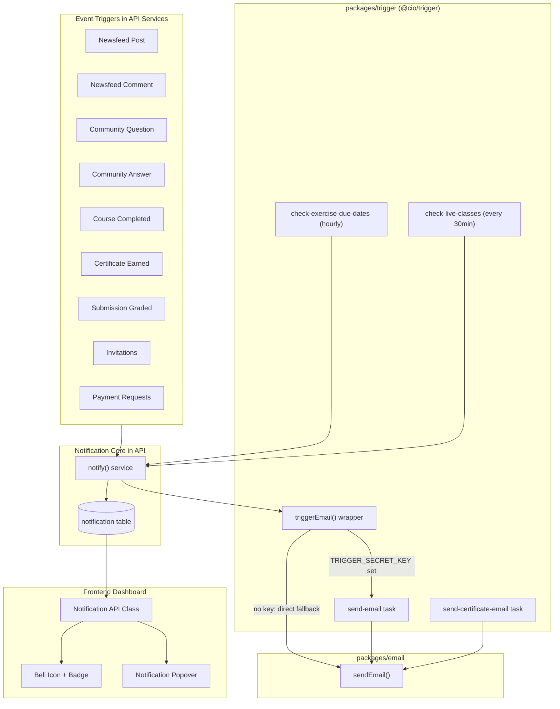
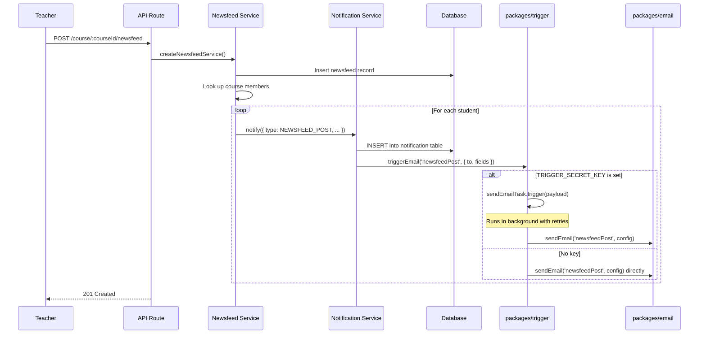

# Notification System PRD

## Purpose

Add a notification system to ClassroomIO that:
1. Sends **in-app notifications** visible in the bell icon popover at the top nav bar
2. Sends **email notifications** for important events via background tasks
3. Runs **scheduled reminders** (exercise due dates, upcoming live classes)
4. Makes it trivial to add new notification triggers in the future

## Confirmed Decisions

1. **Background jobs**: Trigger.dev (`packages/trigger`) as its own workspace package.
2. **All email sending** in `apps/api` services goes through `triggerEmail()` from `@cio/trigger` (background task with retries). Auth emails in `packages/db` stay as direct `sendEmail()` to avoid circular dependencies.
3. **Graceful degradation**: If `TRIGGER_SECRET_KEY` is not set, emails send directly (fire-and-forget). Scheduled tasks simply won't run. The app never breaks.
4. **Frontend**: Notifications load on page load and on refresh button click. No real-time polling or WebSocket.
5. **Notification popover**: Extracted into a shared component used by all 3 header components.

## Architecture



### How the flow works (example: teacher creates a newsfeed post)



---

## Current State Audit

| Capability | Status | Location |
| --- | --- | --- |
| Notification table | not implemented | -- |
| Notification API routes | not implemented | -- |
| Notification UI | placeholder only | Bell icon with "No Notifications" in 3 headers |
| Email infrastructure | fully working | `packages/email` (Zeptomail + Nodemailer fallback) |
| Email templates | 13 templates exist | `packages/email/src/emails/` |
| Background jobs | not implemented | -- |
| Scheduled tasks (cron) | not implemented | -- |
| Redis | available | `apps/api/src/utils/redis/redis.ts` (used for rate limiting) |
| Exercise due dates | field exists | `exercise.dueBy` column in DB |
| Live class scheduling | field exists | `lesson.lessonAt` column for `LIVE_CLASS` courses |
| Community Q&A | implemented | `community_question` + `community_answer` tables |
| Course completion tracking | implemented | `lesson_completion` + `submission` tables, `getCourseProgress()` |
| Certificate generation | implemented | `apps/api/src/utils/certificate.ts` |

### All existing email send call sites (19 total)

**In `apps/api/` services (14 call sites) -- will migrate to `triggerEmail()`:**

| # | File | Email ID | What it does |
| --- | --- | --- | --- |
| 1 | `services/onboarding.ts` | `welcome` | Welcome email after signup |
| 2 | `services/organization/invite.ts` | `inviteTeacher` | Teacher invitation |
| 3 | `services/course/people.ts` | `studentCourseWelcome` | Student added to course |
| 4 | `services/course/people.ts` | `teacherStudentJoined` | Teacher notified of new student |
| 5 | `services/course/people.ts` | `teacherCourseWelcome` | Teacher/admin added to course |
| 6 | `services/course/invite.ts` | `studentCourseWelcome` | Student enrolled via invite |
| 7 | `services/course/invite.ts` | `teacherStudentJoined` | Teacher notified (invite flow) |
| 8 | `services/course/invite.ts` | `studentCourseInvite` | Course invitation email |
| 9 | `services/course/payment-request.ts` | `teacherStudentBuyRequest` | Payment request to teacher |
| 10 | `services/course/payment-request.ts` | `studentProvePayment` | Payment proof to student |
| 11 | `services/newsfeed/newsfeed.ts` | `newsfeedPost` | New post to course members |
| 12 | `services/newsfeed/newsfeed.ts` | `newsfeedComment` | Comment to feed author |
| 13 | `services/submission/submission.ts` | raw `deliverEmail()` | Submission graded to student |
| 14 | `services/submission/submission.ts` | raw `deliverEmail()` | New submission to tutors |

**In `packages/db/` auth hooks (4 call sites) -- keep as direct `sendEmail()`:**

| # | File | Email ID | Why keep direct |
| --- | --- | --- | --- |
| 15 | `packages/db/src/auth/email-password.ts` | `forgotPassword` | Circular dep: trigger depends on db |
| 16 | `packages/db/src/auth/email-password.ts` | `onPasswordReset` | Same |
| 17 | `packages/db/src/auth/email-verification.ts` | `verifyEmail` | Same |
| 18 | `packages/db/src/auth/email-verification.ts` | `verifyEmail` | Same |

**Generic mail endpoint (1 call site) -- leave as-is:**

| # | File | Notes |
| --- | --- | --- |
| 19 | `apps/api/src/routes/mail/mail.ts` | Raw pass-through API |

---

## Phase 1: `packages/trigger` -- Trigger.dev Package

### What is Trigger.dev?

Trigger.dev is a background job framework for TypeScript. It runs your code as tasks that:
- Have automatic retries on failure
- Can be scheduled with cron syntax
- Run outside the HTTP request lifecycle (don't slow down API responses)
- Have a dashboard for monitoring

### 1a. Folder Structure

```
packages/trigger/
  package.json
  trigger.config.ts
  tsconfig.json
  README.md
  src/
    index.ts
    client.ts
    tasks/
      send-email.ts
      send-certificate-email.ts
    scheduled/
      check-exercise-due-dates.ts
      check-upcoming-live-classes.ts
```

### 1b. `package.json`

```json
{
  "name": "@cio/trigger",
  "version": "0.0.1",
  "type": "module",
  "main": "src/index.ts",
  "types": "src/index.ts",
  "scripts": {
    "dev": "npx trigger.dev@latest dev",
    "deploy": "npx trigger.dev@latest deploy"
  },
  "dependencies": {
    "@trigger.dev/sdk": "latest",
    "@cio/email": "workspace:*",
    "@cio/db": "workspace:*"
  },
  "devDependencies": {
    "@trigger.dev/build": "latest",
    "typescript": "^5.5.2"
  }
}
```

The workspace already includes `packages/*` in `pnpm-workspace.yaml`, so this is auto-discovered.

### 1c. `trigger.config.ts`

```typescript
import { defineConfig } from "@trigger.dev/sdk/v3";

export default defineConfig({
  project: "your-project-ref",
  runtime: "node",
  logLevel: "log",
  dirs: ["src/tasks", "src/scheduled"]
});
```

### 1d. `src/client.ts` -- Graceful Fallback

This is the key file that makes the app work without Trigger.dev:

```typescript
import { configure } from "@trigger.dev/sdk/v3";

const TRIGGER_SECRET_KEY = process.env.TRIGGER_SECRET_KEY;

export function isTriggerConfigured(): boolean {
  return !!TRIGGER_SECRET_KEY;
}

if (isTriggerConfigured()) {
  configure({ secretKey: TRIGGER_SECRET_KEY! });
}
```

### 1e. `src/index.ts` -- The `triggerEmail()` Wrapper

Every email send in the API should go through this function instead of calling `sendEmail()` directly:

```typescript
import type { EmailId, EmailSchemaFor } from '@cio/email';
import type { SendConfig } from '@cio/email';
import { sendEmail } from '@cio/email';
import { isTriggerConfigured } from './client';
import { sendEmailTask } from './tasks/send-email';

export { isTriggerConfigured } from './client';

/**
 * Send an email via Trigger.dev background task (if configured)
 * or directly via sendEmail() as fallback.
 *
 * USE THIS instead of sendEmail() in all API services.
 */
export async function triggerEmail<TEmailId extends EmailId>(
  emailId: TEmailId,
  config: SendConfig<EmailSchemaFor<TEmailId>>
): Promise<void> {
  if (isTriggerConfigured()) {
    await sendEmailTask.trigger({
      emailId,
      to: config.to,
      fields: config.fields,
      from: config.from,
      replyTo: config.replyTo
    });
  } else {
    sendEmail(emailId, config).catch((err) =>
      console.error(`[triggerEmail fallback] Failed to send "${emailId}":`, err)
    );
  }
}
```

### 1f. `src/tasks/send-email.ts`

```typescript
import { task } from "@trigger.dev/sdk/v3";
import { sendEmail } from "@cio/email";

export const sendEmailTask = task({
  id: "send-email",
  retry: {
    maxAttempts: 3,
    factor: 2,
    minTimeoutInMs: 1000,
    maxTimeoutInMs: 10000
  },
  run: async (payload: {
    emailId: string;
    to: string;
    fields: Record<string, unknown>;
    from?: string;
    replyTo?: string;
  }) => {
    await sendEmail(payload.emailId as any, {
      to: payload.to,
      fields: payload.fields as any,
      from: payload.from,
      replyTo: payload.replyTo
    });
  }
});
```

### 1g. `src/tasks/send-certificate-email.ts`

```typescript
import { task } from "@trigger.dev/sdk/v3";
import { generateCertificate } from '@api/utils/certificate';
import { deliverEmail } from '@cio/email';

export const sendCertificateEmailTask = task({
  id: "send-certificate-email",
  retry: { maxAttempts: 3 },
  run: async (payload: {
    studentEmail: string;
    studentName: string;
    courseName: string;
    courseDescription: string;
    orgLogoUrl: string;
    orgName: string;
    facilitator?: string;
  }) => {
    const pdfBuffer = await generateCertificate({
      studentName: payload.studentName,
      courseName: payload.courseName,
      courseDescription: payload.courseDescription,
      orgLogoUrl: payload.orgLogoUrl,
      orgName: payload.orgName,
      facilitator: payload.facilitator
    });

    // Send email with PDF attachment
    // (extend deliverEmail or use nodemailer directly for attachments)
  }
});
```

### 1h. `src/scheduled/check-exercise-due-dates.ts`

```typescript
import { schedules } from "@trigger.dev/sdk/v3";

export const checkExerciseDueDates = schedules.task({
  id: "check-exercise-due-dates",
  cron: "0 * * * *", // Every hour
  run: async (payload) => {
    // 1. Query exercises where dueBy is between now and 24 hours from now
    // 2. For each exercise, get enrolled students (via course -> group -> groupmember)
    // 3. Check if a notification of type EXERCISE_DUE_REMINDER already exists
    //    for this exercise + profile + today (deduplication)
    // 4. If not, call notify() for each student
  }
});
```

**Deduplication logic explained:** Before creating a reminder notification, query the `notification` table:

```typescript
const existing = await db
  .select({ id: schema.notification.id })
  .from(schema.notification)
  .where(
    and(
      eq(schema.notification.profileId, profileId),
      eq(schema.notification.type, 'EXERCISE_DUE_REMINDER'),
      sql`${schema.notification.metadata}->>'exerciseId' = ${exerciseId}`,
      gte(schema.notification.createdAt, startOfToday)
    )
  )
  .limit(1);

if (existing.length > 0) return; // Already sent today, skip
```

### 1i. `src/scheduled/check-upcoming-live-classes.ts`

```typescript
import { schedules } from "@trigger.dev/sdk/v3";

export const checkUpcomingLiveClasses = schedules.task({
  id: "check-upcoming-live-classes",
  cron: "*/30 * * * *", // Every 30 minutes
  run: async (payload) => {
    // 1. Query lessons where:
    //    - lessonAt is between now and 1 hour from now
    //    - course.type = 'LIVE_CLASS'
    // 2. For each lesson, get enrolled students via course -> group -> groupmember
    // 3. Deduplicate (check notification table)
    // 4. Call notify() for each student
  }
});
```

### 1j. Setup Guide (README.md)

Create `packages/trigger/README.md` covering:

1. **Create account**: Go to https://trigger.dev, sign up, create a project
2. **Get secret key**: Copy `TRIGGER_SECRET_KEY` from project API Keys page
3. **Add to `.env`**:
   ```
   TRIGGER_SECRET_KEY=tr_dev_xxxxxxxxxx
   ```
4. **Install deps**: `pnpm install` from workspace root
5. **Run locally**: `pnpm --filter @cio/trigger dev`
6. **Deploy**: `pnpm --filter @cio/trigger deploy`
7. **Without Trigger.dev**: If you don't set the env var, the app works normally -- emails send directly (no retries, no dashboard), and scheduled tasks (exercise reminders, live class reminders) won't run.

Also add to `apps/api/src/config/env.ts`:
```typescript
TRIGGER_SECRET_KEY: z.string().optional(),
```

---

## Phase 2: Database -- `notification` Table

### 2a. Schema

Add to `packages/db/src/schema.ts`:

```typescript
export const notificationType = pgEnum('NOTIFICATION_TYPE', [
  'EXERCISE_DUE_REMINDER',
  'LIVE_CLASS_REMINDER',
  'NEWSFEED_POST',
  'NEWSFEED_COMMENT',
  'COMMUNITY_QUESTION',
  'COMMUNITY_ANSWER',
  'COURSE_COMPLETED',
  'CERTIFICATE_EARNED'
]);

export const notification = pgTable('notification', {
  id: uuid('id').defaultRandom().primaryKey(),
  profileId: uuid('profile_id').references(() => profile.id).notNull(),
  type: notificationType().notNull(),
  title: varchar('title').notNull(),
  body: text('body'),
  metadata: jsonb('metadata').$type<Record<string, unknown>>().default({}),
  isRead: boolean('is_read').default(false).notNull(),
  courseId: uuid('course_id').references(() => course.id),
  organizationId: uuid('organization_id').references(() => organization.id),
  createdAt: timestamp('created_at', { withTimezone: true }).defaultNow().notNull()
}, (t) => [
  index('idx_notification_profile').on(t.profileId),
  index('idx_notification_profile_unread').on(t.profileId, t.isRead)
]);
```

**What each column is for:**

| Column | Purpose |
| --- | --- |
| `id` | Primary key (UUID) |
| `profileId` | Who receives the notification (FK to `profile`) |
| `type` | Enum -- determines the icon and behavior in the UI |
| `title` | Short summary shown in the popover (e.g. "New post in React 101") |
| `body` | Optional longer description |
| `metadata` | JSONB -- stores context-specific data for deep linking (see below) |
| `isRead` | Whether the user has seen it (clicked) |
| `courseId` | Optional FK -- which course this notification relates to |
| `organizationId` | Optional FK -- which org this belongs to |
| `createdAt` | When the notification was created |

**`metadata` examples per notification type:**

```typescript
// NEWSFEED_POST
{ feedId: "uuid-123", link: "/courses/abc/newsfeed?feedId=uuid-123" }

// COMMUNITY_QUESTION
{ questionSlug: "how-to-use-hooks", courseId: "abc", link: "/courses/abc/community/how-to-use-hooks" }

// EXERCISE_DUE_REMINDER
{ exerciseId: "ex-123", dueBy: "2026-03-01T23:59:00Z", link: "/courses/abc/exercises/ex-123" }

// LIVE_CLASS_REMINDER
{ lessonId: "lesson-456", lessonAt: "2026-03-02T14:00:00Z", link: "/courses/abc/lessons/lesson-456" }

// COURSE_COMPLETED
{ studentName: "Jane Doe", studentProfileId: "profile-789", link: "/courses/abc/people" }
```

### 2b. Migration

Create `packages/db/src/migrations/00XX_add_notification_table.sql`. Use drizzle-kit to generate:

```bash
pnpm --filter @cio/db drizzle-kit generate
```

### 2c. Types

Export types in `packages/db/src/types.ts`:

```typescript
export type TNotification = typeof schema.notification.$inferSelect;
export type TNewNotification = typeof schema.notification.$inferInsert;
```

### 2d. Queries

Create `packages/db/src/queries/notification/notification.ts`:

```typescript
import * as schema from '@db/schema';
import { and, count, db, desc, eq } from '@db/drizzle';

import type { TNewNotification } from '@db/types';

export async function createNotification(data: TNewNotification) {
  try {
    const [result] = await db.insert(schema.notification).values(data).returning();
    return result;
  } catch (error) {
    console.error('createNotification error:', error);
    throw new Error('Failed to create notification');
  }
}

export async function createNotifications(data: TNewNotification[]) {
  try {
    if (data.length === 0) return [];
    const results = await db.insert(schema.notification).values(data).returning();
    return results;
  } catch (error) {
    console.error('createNotifications error:', error);
    throw new Error('Failed to create notifications');
  }
}

export async function getNotifications(
  profileId: string,
  options: { page: number; limit: number }
) {
  try {
    const offset = (options.page - 1) * options.limit;

    const [notifications, totalResult] = await Promise.all([
      db
        .select()
        .from(schema.notification)
        .where(eq(schema.notification.profileId, profileId))
        .orderBy(desc(schema.notification.createdAt))
        .limit(options.limit)
        .offset(offset),
      db
        .select({ count: count() })
        .from(schema.notification)
        .where(eq(schema.notification.profileId, profileId))
    ]);

    const total = totalResult[0]?.count ?? 0;

    return {
      items: notifications,
      pagination: {
        page: options.page,
        limit: options.limit,
        total,
        totalPages: Math.ceil(total / options.limit)
      }
    };
  } catch (error) {
    console.error('getNotifications error:', error);
    throw new Error('Failed to get notifications');
  }
}

export async function getUnreadCount(profileId: string): Promise<number> {
  try {
    const result = await db
      .select({ count: count() })
      .from(schema.notification)
      .where(
        and(
          eq(schema.notification.profileId, profileId),
          eq(schema.notification.isRead, false)
        )
      );

    return result[0]?.count ?? 0;
  } catch (error) {
    console.error('getUnreadCount error:', error);
    throw new Error('Failed to get unread count');
  }
}

export async function markAsRead(notificationId: string, profileId: string) {
  try {
    const [result] = await db
      .update(schema.notification)
      .set({ isRead: true })
      .where(
        and(
          eq(schema.notification.id, notificationId),
          eq(schema.notification.profileId, profileId)
        )
      )
      .returning();

    return result;
  } catch (error) {
    console.error('markAsRead error:', error);
    throw new Error('Failed to mark notification as read');
  }
}

export async function markAllAsRead(profileId: string) {
  try {
    await db
      .update(schema.notification)
      .set({ isRead: true })
      .where(
        and(
          eq(schema.notification.profileId, profileId),
          eq(schema.notification.isRead, false)
        )
      );
  } catch (error) {
    console.error('markAllAsRead error:', error);
    throw new Error('Failed to mark all notifications as read');
  }
}
```

Export from `packages/db/src/queries/notification/index.ts`:
```typescript
export * from './notification';
```

---

## Phase 3: Notification Service + API Routes

### 3a. Validation

Create `packages/utils/src/validation/notification/notification.ts`:

```typescript
import { z } from 'zod';

export const ZGetNotifications = z.object({
  page: z.string().transform(Number).pipe(z.number().min(1)).default('1'),
  limit: z.string().transform(Number).pipe(z.number().min(1).max(100)).default('20')
});

export const ZMarkAsRead = z.object({
  id: z.string().uuid()
});

export type TGetNotifications = z.infer<typeof ZGetNotifications>;
```

### 3b. Notification Service

Create `apps/api/src/services/notification/notification.ts`:

```typescript
import { AppError, ErrorCodes } from '@api/utils/errors';
import {
  createNotification,
  createNotifications,
  getNotifications,
  getUnreadCount,
  markAllAsRead,
  markAsRead
} from '@cio/db/queries/notification';
import { triggerEmail } from '@cio/trigger';
import type { TNewNotification } from '@cio/db/types';
import type { EmailId } from '@cio/email';

interface NotifyParams {
  profileId: string;
  type: TNewNotification['type'];
  title: string;
  body?: string;
  metadata?: Record<string, unknown>;
  courseId?: string;
  organizationId?: string;
  email?: {
    emailId: EmailId;
    to: string;
    fields: Record<string, unknown>;
    from?: string;
    replyTo?: string;
  };
}

/**
 * Create an in-app notification AND optionally send an email.
 * This is the SINGLE ENTRY POINT for all notifications.
 *
 * @example
 * ```typescript
 * await notify({
 *   profileId: student.id,
 *   type: 'NEWSFEED_POST',
 *   title: `New post in ${courseTitle}`,
 *   body: content.substring(0, 100),
 *   courseId,
 *   organizationId: orgId,
 *   metadata: { feedId: feed.id, link: `/courses/${courseId}?feedId=${feed.id}` },
 *   email: {
 *     emailId: 'newsfeedPost',
 *     to: student.email,
 *     fields: { courseTitle, teacherName, content, postLink, orgName }
 *   }
 * });
 * ```
 */
export async function notify(params: NotifyParams) {
  try {
    const record = await createNotification({
      profileId: params.profileId,
      type: params.type,
      title: params.title,
      body: params.body,
      metadata: params.metadata ?? {},
      courseId: params.courseId,
      organizationId: params.organizationId
    });

    if (params.email) {
      triggerEmail(params.email.emailId as any, {
        to: params.email.to,
        fields: params.email.fields as any,
        from: params.email.from,
        replyTo: params.email.replyTo
      }).catch((err) => {
        console.error('notify: email trigger failed:', err);
      });
    }

    return record;
  } catch (error) {
    console.error('notify error:', error);
    throw new AppError('Failed to create notification', ErrorCodes.INTERNAL_ERROR, 500);
  }
}

/**
 * Create in-app notifications for multiple recipients AND send emails.
 * Batch inserts notifications, then triggers emails individually.
 *
 * @example
 * ```typescript
 * await notifyMany(courseMembers.map(member => ({
 *   profileId: member.profileId,
 *   type: 'NEWSFEED_POST',
 *   title: `New post in ${courseTitle}`,
 *   courseId,
 *   email: { emailId: 'newsfeedPost', to: member.email, fields: { ... } }
 * })));
 * ```
 */
export async function notifyMany(recipients: NotifyParams[]) {
  try {
    if (recipients.length === 0) return [];

    const notificationData = recipients.map((r) => ({
      profileId: r.profileId,
      type: r.type,
      title: r.title,
      body: r.body,
      metadata: r.metadata ?? {},
      courseId: r.courseId,
      organizationId: r.organizationId
    }));

    const records = await createNotifications(notificationData);

    const emailPromises = recipients
      .filter((r) => r.email)
      .map((r) =>
        triggerEmail(r.email!.emailId as any, {
          to: r.email!.to,
          fields: r.email!.fields as any,
          from: r.email!.from,
          replyTo: r.email!.replyTo
        }).catch((err) => {
          console.error(`notifyMany: email to ${r.email!.to} failed:`, err);
        })
      );

    await Promise.allSettled(emailPromises);

    return records;
  } catch (error) {
    console.error('notifyMany error:', error);
    throw new AppError('Failed to create notifications', ErrorCodes.INTERNAL_ERROR, 500);
  }
}

export async function listNotifications(profileId: string, options: { page: number; limit: number }) {
  try {
    return await getNotifications(profileId, options);
  } catch (error) {
    console.error('listNotifications error:', error);
    throw new AppError('Failed to list notifications', ErrorCodes.NOTIFICATION_FETCH_FAILED, 500);
  }
}

export async function fetchUnreadCount(profileId: string) {
  try {
    return await getUnreadCount(profileId);
  } catch (error) {
    console.error('fetchUnreadCount error:', error);
    throw new AppError('Failed to get unread count', ErrorCodes.NOTIFICATION_FETCH_FAILED, 500);
  }
}

export async function markNotificationRead(notificationId: string, profileId: string) {
  try {
    return await markAsRead(notificationId, profileId);
  } catch (error) {
    console.error('markNotificationRead error:', error);
    throw new AppError('Failed to mark notification as read', ErrorCodes.NOTIFICATION_UPDATE_FAILED, 500);
  }
}

export async function markAllNotificationsRead(profileId: string) {
  try {
    return await markAllAsRead(profileId);
  } catch (error) {
    console.error('markAllNotificationsRead error:', error);
    throw new AppError('Failed to mark all notifications as read', ErrorCodes.NOTIFICATION_UPDATE_FAILED, 500);
  }
}
```

### 3c. Error Codes

Add to `apps/api/src/utils/errors.ts` inside `ErrorCodes`:

```typescript
// Notification errors
NOTIFICATION_FETCH_FAILED: 'NOTIFICATION_FETCH_FAILED',
NOTIFICATION_NOT_FOUND: 'NOTIFICATION_NOT_FOUND',
NOTIFICATION_UPDATE_FAILED: 'NOTIFICATION_UPDATE_FAILED',
```

### 3d. API Routes

Create `apps/api/src/routes/notification/notification.ts`:

```typescript
import { Hono } from '@api/utils/hono';
import { authMiddleware } from '@api/middlewares/auth';
import { handleError } from '@api/utils/errors';
import { zValidator } from '@hono/zod-validator';
import { ZGetNotifications, ZMarkAsRead } from '@cio/utils/validation/notification';
import {
  listNotifications,
  fetchUnreadCount,
  markNotificationRead,
  markAllNotificationsRead
} from '@api/services/notification/notification';

export const notificationRouter = new Hono()
  .get('/', authMiddleware, zValidator('query', ZGetNotifications), async (c) => {
    try {
      const user = c.get('user')!;
      const { page, limit } = c.req.valid('query');

      const result = await listNotifications(user.id, { page, limit });

      return c.json({ success: true, data: result.items, pagination: result.pagination });
    } catch (error) {
      return handleError(c, error, 'Failed to fetch notifications');
    }
  })
  .get('/unread-count', authMiddleware, async (c) => {
    try {
      const user = c.get('user')!;

      const count = await fetchUnreadCount(user.id);

      return c.json({ success: true, data: { count } });
    } catch (error) {
      return handleError(c, error, 'Failed to fetch unread count');
    }
  })
  .put('/:id/read', authMiddleware, zValidator('param', ZMarkAsRead), async (c) => {
    try {
      const user = c.get('user')!;
      const { id } = c.req.valid('param');

      await markNotificationRead(id, user.id);

      return c.json({ success: true });
    } catch (error) {
      return handleError(c, error, 'Failed to mark notification as read');
    }
  })
  .put('/read-all', authMiddleware, async (c) => {
    try {
      const user = c.get('user')!;

      await markAllNotificationsRead(user.id);

      return c.json({ success: true });
    } catch (error) {
      return handleError(c, error, 'Failed to mark all as read');
    }
  });
```

### 3e. Register in `apps/api/src/app.ts`

Add import and route:

```typescript
import { notificationRouter } from '@api/routes/notification/notification';

// In the chain:
.route('/notification', notificationRouter)
```

Also add `@cio/trigger` to `apps/api/package.json` dependencies:

```json
"@cio/trigger": "workspace:*"
```

---

## Phase 4: New Email Templates

Create 8 new templates in `packages/email/src/emails/`. Follow the existing pattern in `packages/email/src/emails/newsfeed.ts`.

### Example: `community-question.ts`

```typescript
import * as z from 'zod';
import { defineEmail } from '../send';
import { getDefaultTemplate } from '../templates';

export const communityQuestionEmail = defineEmail({
  id: 'communityQuestion',
  subject: 'New question in your course',
  schema: z.object({
    studentName: z.string().min(1),
    questionTitle: z.string().min(1),
    courseName: z.string().min(1),
    questionLink: z.url(),
    orgName: z.string().min(1)
  }),
  render: (fields) => {
    const content = `
      <p>${fields.studentName} posted a question in ${fields.courseName}:</p>
      <p style="font-weight: bold; font-size: 16px;">${fields.questionTitle}</p>
      <div>
        <a class="button" href="${fields.questionLink}">View Question</a>
      </div>
    `;
    return getDefaultTemplate(content);
  }
});
```

### All 8 templates to create

| File | ID | Subject | Schema fields |
| --- | --- | --- | --- |
| `exercise-due-reminder.ts` | `exerciseDueReminder` | "Exercise due soon" | `exerciseTitle`, `courseName`, `dueBy`, `exerciseLink`, `orgName` |
| `live-class-reminder.ts` | `liveClassReminder` | "Upcoming class reminder" | `lessonTitle`, `courseName`, `lessonAt`, `lessonLink`, `orgName` |
| `community-question.ts` | `communityQuestion` | "New question in your course" | `studentName`, `questionTitle`, `courseName`, `questionLink`, `orgName` |
| `community-answer.ts` | `communityAnswer` | "Your question received an answer" | `questionTitle`, `courseName`, `answerPreview`, `questionLink`, `orgName` |
| `course-completed.ts` | `courseCompleted` | "Student completed your course" | `studentName`, `courseName`, `courseLink`, `orgName` |
| `certificate-earned.ts` | `certificateEarned` | "Your certificate is ready" | `studentName`, `courseName`, `downloadLink`, `orgName` |
| `submission-graded.ts` | `submissionGraded` | "Submission graded" | `studentName`, `exerciseTitle`, `courseName`, `statusText`, `score`, `exerciseLink`, `orgName` |
| `submission-received.ts` | `submissionReceived` | "New submission received" | `studentName`, `exerciseTitle`, `courseName`, `submissionLink`, `orgName` |

### Register templates

After creating each file, add to `packages/email/src/emails/index.ts`:

```typescript
// Add exports
export * from './exercise-due-reminder';
export * from './live-class-reminder';
export * from './community-question';
export * from './community-answer';
export * from './course-completed';
export * from './certificate-earned';
export * from './submission-graded';
export * from './submission-received';

// Add to EmailSchemas type
export type EmailSchemas = {
  // ... existing entries ...
  exerciseDueReminder: typeof exerciseDueReminderEmail.template.schema;
  liveClassReminder: typeof liveClassReminderEmail.template.schema;
  communityQuestion: typeof communityQuestionEmail.template.schema;
  communityAnswer: typeof communityAnswerEmail.template.schema;
  courseCompleted: typeof courseCompletedEmail.template.schema;
  certificateEarned: typeof certificateEarnedEmail.template.schema;
  submissionGraded: typeof submissionGradedEmail.template.schema;
  submissionReceived: typeof submissionReceivedEmail.template.schema;
};
```

---

## Phase 5: Migrate Existing Email Sends to `triggerEmail()`

For each file in the table above, replace `sendEmail(...)` with `triggerEmail(...)` from `@cio/trigger`.

### Before (current code):

```typescript
// apps/api/src/services/onboarding.ts
import { sendEmail } from '@cio/email';

await sendEmail('welcome', {
  to: user.email,
  fields: { name: profile.fullname }
});
```

### After:

```typescript
// apps/api/src/services/onboarding.ts
import { triggerEmail } from '@cio/trigger';

await triggerEmail('welcome', {
  to: user.email,
  fields: { name: profile.fullname }
});
```

The function signature is identical -- the only change is the import and function name.

### For raw `deliverEmail()` calls (submission.ts)

These need to be converted to templates first (Phase 4: `submissionGraded` and `submissionReceived`), then use `notify()` instead since they should also create in-app notifications.

**Before:**
```typescript
await deliverEmail([{
  from: buildEmailFromName(`${orgName} (via ClassroomIO.com)`),
  to: fullSubmission.groupmember.profile.email,
  subject: 'Submission Update',
  content  // raw HTML string
}]);
```

**After:**
```typescript
await notify({
  profileId: fullSubmission.groupmember.profile.id,
  type: 'SUBMISSION_GRADED', // add this to the enum if you want
  title: `Exercise "${exercise.title}" has been graded`,
  courseId,
  metadata: { exerciseId, link: exerciseLink },
  email: {
    emailId: 'submissionGraded',
    to: fullSubmission.groupmember.profile.email,
    fields: {
      studentName: fullSubmission.groupmember.profile.fullname,
      exerciseTitle: exercise.title,
      courseName: course.title,
      statusText,
      score: `${totalMark}/${maxMark}`,
      exerciseLink,
      orgName
    }
  }
});
```

---

## Phase 6: Wire Up Notification Triggers

### 6a. Newsfeed

**File:** `apps/api/src/services/newsfeed/newsfeed.ts`

Replace the existing `sendNewsfeedPostEmail()` call in `createNewsfeedService()`:

**Before:**
```typescript
sendNewsfeedPostEmail(feed.id, authorId).catch((error) => {
  console.error('Failed to send newsfeed post email:', error);
});
```

**After:**
```typescript
// Fire-and-forget: create in-app notifications + emails for all course members
sendNewsfeedNotifications(feed.id, authorId, courseId).catch((error) => {
  console.error('Failed to send newsfeed notifications:', error);
});
```

Where `sendNewsfeedNotifications` is a new helper function:
```typescript
async function sendNewsfeedNotifications(feedId: string, authorId: string, courseId: string) {
  const feedData = await getNewsfeedForEmail(feedId, authorId);
  if (!feedData?.courseId || !feedData.courseTitle || !feedData.organization?.siteName) return;
  if (feedData.courseMembers.length === 0) return;

  const orgName = feedData.organization?.name || 'ClassroomIO';
  const orgSiteName = feedData.organization?.siteName || 'app';
  const postLink = `https://${orgSiteName}.classroomio.com/courses/${feedData.courseId}?feedId=${feedData.feedId}`;

  const recipients = feedData.courseMembers
    .filter((m) => m.email && m.profileId)
    .map((member) => ({
      profileId: member.profileId!,
      type: 'NEWSFEED_POST' as const,
      title: `New post in ${feedData.courseTitle}`,
      body: (feedData.content || '').substring(0, 100),
      courseId,
      organizationId: feedData.organization?.id,
      metadata: { feedId, link: `/courses/${courseId}?feedId=${feedId}` },
      email: {
        emailId: 'newsfeedPost' as const,
        to: member.email!,
        fields: {
          courseTitle: feedData.courseTitle!,
          teacherName: feedData.author?.fullname || 'A teacher',
          content: feedData.content || '',
          postLink,
          orgName
        },
        from: buildEmailFromName(`${orgName} - ClassroomIO`),
        replyTo: feedData.author?.email || 'noreply@classroomio.com'
      }
    }));

  await notifyMany(recipients);
}
```

Same pattern for comment notifications -- replace `sendNewsfeedCommentEmail()` with a `notify()` call.

### 6b. Community

**File:** `apps/api/src/services/community.ts`

In `createQuestion()`, after the question is created, add:

```typescript
import { getCourseMembers } from '@cio/db/queries/course/people';
import { notifyMany } from '@api/services/notification/notification';
import { ROLE } from '@cio/utils/constants';

// After the question is created successfully:
// Get course teachers/tutors
const members = await getCourseMembers(courseId);
const teachers = members.filter(
  (m) => m.profileId && m.profileId !== authorProfileId &&
         (m.roleId === ROLE.ADMIN || m.roleId === ROLE.TUTOR)
);

if (teachers.length > 0) {
  notifyMany(
    teachers.map((teacher) => ({
      profileId: teacher.profileId!,
      type: 'COMMUNITY_QUESTION' as const,
      title: `New question: "${title}"`,
      courseId,
      organizationId,
      metadata: { questionSlug: slug, link: `/courses/${courseId}/community/${slug}` },
      email: teacher.email ? {
        emailId: 'communityQuestion' as const,
        to: teacher.email,
        fields: {
          studentName: '...', // look up from profile
          questionTitle: title || '',
          courseName: '...', // look up from course
          questionLink: `https://...`,
          orgName: '...'
        }
      } : undefined
    }))
  ).catch((err) => console.error('Failed to notify teachers about question:', err));
}
```

Same pattern for `createComment()` -- notify the question author.

### 6c. Course Completion

This is **new logic** -- there's no current backend check for "student completed the course."

**Where to add it:** In the lesson completion upsert and exercise submission endpoints. After the upsert/insert succeeds, check if the student is now 100% complete.

```typescript
import { getCourseProgress } from '@cio/db/queries/course';
import { getCourseById } from '@cio/db/queries/course';
import { notify } from '@api/services/notification/notification';

// After lesson is marked complete or exercise is submitted:
async function checkAndNotifyCourseCompletion(courseId: string, profileId: string) {
  const progress = await getCourseProgress(courseId, profileId);

  const totalItems = progress.lessonsCount + progress.exercisesCount;
  const completedItems = progress.lessonsCompleted + progress.exercisesCompleted;

  if (totalItems === 0 || completedItems < totalItems) return;

  // Student has completed the course!
  const course = await getCourseById(courseId);
  if (!course) return;

  // Notify course teachers
  const teachers = await getCourseTeachers({ courseId });
  for (const teacher of teachers) {
    if (!teacher.profileId) continue;
    await notify({
      profileId: teacher.profileId,
      type: 'COURSE_COMPLETED',
      title: `Student completed ${course.title}`,
      courseId,
      metadata: { studentProfileId: profileId, link: `/courses/${courseId}/people` },
      email: teacher.email ? {
        emailId: 'courseCompleted',
        to: teacher.email,
        fields: {
          studentName: '...', // look up student name
          courseName: course.title,
          courseLink: `https://...`,
          orgName: '...'
        }
      } : undefined
    });
  }

  // Auto-send certificate if enabled
  if (course.isCertificateDownloadable) {
    // Trigger the send-certificate-email task
    // (import from @cio/trigger)
  }
}
```

---

## Phase 7: Frontend

### 7a. Request Types

Create `apps/dashboard/src/lib/features/notification/utils/types.ts`:

```typescript
import { classroomio, type InferResponseType } from '$lib/utils/services/api';

export type GetNotificationsRequest = typeof classroomio.notification.$get;
export type GetNotificationsSuccess = Extract<InferResponseType<GetNotificationsRequest>, { success: true }>;
export type NotificationItem = GetNotificationsSuccess['data'][number];

export type GetUnreadCountRequest = (typeof classroomio.notification)['unread-count']['$get'];
export type GetUnreadCountSuccess = Extract<InferResponseType<GetUnreadCountRequest>, { success: true }>;

export type MarkAsReadRequest = (typeof classroomio.notification)[':id']['read']['$put'];
export type MarkAllReadRequest = (typeof classroomio.notification)['read-all']['$put'];
```

### 7b. API Class

Create `apps/dashboard/src/lib/features/notification/api/notification.svelte.ts`:

```typescript
import { BaseApi, classroomio } from '$lib/utils/services/api';
import type {
  GetNotificationsRequest,
  GetUnreadCountRequest,
  MarkAllReadRequest,
  MarkAsReadRequest,
  NotificationItem
} from '../utils/types';

class NotificationApi extends BaseApi {
  notifications = $state<NotificationItem[]>([]);
  unreadCount = $state(0);
  hasMore = $state(false);
  currentPage = $state(1);

  async fetchNotifications(page = 1) {
    await this.execute<GetNotificationsRequest>({
      requestFn: () =>
        classroomio.notification.$get({
          query: { page: page.toString(), limit: '20' }
        }),
      logContext: 'fetching notifications',
      onSuccess: (response) => {
        if (page === 1) {
          this.notifications = response.data;
        } else {
          this.notifications = [...this.notifications, ...response.data];
        }
        this.currentPage = page;
        this.hasMore = response.pagination.page < response.pagination.totalPages;
      }
    });
  }

  async fetchUnreadCount() {
    await this.execute<GetUnreadCountRequest>({
      requestFn: () => classroomio.notification['unread-count'].$get(),
      logContext: 'fetching unread count',
      onSuccess: (response) => {
        this.unreadCount = response.data.count;
      }
    });
  }

  async markAsRead(id: string) {
    await this.execute<MarkAsReadRequest>({
      requestFn: () =>
        classroomio.notification[':id'].read.$put({
          param: { id }
        }),
      logContext: 'marking notification as read',
      onSuccess: () => {
        this.notifications = this.notifications.map((n) =>
          n.id === id ? { ...n, isRead: true } : n
        );
        this.unreadCount = Math.max(0, this.unreadCount - 1);
      }
    });
  }

  async markAllAsRead() {
    await this.execute<MarkAllReadRequest>({
      requestFn: () => classroomio.notification['read-all'].$put(),
      logContext: 'marking all notifications as read',
      onSuccess: () => {
        this.notifications = this.notifications.map((n) => ({ ...n, isRead: true }));
        this.unreadCount = 0;
      }
    });
  }
}

export const notificationApi = new NotificationApi();
```

### 7c. Notification Popover Component

Create `apps/dashboard/src/lib/features/notification/components/notification-popover.svelte`:

```svelte
<script lang="ts">
  import BellIcon from '@lucide/svelte/icons/bell';
  import CheckCheckIcon from '@lucide/svelte/icons/check-check';
  import RefreshCcwIcon from '@lucide/svelte/icons/refresh-ccw';
  import { Button } from '@cio/ui/base/button';
  import * as Popover from '@cio/ui/base/popover';
  import * as Empty from '@cio/ui/base/empty';
  import { notificationApi } from '../api/notification.svelte';
  import { t } from '$lib/utils/functions/translations';
  import { goto } from '$app/navigation';
  import NotificationItem from './notification-item.svelte';

  let open = $state(false);

  $effect(() => {
    notificationApi.fetchUnreadCount();
  });

  function handleOpen(isOpen: boolean) {
    open = isOpen;
    if (isOpen) {
      notificationApi.fetchNotifications(1);
    }
  }

  function handleRefresh() {
    notificationApi.fetchNotifications(1);
    notificationApi.fetchUnreadCount();
  }

  async function handleNotificationClick(notification: { id: string; metadata?: Record<string, unknown> }) {
    await notificationApi.markAsRead(notification.id);

    const link = notification.metadata?.link as string | undefined;
    if (link) {
      open = false;
      goto(link);
    }
  }

  const unreadCount = $derived(notificationApi.unreadCount);
  const notifications = $derived(notificationApi.notifications);
  const isLoading = $derived(notificationApi.isLoading);
</script>

<Popover.Root bind:open onOpenChange={handleOpen}>
  <Popover.Trigger>
    <Button variant="outline" size="icon" class="relative">
      <BellIcon class="custom rounded-full" />
      {#if unreadCount > 0}
        <span
          class="ui:bg-destructive ui:text-destructive-foreground absolute -top-1 -right-1 flex h-4 min-w-4 items-center justify-center rounded-full px-1 text-[10px] font-medium"
        >
          {unreadCount > 99 ? '99+' : unreadCount}
        </span>
      {/if}
    </Button>
  </Popover.Trigger>
  <Popover.Content class="w-80 p-0">
    <div class="flex items-center justify-between border-b p-3">
      <h3 class="ui:text-foreground text-sm font-semibold">{$t('notifications.title')}</h3>
      <div class="flex gap-1">
        {#if unreadCount > 0}
          <Button variant="ghost" size="sm" onclick={() => notificationApi.markAllAsRead()}>
            <CheckCheckIcon class="h-4 w-4" />
          </Button>
        {/if}
        <Button variant="ghost" size="sm" onclick={handleRefresh}>
          <RefreshCcwIcon class="h-4 w-4" />
        </Button>
      </div>
    </div>

    <div class="max-h-80 overflow-y-auto">
      {#if notifications.length === 0 && !isLoading}
        <Empty.Root class="py-8">
          <Empty.Header>
            <Empty.Media variant="icon">
              <BellIcon />
            </Empty.Media>
            <Empty.Title>{$t('notifications.empty.title')}</Empty.Title>
            <Empty.Description>{$t('notifications.empty.description')}</Empty.Description>
          </Empty.Header>
        </Empty.Root>
      {:else}
        {#each notifications as notification (notification.id)}
          <NotificationItem
            {notification}
            onclick={() => handleNotificationClick(notification)}
          />
        {/each}
      {/if}
    </div>
  </Popover.Content>
</Popover.Root>
```

Also create `notification-item.svelte` to render each notification row (title, body, time ago, read/unread dot).

### 7d. Update Header Components

Replace the inline bell popover in all 3 headers with the new component.

**Before** (in `app-header.svelte`):
```svelte
<Popover.Root>
  <Popover.Trigger>
    <Button variant="outline" size="icon">
      <BellIcon class="custom rounded-full" />
    </Button>
  </Popover.Trigger>
  <Popover.Content>
    <Empty.Root ...>
      ...
    </Empty.Root>
  </Popover.Content>
</Popover.Root>
```

**After:**
```svelte
<script lang="ts">
  import NotificationPopover from '$features/notification/components/notification-popover.svelte';
</script>

<NotificationPopover />
```

Do the same for `lms-header.svelte` and `course-header.svelte`.

### 7e. Translations

Add to `apps/dashboard/src/lib/utils/translations/en.json`:

```json
{
  "notifications": {
    "title": "Notifications",
    "empty": {
      "title": "No Notifications",
      "description": "You're all caught up. New notifications will appear here."
    },
    "mark_all_read": "Mark all as read",
    "type": {
      "EXERCISE_DUE_REMINDER": "Exercise Due",
      "LIVE_CLASS_REMINDER": "Upcoming Class",
      "NEWSFEED_POST": "New Post",
      "NEWSFEED_COMMENT": "New Comment",
      "COMMUNITY_QUESTION": "New Question",
      "COMMUNITY_ANSWER": "New Answer",
      "COURSE_COMPLETED": "Course Completed",
      "CERTIFICATE_EARNED": "Certificate Ready"
    }
  }
}
```

---

## Adding New Notification Triggers (Developer Guide)

Adding a new notification type to the system requires 3 steps. No route, frontend, or Trigger.dev task changes needed.

### Step 1: Add the type to the enum

In `packages/db/src/schema.ts`, add the new value to the `notificationType` enum:

```typescript
export const notificationType = pgEnum('NOTIFICATION_TYPE', [
  // ... existing types ...
  'MY_NEW_TYPE'   // <-- add here
]);
```

Then generate a migration: `pnpm --filter @cio/db drizzle-kit generate`

### Step 2: Create an email template

Create `packages/email/src/emails/my-new-template.ts`:

```typescript
import * as z from 'zod';
import { defineEmail } from '../send';
import { getDefaultTemplate } from '../templates';

export const myNewTemplateEmail = defineEmail({
  id: 'myNewTemplate',
  subject: 'Something happened',
  schema: z.object({
    userName: z.string().min(1),
    link: z.url(),
    orgName: z.string().min(1)
  }),
  render: (fields) => {
    const content = `
      <p>Hello ${fields.userName}, something happened.</p>
      <div>
        <a class="button" href="${fields.link}">View Details</a>
      </div>
    `;
    return getDefaultTemplate(content);
  }
});
```

Then register it in `packages/email/src/emails/index.ts`.

### Step 3: Call `notify()` from the relevant service

```typescript
import { notify } from '@api/services/notification/notification';

await notify({
  profileId: recipientProfileId,
  type: 'MY_NEW_TYPE',
  title: 'Something happened',
  body: 'Optional longer description',
  courseId: courseId,          // optional
  organizationId: orgId,      // optional
  metadata: {
    link: '/some/deep/link',  // used by frontend to navigate on click
    someId: '123'             // any extra context
  },
  email: {
    emailId: 'myNewTemplate',
    to: recipientEmail,
    fields: {
      userName: 'John',
      link: 'https://app.classroomio.com/some/deep/link',
      orgName: 'Acme School'
    }
  }
});
```

That's it. The notification will:
- Appear in the bell icon popover for the recipient
- Send an email via background task (or directly if Trigger.dev is not configured)

---

## Files to Create

| File | Purpose |
| --- | --- |
| `packages/trigger/package.json` | Package config |
| `packages/trigger/trigger.config.ts` | Trigger.dev config |
| `packages/trigger/tsconfig.json` | TypeScript config |
| `packages/trigger/README.md` | Setup guide |
| `packages/trigger/src/index.ts` | Exports `triggerEmail()`, `isTriggerConfigured()` |
| `packages/trigger/src/client.ts` | Trigger.dev configure + env check |
| `packages/trigger/src/tasks/send-email.ts` | Background email sending task |
| `packages/trigger/src/tasks/send-certificate-email.ts` | Certificate PDF generation + email |
| `packages/trigger/src/scheduled/check-exercise-due-dates.ts` | Hourly exercise reminder cron |
| `packages/trigger/src/scheduled/check-upcoming-live-classes.ts` | 30-min live class reminder cron |
| `packages/db/src/migrations/00XX_add_notification_table.sql` | DB migration |
| `packages/db/src/queries/notification/notification.ts` | CRUD queries |
| `packages/utils/src/validation/notification/notification.ts` | Zod schemas |
| `apps/api/src/services/notification/notification.ts` | `notify()` / `notifyMany()` core |
| `apps/api/src/routes/notification/notification.ts` | REST endpoints |
| `packages/email/src/emails/exercise-due-reminder.ts` | Email template |
| `packages/email/src/emails/live-class-reminder.ts` | Email template |
| `packages/email/src/emails/community-question.ts` | Email template |
| `packages/email/src/emails/community-answer.ts` | Email template |
| `packages/email/src/emails/course-completed.ts` | Email template |
| `packages/email/src/emails/certificate-earned.ts` | Email template |
| `packages/email/src/emails/submission-graded.ts` | Email template |
| `packages/email/src/emails/submission-received.ts` | Email template |
| `apps/dashboard/src/lib/features/notification/api/notification.svelte.ts` | Frontend API class |
| `apps/dashboard/src/lib/features/notification/utils/types.ts` | Request types |
| `apps/dashboard/src/lib/features/notification/components/notification-popover.svelte` | Popover component |
| `apps/dashboard/src/lib/features/notification/components/notification-item.svelte` | Single notification row |

## Files to Modify

| File | Change |
| --- | --- |
| `packages/db/src/schema.ts` | Add `notificationType` enum + `notification` table |
| `packages/db/src/types.ts` | Export `TNotification`, `TNewNotification` |
| `packages/email/src/emails/index.ts` | Register 8 new templates + add to `EmailSchemas` |
| `apps/api/src/app.ts` | Register `.route('/notification', notificationRouter)` |
| `apps/api/src/config/env.ts` | Add `TRIGGER_SECRET_KEY: z.string().optional()` |
| `apps/api/src/utils/errors.ts` | Add notification error codes |
| `apps/api/package.json` | Add `"@cio/trigger": "workspace:*"` dependency |
| `apps/api/src/services/newsfeed/newsfeed.ts` | Replace email sends with `notifyMany()` |
| `apps/api/src/services/community.ts` | Add notification triggers on question/answer |
| `apps/api/src/services/submission/submission.ts` | Convert `deliverEmail()` to templates + `notify()` |
| `apps/api/src/services/onboarding.ts` | `sendEmail` -> `triggerEmail` |
| `apps/api/src/services/organization/invite.ts` | `sendEmail` -> `triggerEmail` |
| `apps/api/src/services/course/people.ts` | `sendEmail` -> `triggerEmail` |
| `apps/api/src/services/course/invite.ts` | `sendEmail` -> `triggerEmail` |
| `apps/api/src/services/course/payment-request.ts` | `sendEmail` -> `triggerEmail` |
| `apps/dashboard/.../navigation/app-header.svelte` | Replace inline popover with `<NotificationPopover />` |
| `apps/dashboard/.../navigation/lms-header.svelte` | Same |
| `apps/dashboard/.../course/components/course-header.svelte` | Same |
| `apps/dashboard/src/lib/utils/translations/en.json` | Add notification strings |
