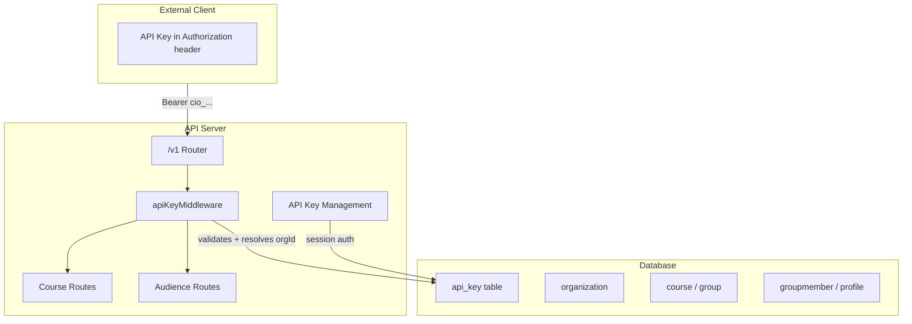

# Public API with Organization-Scoped API Keys

## Architecture Overview




## 1. Database: `api_key` Table

Add a new table in [packages/db/src/schema.ts](packages/db/src/schema.ts):

```typescript
export const apiKey = pgTable('api_key', {
  id: uuid('id').defaultRandom().primaryKey(),
  organizationId: uuid('organization_id').notNull().references(() => organization.id, { onDelete: 'cascade' }),
  keyHash: text('key_hash').notNull(),       // SHA-256 hash of the key
  keyPrefix: varchar('key_prefix', { length: 12 }).notNull(), // "cio_live_xxxx" for display
  name: varchar('name', { length: 255 }).notNull().default('Default'),
  lastUsedAt: timestamp('last_used_at'),
  expiresAt: timestamp('expires_at'),
  isRevoked: boolean('is_revoked').notNull().default(false),
  createdAt: timestamp('created_at').defaultNow().notNull(),
  createdBy: uuid('created_by').notNull().references(() => profile.id),
});
```

- The raw key is only shown once on creation; we store a SHA-256 hash.
- `keyPrefix` (e.g. `cio_live_a1b2`) lets users identify keys in the UI without exposing the secret.
- DON'T GENERATE MIGRATION, when we run `pnpm db push` it will automatically apply the changes.

## 2. API Key Queries

New file: [packages/db/src/queries/api-key/api-key.ts](packages/db/src/queries/api-key/api-key.ts)

Functions:

- `createApiKey(orgId, createdBy, name?)` -- inserts row, returns id
- `getApiKeyByHash(hash)` -- lookup for auth middleware
- `getApiKeysByOrganization(orgId)` -- list keys (prefix, name, createdAt, lastUsedAt, isRevoked)
- `revokeApiKey(keyId, orgId)` -- sets `isRevoked = true`
- `updateApiKeyLastUsed(keyId)` -- stamps `lastUsedAt`

## 3. API Key Auth Middleware

New file: [apps/api/src/middlewares/api-key.ts](apps/api/src/middlewares/api-key.ts)

- Reads `Authorization: Bearer cio_live_...` header
- SHA-256 hashes the key, looks up via `getApiKeyByHash`
- Checks `isRevoked`, `expiresAt`
- Sets `c.set('orgId', key.organizationId)` on context (same pattern as `orgMemberMiddleware`)
- Returns 401 on invalid/expired/revoked key

## 4. Validation Schemas

New file: [packages/utils/src/validation/api-key/api-key.ts](packages/utils/src/validation/api-key/api-key.ts)

Schemas for API key management and public API input validation:

- `ZCreateApiKey` -- `{ name?: string }`
- `ZRevokeApiKeyParam` -- `{ keyId: string (uuid) }`
- Public API schemas for course CRUD, audience CRUD, pagination, etc.

## 5. Public API Routes (Versioned)

### Router structure

New directory: `apps/api/src/routes/v1/`

Files:

- [apps/api/src/routes/v1/courses.ts](apps/api/src/routes/v1/courses.ts) -- Course endpoints
- [apps/api/src/routes/v1/audience.ts](apps/api/src/routes/v1/audience.ts) -- Audience endpoints
- [apps/api/src/routes/v1/index.ts](apps/api/src/routes/v1/index.ts) -- Combines sub-routers

Register in [apps/api/src/app.ts](apps/api/src/app.ts):

```typescript
.route('/v1', v1Router)
```

All v1 routes use `apiKeyMiddleware` (not session auth).

### Course Endpoints (`/v1/courses`)


| Method | Path                             | Description                                        |
| ------ | -------------------------------- | -------------------------------------------------- |
| GET    | `/v1/courses`                    | List all org courses (paginated)                   |
| POST   | `/v1/courses`                    | Create a course                                    |
| GET    | `/v1/courses/:courseId`          | Get course details                                 |
| PUT    | `/v1/courses/:courseId`          | Update a course                                    |
| DELETE | `/v1/courses/:courseId`          | Soft-delete a course                               |
| GET    | `/v1/courses/:courseId/export`   | Export course content (lessons, exercises) as JSON |
| GET    | `/v1/courses/:courseId/students` | List students enrolled in a course                 |


### Audience Endpoints (`/v1/audience`)


| Method | Path                      | Description                       |
| ------ | ------------------------- | --------------------------------- |
| GET    | `/v1/audience`            | List all org students (paginated) |
| POST   | `/v1/audience`            | Add a student to the org          |
| GET    | `/v1/audience/:studentId` | Get student details               |
| PUT    | `/v1/audience/:studentId` | Update student info               |
| DELETE | `/v1/audience/:studentId` | Remove student from org           |


### API Key Management (session-authenticated, not public API)

New file: [apps/api/src/routes/api-key/api-key.ts](apps/api/src/routes/api-key/api-key.ts)


| Method | Path              | Description                                 |
| ------ | ----------------- | ------------------------------------------- |
| POST   | `/api-key`        | Generate new API key (returns raw key once) |
| GET    | `/api-key`        | List API keys for the org                   |
| DELETE | `/api-key/:keyId` | Revoke an API key                           |


Registered in `app.ts` as `.route('/api-key', apiKeyRouter)`. Protected by `authMiddleware` + `orgAdminMiddleware`.

## 6. Services

- [apps/api/src/services/api-key.ts](apps/api/src/services/api-key.ts) -- Key generation (crypto.randomBytes), hashing, CRUD logic
- [apps/api/src/services/v1/course.ts](apps/api/src/services/v1/course.ts) -- Public API course business logic (reuses existing queries from `@cio/db/queries/course`)
- [apps/api/src/services/v1/audience.ts](apps/api/src/services/v1/audience.ts) -- Public API audience business logic (reuses `getOrganizationAudience` and related queries)

## 7. Tests

New test files under `apps/api/src/__tests__/`:

- `api-key.test.ts` -- API key creation, listing, revocation, auth flow
- `v1/courses.test.ts` -- All course CRUD + export + students endpoints
- `v1/audience.test.ts` -- All audience CRUD endpoints

Tests will use Hono's `app.request()` test helper (no HTTP server needed). Mock the DB layer with `vi.mock()`.

## 8. Dashboard UI: Automation Page

### Sidebar Navigation

Add an "Automation" nav item in [apps/dashboard/src/lib/features/ui/navigation/org-navigation.ts](apps/dashboard/src/lib/features/ui/navigation/org-navigation.ts), placed before Settings, with `requiresAdmin: true`:

```typescript
{
  titleKey: 'org_navigation.automation',
  path: '/automation',
  icon: AutomationIcon, // use Zap or Workflow icon from lucide
  requiresAdmin: true,
  matchPattern: '^/org/[^/]+/automation(/.*)?$'
}
```

### Route

New file: [apps/dashboard/src/routes/org/[slug]/automation/+page.svelte](apps/dashboard/src/routes/org/[slug]/automation/+page.svelte)

### Page Structure

```
+----------------------------------------------+
| Automation                                    |
| Connect ClassroomIO with your tools and       |
| workflows.                                    |
+----------------------------------------------+
| [ API ]  [ Zapier ]  [ Webhooks ]             |
+----------------------------------------------+
|                                               |
|  (Tab content based on selection)             |
|                                               |
+----------------------------------------------+
```

- Title: "Automation" with description text
- Uses `Tabs` from `@cio/ui/base/tabs`
- Three tabs: **API**, **Zapier**, **Webhooks**

### API Tab Content

**Free plan users:** Show `UpgradeBanner` component (same pattern as other pages). Disable all controls.

**Paid plan users:**

- API key display field (masked by default, e.g. `cio_live_••••••••••••a1b2`)
- "Show" / "Hide" toggle button to reveal/mask the key
- "Copy" button to copy to clipboard
- "Regenerate" button (with confirmation) to create a new key and revoke the old one
- "Read the Docs" button/link pointing to the API documentation URL

### API Class

New file: [apps/dashboard/src/lib/features/automation/api/automation.svelte.ts](apps/dashboard/src/lib/features/automation/api/automation.svelte.ts)

Extends `BaseApi`, methods:

- `fetchApiKeys()` -- GET `/api-key`
- `createApiKey()` -- POST `/api-key`
- `revokeApiKey(keyId)` -- DELETE `/api-key/:keyId`

### Frontend Types

New file: [apps/dashboard/src/lib/features/automation/utils/types.ts](apps/dashboard/src/lib/features/automation/utils/types.ts)

### Translations

Add keys to [apps/dashboard/src/lib/utils/translations/en.json](apps/dashboard/src/lib/utils/translations/en.json):

- `org_navigation.automation`
- `automation.title`, `automation.description`
- `automation.tabs.api`, `automation.tabs.zapier`, `automation.tabs.webhooks`
- `automation.api.key_label`, `automation.api.copy`, `automation.api.regenerate`, `automation.api.read_docs`
- `automation.api.upgrade_prompt`
- `automation.zapier.coming_soon`, `automation.webhooks.coming_soon`

## 9. Versioning Strategy

- All public API routes live under `/v1/`. When v2 is needed, a new `apps/api/src/routes/v2/` directory is created with its own router, registered as `.route('/v2', v2Router)`.
- The v1 router remains untouched, ensuring backward compatibility.
- The API key middleware is version-agnostic and shared across all versions.

Note: Follow AGENTS.md for code practices.
