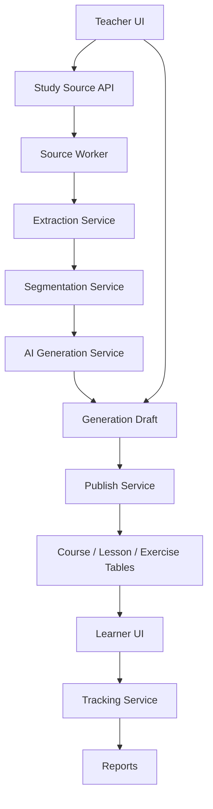

# Study from Source Implementation Plan

## Engineering Position

Study from Source should be built as a durable source-ingestion and generation pipeline, not as a direct "send file to AI" feature.

The system owns:

1. source intake
2. storage
3. deterministic extraction
4. normalization
5. segmentation
6. AI generation from bounded source segments
7. draft persistence
8. teacher review
9. publish into existing course primitives
10. learner progress and completion evidence

The AI should not fetch arbitrary URLs, read private files directly, or decide what gets persisted. The AI receives normalized source segments and returns structured drafts that are validated before storage and again before publish.

## Task Separation

### Deterministic System Tasks

These tasks should be regular backend services and workers:

| Task | Owner | Notes |
| --- | --- | --- |
| Auth and permission checks | API routes/middleware | Organization-scoped, course-team-scoped where relevant |
| File upload and asset registration | API service | Reuse asset pipeline where possible |
| Webpage fetch | API worker | Server-side fetch with strict SSRF protections |
| Text extraction | Extraction service | PDF/DOCX/PPTX/TXT/Markdown/HTML |
| Text normalization | Extraction service | Remove boilerplate, normalize whitespace, preserve headings |
| Source segmentation | Segmentation service | Deterministic first, AI-assisted only for weak structure |
| Source snapshot persistence | DB/query layer | Source must remain stable after publish |
| Job state, retries, cancellation | Worker/job service | Durable and resumable |
| Draft validation | Utils validation + API service | Zod schema validation before persistence |
| Publishing | Publish service | Creates sections, lessons, lesson language content, exercises |
| Learner events | Tracking endpoint/service | Idempotent events and progress aggregation |
| Completion evaluation | Completion service | Central rule evaluator, not UI-driven |
| Reporting/export | Reporting service | Reads progress aggregates and submissions |

### AI Tasks

The AI should perform bounded transformations only after source extraction:

| AI Task | Input | Output |
| --- | --- | --- |
| Structure inference | Source segment outline and selected segment text | Proposed lessons, optional sections, learning objectives |
| Lesson drafting | Segment text for one planned lesson | Lesson body content, summary, key concepts |
| Quiz generation | Segment text and learning objectives | Auto-gradable questions, options, correct answers, explanations |
| Activity quiz generation | One source/activity segment set | Key subject matter, quiz, optional reflection prompt |
| Coverage mapping assist | Generated item + source segment IDs | Segment references and confidence |
| Regeneration | Existing draft item + source segments + teacher instruction | Replacement draft item |

The AI must not:

- publish directly
- change permissions
- create records without service validation
- infer facts outside the provided source unless explicitly configured
- generate questions without source segment references
- fetch URLs itself
- grade learner submissions in v1 unless the question type already has a supported grading path

## High-Level Architecture



## Pipeline Overview

### Course Type Pipeline

```
create source
  -> extract source
  -> normalize text
  -> segment source
  -> generate course outline draft
  -> teacher reviews outline
  -> generate lesson and quiz drafts per lesson
  -> teacher approves
  -> publish into course/sections/lessons/exercises
  -> learner completes course
  -> reports show progress, score, and source coverage
```

### Activity Type Pipeline

```
create source inside existing course
  -> extract source
  -> normalize text
  -> segment source
  -> generate source-study activity draft
  -> teacher reviews quiz and requirements
  -> publish as lesson variant + generated exercise
  -> learner studies source and submits quiz
  -> completion service evaluates activity completion
```

## Source Intake and Extraction

### Intake Sources

#### File Upload

Supported v1:

- PDF
- DOCX
- PPTX
- TXT
- Markdown

Implementation:

1. API receives file metadata and creates a `study_source` record with status `draft`.
2. File is uploaded to object storage and registered as an `asset`.
3. API creates a `study_source_job` with type `extract_source`.
4. Worker claims job and extracts text.
5. Worker updates source status to `ready` or `failed`.

Use the current AI chat document extraction as a reference, but do not reuse its temporary conversation assumptions. The existing service stores extracted text against `ai_chat_document`; Study from Source needs durable source records and source segments.

#### Webpage URL

Supported v1:

- one public URL per source
- server-side fetch
- readable article/body extraction
- stored snapshot

Implementation:

1. Validate URL scheme is `https` or `http`.
2. Block localhost, private IP ranges, link-local ranges, metadata service IPs, and internal hostnames.
3. Resolve DNS before fetch and validate resolved IPs.
4. Enforce redirect limit, response size limit, and timeout.
5. Reject unsupported content types unless the response is parseable HTML/text.
6. Store:
   - original URL
   - final URL
   - HTTP status
   - content type
   - fetch timestamp
   - extracted readable text
   - page title
   - canonical URL if present

The learner should see the stored snapshot/readable text by default, with the original URL shown as a citation/link.

#### Pasted Text

Supported v1:

- plain text
- Markdown

Implementation:

1. API stores text directly in `study_source.rawText`.
2. Worker normalizes and segments it like other source types.
3. No external asset is required.

### Extraction Libraries

Candidate extraction approach:

| Source | Extractor |
| --- | --- |
| PDF | Existing `pdf-parse` initially; consider page-aware extractor if page locators are required |
| DOCX | Existing `mammoth` |
| PPTX | Existing ZIP/XML extraction, later replace with a stronger parser if needed |
| HTML | `readability`-style extraction using DOM parsing |
| TXT/Markdown | Direct decode and normalization |

### Extraction Output Contract

Extraction should produce a structured intermediate result:

```ts
type ExtractedSource = {
  title: string | null;
  rawText: string;
  normalizedText: string;
  wordCount: number;
  pageCount?: number | null;
  language?: string | null;
  locators: Array<{
    kind: 'page' | 'heading' | 'slide' | 'paragraph' | 'url_fragment';
    label: string;
    startOffset: number;
    endOffset: number;
    metadata?: Record<string, unknown>;
  }>;
  warnings: Array<{
    code: string;
    severity: 'info' | 'warning' | 'error';
    message: string;
  }>;
};
```

The AI should consume the normalized text and segment records, not the uploaded file.

## Normalization

Normalization should be deterministic and conservative.

Steps:

1. decode text as UTF-8 where possible
2. normalize line endings
3. collapse repeated whitespace
4. preserve headings, page breaks, slide breaks, and URL headings
5. remove obvious webpage boilerplate such as nav/footer/cookie banners where the parser identifies them
6. detect very low text density and mark extraction as weak
7. compute word count and character count
8. detect likely language

Do not rewrite content during normalization. Rewriting belongs to AI generation, not extraction.

## Segmentation

Segmentation is the contract between source extraction and AI generation.

### Deterministic Segmentation First

Use deterministic rules before AI:

- PDF: pages, detected headings, paragraph blocks
- DOCX: heading styles if available, then paragraphs
- PPTX: slide boundaries, slide titles
- HTML: h1/h2/h3 sections, article paragraphs
- Markdown: heading hierarchy
- TXT: heading-like lines and paragraph grouping

### AI-Assisted Segmentation

Use AI-assisted segmentation only when deterministic segmentation is weak:

- no headings
- long flat text
- inconsistent formatting
- extracted text has unclear boundaries

AI-assisted segmentation should receive chunked text and return only segment boundaries and titles, not rewritten lesson content.

### Segment Size Rules

Default target:

- minimum useful segment: 150 words
- target segment: 500-1,200 words
- maximum segment: 2,000 words before further splitting

Very short segments should be merged with neighbors unless they are headings, definitions, or policy clauses that need to remain separate.

### Segment Output

Each `study_source_segment` should include:

- stable order
- title where available
- kind
- text
- parent segment if hierarchical
- source locator
- extraction confidence or warnings

## AI Generation Responsibilities

### Course Outline Generation

Input:

- source metadata
- segment list with IDs, titles, sizes, and short previews
- teacher instructions
- generation settings

Output:

- title
- description
- `usesSections`
- optional sections
- lessons
- lesson-to-segment mapping
- learning objectives
- recommended quiz placement
- warnings

Rules:

- for small sources, generate a flat lesson list
- for large/naturally structured sources, generate sections
- do not create a lesson without source segment IDs
- do not include ungrounded content
- include warnings for uncovered or low-confidence segments

### Lesson Draft Generation

Input:

- approved lesson plan item
- full text of mapped source segments
- course style settings
- teacher instructions

Output:

- lesson body HTML
- summary
- key concepts
- source segment references
- warnings

Rules:

- lesson body starts at `h3` or lower to match existing lesson content rules
- keep source-grounded; do not add external facts by default
- explain and teach, but do not invent new policy requirements
- include source coverage metadata

### Quiz Generation

Input:

- source segment text
- learning objectives
- desired question count
- allowed question types
- passing score

Output:

- questions
- options
- correct answers
- answer explanations
- source segment references
- difficulty

Rules:

- v1 should prefer auto-gradable question types
- every question must map to at least one source segment
- avoid trick questions
- avoid questions whose answer depends on ambiguous wording
- avoid questions about insignificant details unless the teacher asks for strict recall
- generated options must be mutually exclusive for single-answer questions
- checkbox questions must have at least two correct options only when the source supports that clearly

### Activity Generation

Input:

- source segments for one activity
- teacher settings

Output:

- activity title
- source summary
- key subject matter list
- quiz
- completion settings
- source coverage

Rules:

- do not split activity into multiple lessons
- focus quiz on key subject matter, not every paragraph
- activity summary is optional learner support, not proof of study

## Data Model Additions

### Enums

Add:

- `COURSE_TYPE`: `STUDY_FROM_SOURCE`
- `STUDY_SOURCE_TYPE`: `file`, `webpage`, `text`
- `STUDY_SOURCE_STATUS`: `draft`, `extracting`, `ready`, `failed`, `archived`
- `STUDY_SOURCE_JOB_TYPE`: `extract_source`, `segment_source`, `generate_course_outline`, `generate_activity`, `publish_draft`
- `STUDY_SOURCE_JOB_STATUS`: `pending`, `running`, `completed`, `failed`, `canceled`
- `STUDY_SOURCE_SEGMENT_KIND`: `chapter`, `section`, `paragraph`, `page`, `slide`, `inferred_topic`
- `STUDY_SOURCE_DRAFT_KIND`: `course_outline`, `activity_quiz`, `lesson_regeneration`, `quiz_regeneration`
- `STUDY_SOURCE_ACTIVITY_STATUS`: `draft`, `published`, `archived`

### Tables

Use the PRD data model plus add an explicit job table:

#### `study_source_job`

| Field | Type | Notes |
| --- | --- | --- |
| `id` | uuid | Job ID |
| `organizationId` | uuid | Scope |
| `sourceId` | uuid nullable | Source |
| `draftId` | uuid nullable | Draft |
| `type` | enum | Job type |
| `status` | enum | Job status |
| `attempt` | integer | Current attempt |
| `maxAttempts` | integer | Retry cap |
| `leasedBy` | text nullable | Worker lease |
| `leaseExpiresAt` | timestamp nullable | Worker lease expiry |
| `progressPercent` | integer | UI progress |
| `stage` | text | Human-readable stage |
| `checkpoint` | jsonb | Resume data |
| `input` | jsonb | Job input |
| `output` | jsonb | Job result |
| `warnings` | jsonb | Non-fatal warnings |
| `error` | jsonb | Terminal error |
| `createdAt` / `updatedAt` | timestamp | Audit fields |

The job system should use DB-backed leasing with `FOR UPDATE SKIP LOCKED`, matching the pattern proposed in the course importer plan.

## API Boundaries

### Routes

Keep routes thin:

- validate input
- enforce auth/middleware
- call service
- return one response shape
- use `handleError`

### Services

Suggested service modules:

- `apps/api/src/services/study-source/source.ts`
- `apps/api/src/services/study-source/extraction.ts`
- `apps/api/src/services/study-source/segmentation.ts`
- `apps/api/src/services/study-source/generation.ts`
- `apps/api/src/services/study-source/publish.ts`
- `apps/api/src/services/study-source/progress.ts`
- `apps/api/src/services/study-source/reporting.ts`

### Queries

Suggested query module:

- `packages/db/src/queries/study-source/study-source.ts`

Queries stay pure and do not know HTTP concerns.

### Validation

Suggested validation module:

- `packages/utils/src/validation/study-source/study-source.ts`

Schemas should cover:

- source create
- file finalize
- URL create
- pasted text create
- generation settings
- draft update
- publish
- activity config
- learner event
- report query

## Async Job Design

Extraction and AI generation should be async jobs.

Do not hold a request open while:

- fetching a webpage
- parsing a large PDF
- segmenting large text
- generating a full course outline
- generating all lesson content
- publishing a large generated course

### Job Lifecycle

```
pending -> running -> completed
                  -> failed
                  -> canceled
```

### Retry Policy

- extraction failures caused by invalid input should not retry
- network timeouts for webpage fetch can retry with backoff
- AI rate limits can retry with backoff
- schema validation failures from AI output should retry once with a repair prompt
- publish failures should be resumable with idempotency keys

### Idempotency

Use idempotency keys for:

- source creation from URL
- draft generation
- publish
- learner event ingestion

Publish must be safe to retry without duplicate sections, lessons, exercises, or questions.

## Publish Strategy

### Course Type Publish

Publishing a course draft should:

1. create or update course shell with type `STUDY_FROM_SOURCE`
2. set `isContentGroupingEnabled` based on approved outline
3. create sections if `usesSections` is true
4. create lessons in order
5. create lesson language content
6. create exercises and questions
7. create source coverage records
8. mark draft `published`

### Activity Publish

Publishing an activity draft should:

1. create a lesson in the existing course
2. create `study_source_activity`
3. attach source metadata to the activity
4. create generated exercise linked to the lesson
5. create source coverage records for quiz questions
6. mark activity/draft `published`

### Partial Publish Failure

Publish should store checkpoints after each created entity:

- course created
- section IDs created
- lesson IDs created
- lesson content written
- exercise IDs created
- questions created
- coverage written

On retry, the service should read the checkpoint and continue instead of creating duplicates.

## Learner Tracking

### Events

Events should be append-only where possible:

- `opened`
- `segment_viewed`
- `progress_updated`
- `active_time_recorded`
- `quiz_started`
- `quiz_submitted`
- `attestation_checked`
- `completed`

### Event Validation

Reject or normalize:

- progress below previous progress unless explicitly resetting
- active time heartbeats that are too frequent
- active time while tab is hidden
- events for unpublished activities
- events from users not enrolled/authorized for the course

### Progress Aggregation

Progress should be aggregated server-side from events and quiz submissions.

Completion should be evaluated by a single service:

```ts
type StudySourceCompletionInput = {
  requiredProgressPercent: number;
  minimumActiveTimeSeconds: number | null;
  passingScorePercent: number;
  requiresAttestation: boolean;
  progressPercent: number;
  activeTimeSeconds: number;
  quizScorePercent: number | null;
  attestedAt: string | null;
};
```

The UI should never mark an activity complete by itself.

## Frontend Implementation

### Course Creation

Add a Study from Source option to course creation.

Screens:

1. source input
2. extraction status and preview
3. generation settings
4. outline review
5. publish progress
6. generated course preview

### Activity Creation

Add Study from Source to the content create modal.

Screens:

1. source input
2. extraction preview
3. quiz settings
4. generated quiz review
5. publish

### Learner Reader

The reader should support:

- normalized text display
- source metadata
- original source link for webpages
- progress tracking
- generated quiz
- attestation if enabled

Do not render raw untrusted HTML from webpages without sanitization.

## Edge Cases

### File Edge Cases

| Edge Case | Expected Behavior |
| --- | --- |
| Unsupported MIME type | Reject with clear error |
| MIME type spoofing | Verify extension and content signature where practical |
| File exceeds limit | Reject before extraction |
| Empty file | Mark extraction failed |
| PDF has no text layer | Mark extraction failed with scanned-PDF warning |
| Password-protected PDF | Reject with unsupported/protected file error |
| Corrupt DOCX/PPTX | Mark extraction failed and keep source in failed state |
| Huge extracted text | Truncate or require teacher to split source; show warning |
| Tables/formulas extracted poorly | Store warning; teacher can review extracted preview |
| Images contain important text | Mark as not extracted in v1; OCR out of scope |
| Duplicate upload | Allow, but optionally detect hash and warn |

### Webpage Edge Cases

| Edge Case | Expected Behavior |
| --- | --- |
| URL is localhost/private IP | Reject to prevent SSRF |
| URL redirects to private IP | Reject after redirect validation |
| URL returns non-HTML binary | Reject unless supported document type |
| URL blocks fetch | Mark failed with fetch error |
| URL times out | Retry with backoff, then fail |
| Page is mostly nav/ads | Extract best readable content; warn if text density is low |
| Page requires login | Fail with "content not accessible" |
| Paywall or cookie wall | Extract available text; warn that content may be incomplete |
| Page content changes later | Existing course/activity keeps stored snapshot |
| Canonical URL differs | Store both original and canonical/final URL |
| Robots/meta restrictions | Store warning and respect product policy decided before launch |

### Text Edge Cases

| Edge Case | Expected Behavior |
| --- | --- |
| Text is too short for quiz | Allow source, block quiz generation or generate fewer questions |
| Text is too long | Enforce character limit and show warning |
| Text has no structure | Use AI-assisted segmentation |
| Text is not in supported locale | Detect language and warn if generation quality may be lower |

### AI Edge Cases

| Edge Case | Expected Behavior |
| --- | --- |
| AI returns invalid JSON | Retry once with repair prompt; then fail draft generation |
| AI omits source references | Reject output and retry |
| AI creates unsupported question type | Reject output and retry or downgrade to supported type |
| AI invents facts outside source | Hard to detect automatically; require teacher review and source references |
| AI makes every lesson too long | Enforce max output lengths per lesson |
| AI creates too many lessons | Enforce generation settings and max lesson count |
| AI creates trivial quiz questions | Flag via quality checks where possible; teacher can regenerate |
| AI rate limit | Retry job with backoff |
| AI token limit | Chunk by segments and generate per lesson/activity |

### Publish Edge Cases

| Edge Case | Expected Behavior |
| --- | --- |
| Teacher edits draft while publish runs | Lock draft during publish |
| Publish interrupted after sections created | Resume from checkpoint |
| Existing course has content | Activity publish appends; course-type publish creates new course unless explicit merge is supported |
| Duplicate publish click | Idempotency prevents duplicates |
| Question validation fails | Fail publish before partial question creation where possible |
| Lesson content validation fails | Keep draft unpublished with actionable error |

### Learner Tracking Edge Cases

| Edge Case | Expected Behavior |
| --- | --- |
| Learner opens source then immediately submits quiz | Completion depends on configured progress/score rules |
| Learner switches tabs | Active time heartbeat pauses |
| Learner loses network | Events queue client-side and replay with idempotency keys |
| Learner retakes quiz | Progress uses best or latest score based on activity settings |
| Teacher changes passing score after attempts | Recompute completion according to product policy; default should apply new rules only to future attempts |
| Source/activity unpublished | Reject learner events |

## Testing Plan

### Unit Tests

- URL validation and SSRF blocking
- file type validation
- text normalization
- deterministic segmentation
- source completion evaluator
- generated draft schema validation
- publish mapping functions

### Integration Tests

- create source from pasted text
- upload file and create source record
- webpage fetch success/failure
- extraction job state transitions
- generation draft persistence
- publish draft to course
- publish activity into existing course
- learner event ingestion and progress aggregation

### E2E Tests

- teacher creates Study from Source course from pasted text and publishes
- teacher adds source-study activity to existing course
- learner studies activity, passes quiz, completion appears in report
- failed extraction shows actionable UI state
- retry publish does not duplicate content

## Delivery Order

1. Data model and validation schemas
2. Source creation and pasted text ingestion
3. Async job foundation
4. File extraction using existing extraction libraries
5. Webpage fetch and readable extraction with SSRF protections
6. Segmentation service
7. Course outline draft generation
8. Activity quiz draft generation
9. Teacher review UI
10. Publish service for activity path
11. Publish service for course type path
12. Learner reader and tracking
13. Reports and CSV export

Build the activity path before the full course path if delivery needs to be staged. It exercises the same source pipeline with lower publish complexity.

