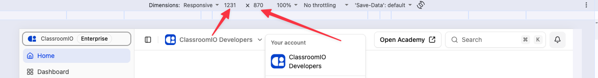
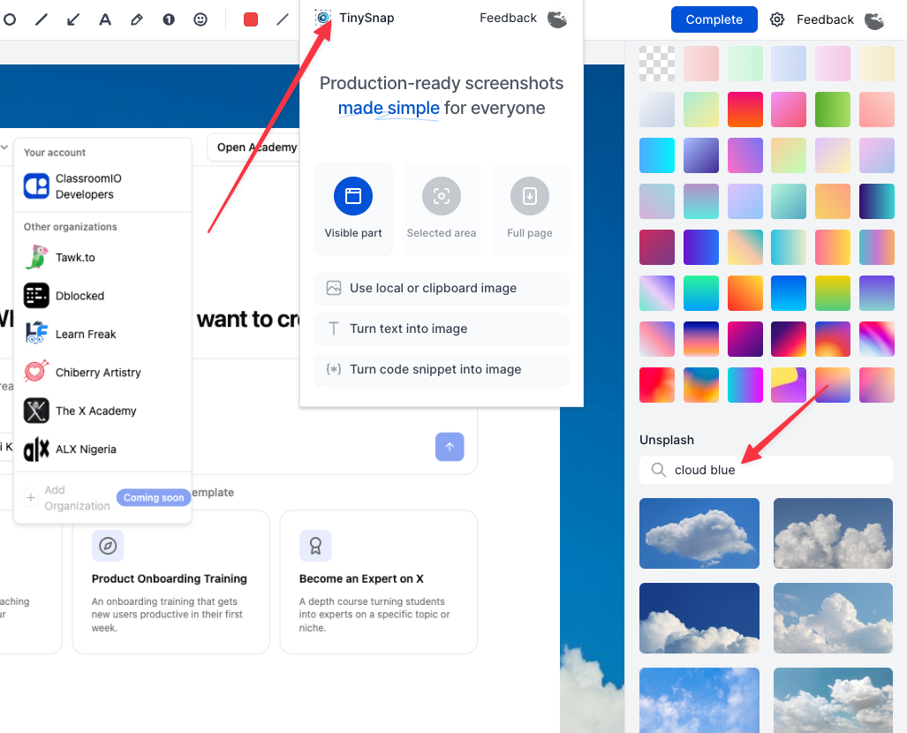
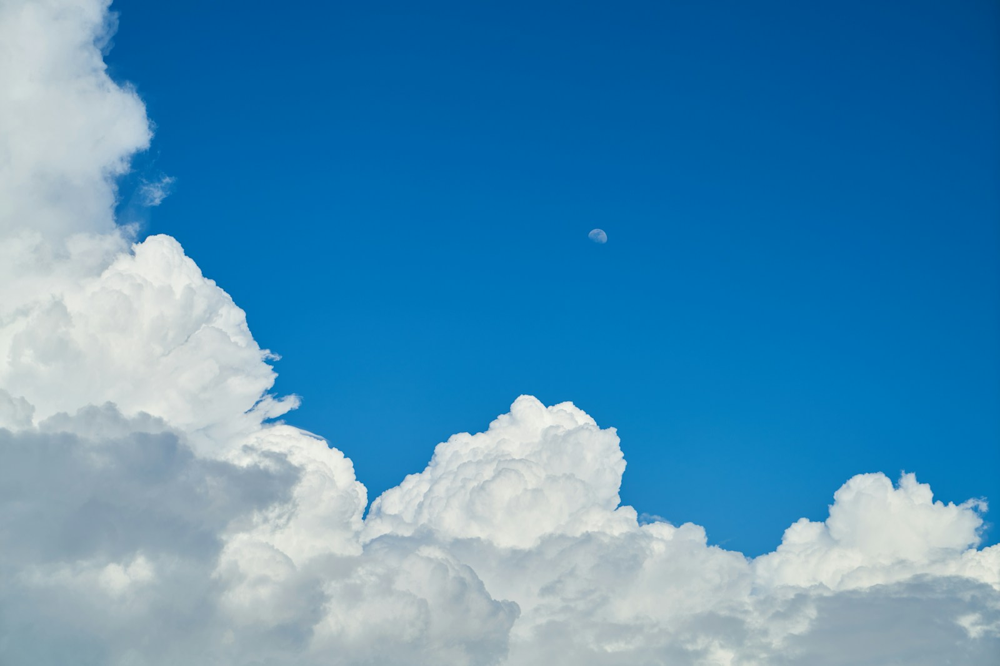

# ClassroomIO screenshot capture standard

Use this standard when creating new product screenshots for the ClassroomIO Help Center. It keeps the captured interface scale and TinySnap presentation consistent without replacing the media-selection, privacy, placement, optimization, or alt-text rules in [media-and-linking.md](media-and-linking.md).

## Required browser viewport

Capture the product from Chrome's responsive device toolbar at:

- **Width:** `1231` pixels
- **Height:** `870` pixels
- **Page zoom:** `100%`
- **Network throttling:** `No throttling`

The `1231 × 870` value is the product viewport before TinySnap adds its background and padding. The TinySnap export can therefore have larger pixel dimensions. Do not resize the browser viewport to match the final decorative canvas.

The red arrows in this reference are instructional annotations only. Do not include them in Help Center screenshots.

## TinySnap presentation

1. Open the TinySnap Chrome extension after the required product state is visible.
2. Select **Visible part** unless the article explicitly needs a selected area or full-page capture.
3. In TinySnap's background panel, open **Unsplash** and search for `ocean blue`.
4. Select the approved white-clouds-and-blue-sky photograph shown below. If search ordering changes, use the source link or the local reference asset instead of substituting another sky image.
5. Keep the product screenshot centered with enough sky visible to frame it. Do not let decorative padding make product labels too small to read.
6. Select **Complete**, then optimize the exported image according to [media-and-linking.md](media-and-linking.md).

The red arrows in this reference explain where to open TinySnap and choose the background. They are not part of the final screenshot style.

## Approved background

Use [White clouds and blue sky during daytime](https://unsplash.com/photos/white-clouds-and-blue-sky-during-daytime-zlGobrmAuyE) by engin akyurt on Unsplash.

The local file is a reference copy. Prefer selecting the same photograph through TinySnap so its normal background controls determine the crop and presentation.

## Final check

Before accepting the export, confirm that:

- the source viewport was `1231 × 870` at `100%` zoom;
- the approved sky photograph is used, rather than a similar search result;
- the product state, labels, and relevant control remain readable;
- no DevTools, TinySnap panels, instructional arrows, browser extensions, or capture controls appear in the final screenshot;
- the image contains demo data and no private names, domains, student records, billing data, analytics, tokens, or notifications;
- the final article asset is converted to WebP, stripped of metadata, and no wider than 1280 pixels unless the text requires a larger source.
